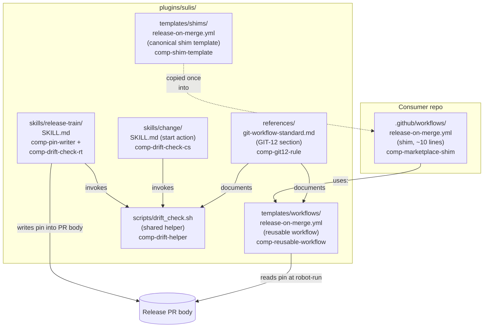

# TDD — auto-back-merge-on-release

## 1. Overview

Sulis's dev → main release flow bumps version files, deletes changesets, and
tags on main, but never advances dev. Every release therefore leaves dev
behind main, and the marketplace has manually back-integrated three times
(`0e85c24`, `8612834`, `d93517c`). This design closes that gap by making the
back-integration the last step of the release workflow itself — Pattern A
from the SRD investigation.

The structural shape:

1. The current `release-on-merge.yml` content moves into the plugin as a
   **reusable workflow** (`workflow_call`).
2. The reusable workflow gains a final block that either (a) fast-forwards
   dev to main when dev is unchanged since the release PR opened, or (b)
   opens a `back-integrate`-labelled PR with auto-merge enabled. It never
   force-pushes.
3. `/sulis:release-train` writes a `dev-sha-at-open: <SHA>` pin into every
   release PR body it opens — the only piece of state the workflow needs at
   robot-run time to distinguish "clean" from "raced".
4. `/sulis:release-train` and `/sulis:change start` get a shared drift-check
   helper that refuses to operate against a stale dev — defence in depth if
   the back-merge step ever fails.
5. The marketplace's own `.github/workflows/release-on-merge.yml` becomes
   the canonical consumer shim — n=1 dogfood from day one.
6. A new rule **GIT-12: Auto-back-merge on release (MUST)** is appended to
   `plugins/sulis/references/git-workflow-standard.md`.

The design is tier-M (sFPC 14, ASR 18, single bounded context). Six
decisions are locked in `adrs/ADR-001..006.md`; this TDD cites them by ID
rather than restating their rationale.

## 2. Source Specification

| Artifact | Path |
|---|---|
| SRD | [`.specifications/auto-back-merge-on-release/SRD.md`](../../.specifications/auto-back-merge-on-release/SRD.md) |
| NFR | [`.specifications/auto-back-merge-on-release/NFR.md`](../../.specifications/auto-back-merge-on-release/NFR.md) |
| Misuse cases | [`.specifications/auto-back-merge-on-release/MISUSE_CASES.md`](../../.specifications/auto-back-merge-on-release/MISUSE_CASES.md) |
| Glossary | [`.specifications/auto-back-merge-on-release/GLOSSARY.md`](../../.specifications/auto-back-merge-on-release/GLOSSARY.md) |
| Primitive tree | [`.specifications/auto-back-merge-on-release/PRIMITIVE_TREE.jsonld`](../../.specifications/auto-back-merge-on-release/PRIMITIVE_TREE.jsonld) |
| Handoff | [`.specifications/auto-back-merge-on-release/HANDOFF_TO_SEA.md`](../../.specifications/auto-back-merge-on-release/HANDOFF_TO_SEA.md) |
| ARCH index | [`ARCH.yaml`](ARCH.yaml) |
| Sizing | [`SIZING.md`](SIZING.md) |
| ADRs | [`adrs/`](adrs/) |

Vocabulary in this TDD matches GLOSSARY.md exactly: **back-integration**
(act), **back-merge** (operation), **back-merge PR** (raced-path PR),
**reusable workflow** (the plugin-side file), **shim** (the consumer-side
caller), **drift** (dev-behind-main state).

## 3. Canonical Identifiers (P8)

This change is mostly YAML + bash + small SKILL.md edits. There is one
cross-component identifier worth locking, plus three string conventions
that multiple components must agree on character-for-character.

| Identifier | Producer | Consumer | Format |
|---|---|---|---|
| **`dev-sha-at-open` pin** | `/sulis:release-train` (Step 5) | reusable workflow back-merge step | HTML comment `<!-- dev-sha-at-open: <40-hex-SHA> -->` at the bottom of the release PR body. Extracted at robot-run time via the GitHub `commits/{SHA}/pulls` API + the regex `dev-sha-at-open: ([a-f0-9]{40})`. See ADR-005 (write) + ADR-006 (read). |
| **`back-integrate` PR label** | reusable workflow (raced-path step) | drift-check helper; `/sulis:release-train`'s drift error message | Literal string `back-integrate`. Used by `gh pr list --label back-integrate` in the drift helper. |
| **Back-merge PR title prefix** | reusable workflow | drift-check fallback (when label is missing) | `chore: back-integrate main → dev (post-release v<NEW_META>)`. Prefix `chore: back-integrate main → dev` is the searchable part. |
| **Back-merge PR base/head** | reusable workflow | GitHub PR API | base=`dev`, head=`main`. |

These four strings appear in: the workflow YAML, the drift-check helper,
the release-train SKILL.md (which writes the pin), and GIT-12 worked
examples. WP-008's tests assert character-for-character parity.

## 4. Form — Structural Design

Eight components, declared in `ARCH.yaml` §components. Each carries a
change primitive (`extend` / `substitute-replace` / `create`) and a
target path.

### 4.1 Component map



### 4.2 Component contracts

| Component | Path | Primitive | Contract |
|---|---|---|---|
| **comp-reusable-workflow** | `plugins/sulis/templates/workflows/release-on-merge.yml` | extend | Top-level `on: workflow_call` (no inputs). `permissions: contents: write, pull-requests: write`. Carries the existing bump+tag+push-main steps verbatim. Appends three new steps: (a) **pin-read** — extract `dev-sha-at-open` from the merged release PR's body via `gh api .../commits/${GITHUB_SHA}/pulls` (ADR-006); (b) **decide+act** — fast-forward `main:dev` when `CURRENT_DEV == DEV_SHA_PIN` and pin is non-empty, else fall through to `gh pr create --base dev --head main --label back-integrate --title 'chore: back-integrate main → dev (post-release v<NEW_META>)'` followed by `gh pr merge --auto --merge`; (c) **post-condition** — assert `origin/dev == origin/main` OR an open/merged PR with label `back-integrate` and base `dev` exists, exit 1 otherwise (NFR-006). FR-002 / FR-003 / FR-004 / FR-005 / FR-011. |
| **comp-marketplace-shim** | `.github/workflows/release-on-merge.yml` | substitute-replace | The marketplace's own ~280-line workflow is replaced wholesale with a ~10-line shim of the canonical form (see comp-shim-template). `uses:` references `sulis-ai/agents/plugins/sulis/templates/workflows/release-on-merge.yml@sulis-v<SHIPPING_VERSION>`. This IS the n=1 dogfood. FR-012. |
| **comp-shim-template** | `plugins/sulis/templates/shims/release-on-merge.yml` | create | The canonical shim template distributed via the plugin. Documented in `plugins/sulis/README.md`. Form: `on.push.branches=[main]`, `permissions.contents=write` + `permissions.pull-requests=write`, `jobs.release.uses` at a SemVer tag (ADR-001, NFR-008). Consumers copy once into their `.github/workflows/`. FR-006. |
| **comp-pin-writer** | `plugins/sulis/skills/release-train/SKILL.md` (Step 5, before `gh pr create`) | extend | Inside the existing release-PR-open step, before the body file is passed to `gh pr create --body-file`, run `git rev-parse origin/dev` and append `\n\n<!-- dev-sha-at-open: <SHA> -->` to the body file. Format is ADR-005. FR-001. |
| **comp-drift-helper** | `plugins/sulis/scripts/drift_check.sh` | create | Pure bash; no Python dependency (NFR-007). Sourced or executed by two SKILL.md call sites. Contract: `drift_check.sh` → exit 0 if `git merge-base --is-ancestor origin/main origin/dev` succeeds (after a `git fetch origin`), else exit 1 and print the structured error to stderr. Reads `gh pr list --base dev --label back-integrate --state open` to compose the recovery message. ADR-003. |
| **comp-drift-check-rt** | `plugins/sulis/skills/release-train/SKILL.md` (Step 1, first action after path resolution) | extend | Invokes `drift_check.sh`. On non-zero exit, the skill exits non-zero with the helper's error message — no further work. FR-009. |
| **comp-drift-check-cs** | `plugins/sulis/skills/change/SKILL.md` (start action preflight) | extend | Same shape as comp-drift-check-rt, in the start preflight. FR-010. |
| **comp-git12-rule** | `plugins/sulis/references/git-workflow-standard.md` (appended after GIT-11) | extend | A new `## GIT-12: Auto-back-merge on release (MUST)` section. States the invariant ("dev's history is append-only relative to the release robot; every release produces either a fast-forwarded dev OR an open `back-integrate`-labelled PR"), names the mechanism (the reusable workflow + shim), and carries the clean / raced / manual-recovery worked examples (FR-007, FR-008). Cross-references GIT-05 (direct merge to dev), GIT-06 (release train), GIT-09 (no rewrite). ADR-004. |

### 4.3 Dependency direction

```
comp-shim-template ─copied→ comp-marketplace-shim ─uses→ comp-reusable-workflow
                                                                  │
                                                                  └─reads─→ pin in release-PR body
                                                                              ↑
                                                              comp-pin-writer (in release-train)

comp-drift-helper ←invoked─ comp-drift-check-rt (in release-train)
                  ←invoked─ comp-drift-check-cs (in change start)

comp-git12-rule references all of the above; nothing depends on it at runtime.
```

The dependency graph has no cycles. Two components are call sites only
(comp-drift-check-rt, comp-drift-check-cs); they delegate all logic to
comp-drift-helper.

### 4.4 Where the convention lives

Per the marketplace's Convention Preference standard (CP-01..05):

- **Reusable workflows** is GitHub's own pattern for sharing CI logic
  across repos (`on: workflow_call` + `uses:` SemVer tag). Taken silently.
- **Bash for shell helpers**, not Python, when the helper is two git
  commands and a `gh` call. NFR-007 (under-5-second deterministic
  execution) aligns. Taken silently.
- **HTML comment for the pin** is the established pattern for machine-
  readable metadata in PR bodies that should not render in the UI
  (used by dependabot, release-please, etc.). ADR-005.
- **`gh api commits/{SHA}/pulls`** is GitHub's documented way to find
  the PR a commit was merged from. ADR-006.

No bespoke approaches; nothing to defend.

## 5. Armor — Operational Hardening

### 5.1 Concurrency model

The reusable workflow carries forward the existing `concurrency: group:
release-on-merge, cancel-in-progress: false` directive (FR-004, MUC-005).
Two release PRs merged in quick succession serialise — B waits for A to
finish before starting, so B sees A's main-tip and back-integrates against
it, not against A's pre-merge state.

### 5.2 No-force-push invariant

NFR-002 promotes this from informal habit to enforced invariant. The
enforcement is layered:

| Layer | Mechanism |
|---|---|
| **Static** | The workflow YAML must not contain any of `--force`, `--force-with-lease`, or `+main:dev`. CI step `grep -nE '(\+main:dev\|--force\|--force-with-lease).*dev' plugins/sulis/templates/workflows/release-on-merge.yml` must return zero hits. |
| **Runtime** | The only push the workflow makes targeting dev is `git push origin main:dev` (fast-forward only; git refuses non-FF pushes by default). Branch protection on dev (`Restrict force pushes`) provides the third layer. |
| **Recovery** | When the FF push is rejected for ANY reason (raced state, branch protection, network), control falls through to the PR-open path. The workflow never escalates to force. |

### 5.3 Atomicity (NFR-006, BR-02)

A release is atomically successful iff main has been bumped AND one of:
(a) dev has been fast-forwarded to main, or (b) a `back-integrate`-
labelled PR exists in `open` or `merged` state with `base:dev` and
`head:main`. The reusable workflow's final step verifies this and exits 1
with a descriptive log line if neither condition holds. The workflow
**does not** roll back main's bump on back-merge failure — the bump has
already been observed by downstream consumers (tag is published; any
follower has fetched it). Instead the failure leaves main bumped + an
open back-merge PR (or a loud workflow failure), both of which UC-006's
drift gate will catch on the next release attempt.

### 5.4 Reusable workflow versioning (ADR-001, MUC-006)

- **Default consumer pin:** SemVer tag (`@sulis-v<MAJOR>.<MINOR>.<PATCH>`).
- **Opt-in:** `@dev` — documented in the README with explicit risk
  language ("breaking changes to the workflow are not communicated
  through changesets and are the consumer's risk to accept").
- **Breaking changes to the reusable workflow's inputs** ship as a
  **major** plugin version bump (per GIT-08 SemVer). The reusable
  workflow currently has zero inputs, so this is forward-looking.

### 5.5 Defence in depth — drift gate in two skills (ADR-003)

Two layers of protection sit upstream of the next release after a
hypothetical back-merge failure:

| Layer | Guard | Triggers |
|---|---|---|
| **L1 (the workflow itself)** | NFR-006 post-condition check; never exit success unless atomicity holds | Catches workflow-internal failure modes (push rejected + PR-open also failed). |
| **L2 (`/sulis:release-train` drift check)** | `git merge-base --is-ancestor origin/main origin/dev` at skill entry | Catches drift caused by manual operator bypass (MUC-003), by an open-but-unmerged back-merge PR (MUC-007), or by a customised-and-broken consumer shim (MUC-004). |
| **L3 (`/sulis:change start` drift check)** | Same helper | Catches the same drift conditions from the developer entry point — a new feature branch cut off a drifted dev would re-introduce stale content into the next release. |

L2 and L3 share the bash helper at `plugins/sulis/scripts/drift_check.sh`
(single source of truth, no copy-paste). NFR-007 caps the check at
under 5 seconds; the implementation is `git fetch origin && git
merge-base --is-ancestor origin/main origin/dev`, which is O(log N) in
commit count.

### 5.6 Pin tampering / safe defaults

- **Pin absent or malformed**: the regex fails to extract a 40-hex SHA.
  The reusable workflow treats `DEV_SHA_PIN=""` as "raced path" and
  opens a PR. Safe default — the user gets a back-merge PR they can
  inspect rather than an unexplained force-push (ADR-006).
- **Pin doesn't match a real commit on dev**: irrelevant — the workflow
  compares the pin against `git ls-remote origin dev` (current SHA) at
  robot-run time. If they differ, raced-path fires regardless of
  whether the pin was a hallucination. Safe default.
- **Multiple `dev-sha-at-open` lines in the PR body** (someone edited
  the PR body manually): the regex's first match wins (the bottom-of-
  body HTML comment written by `/sulis:release-train` is always last
  if writes are append-only; ADR-005 mandates append). Documented in
  ADR-005.

### 5.7 Visibility & audit (NFR-004)

- Every back-integration leaves a visible artifact on dev: a fast-forward
  advance (clean) or a merge commit (raced).
- The reusable workflow logs `back-merge: clean path, dev fast-forwarded
  to main` or `back-merge: raced path, PR #N opened` on a single line —
  one log line is the signal a CI dashboard or a maintainer can grep for.
- Back-merge PRs are labelled `back-integrate` — discoverable via
  `gh pr list --label back-integrate`.

### 5.8 Permissions surface

The reusable workflow declares the minimum permissions needed:

```yaml
permissions:
  contents: write       # bump commits, tag, push to main, fast-forward push to dev
  pull-requests: write  # gh pr create / gh pr merge --auto
```

No additional secrets or PATs are required. The consumer shim re-declares
the same permissions block (GitHub does not inherit caller permissions
into reusable workflows by default — they must be re-stated at the call
site).

## 6. Proof — Verification Protocol

The verification strategy follows the SRD's Verification Plan section
(§Verification Plan). Three test rings:

### 6.1 Unit tests (local, fast, run on every commit)

Location: `plugins/sulis/scripts/tests/unit/`.

| Test | Asserts | Failing-when |
|---|---|---|
| `test_drift_check_clean.sh` | `drift_check.sh` exits 0 when `origin/main` is ancestor of `origin/dev` | FR-009 / FR-010 regress (drift helper returns wrong result on clean state) |
| `test_drift_check_drifted_no_pr.sh` | Drift helper exits 1 with message naming the manual recovery procedure when no `back-integrate` PR is open | FR-009's "otherwise" branch regresses |
| `test_drift_check_drifted_with_pr.sh` | Drift helper exits 1 with message naming the open PR number when one exists | MUC-007 system response regresses |
| `test_pin_write_format.sh` | Inspect a fixture release PR body produced by the modified `/sulis:release-train`; assert the HTML comment matches `<!-- dev-sha-at-open: [a-f0-9]{40} -->` exactly | FR-001 / ADR-005 regress |
| `test_pin_read_parity.sh` | Given a fixture PR body containing the comment, the workflow's pin-extraction regex produces the same SHA the writer wrote | FR-002 / ADR-006 regress |
| `test_no_force_push_static.sh` | `grep -nE '(\+main:dev\|--force\|--force-with-lease).*dev'` on the reusable workflow YAML returns zero hits | NFR-002 regresses (a future change adds a force flag) |
| `test_concurrency_present.sh` | The reusable workflow YAML contains `concurrency: ... group: release-on-merge ... cancel-in-progress: false` | FR-004 regresses (MUC-005 protection removed) |
| `test_post_condition_step_present.sh` | The reusable workflow YAML's final step verifies `origin/dev == origin/main` OR `gh pr list ... label:back-integrate` returns ≥1 PR | FR-011 / NFR-006 regress |

Each test is bash, runs in <1 second, and uses fixture files under
`scripts/tests/fixtures/`. These are WP-008's primary deliverables.

### 6.2 Regression tests — end-to-end paths (CI, on PR)

Location: `plugins/sulis/scripts/tests/integration/`.

| Test | Path covered | FR / MUC |
|---|---|---|
| `test_clean_release_e2e.sh` | UC-001 — dev and main at same SHA → simulate bump+tag+push on main → assert FF step ran → assert `git rev-parse dev == git rev-parse main` | FR-002, FR-013 |
| `test_raced_release_e2e.sh` | UC-002 — dev advances by one commit during the window → simulate workflow → assert a `back-integrate`-labelled PR opens with auto-merge enabled and the expected title prefix | FR-003, FR-014, MUC-001 |
| `test_branch_protection_fallthrough.sh` | MUC-002 — dev's FF push is rejected (simulated via a pre-receive hook in the test fixture) → assert workflow falls through to PR path | MUC-002 |
| `test_atomicity_failure_exits_nonzero.sh` | Both push and PR-open fail → assert workflow exits 1 with a log line naming what went wrong | FR-011, NFR-006 |

These run against scripted local git remotes; `gh` calls are mocked at
the `git`-and-`gh`-binary boundary (a stub `gh` on `$PATH` that records
inputs and returns canned outputs). Mocking the `gh` binary is the
boring choice here — using the real GitHub API in CI requires real
repos, real tokens, and rate-limit budget; the contract under test is
**the workflow's logic**, not GitHub's API behaviour.

### 6.3 Chaos test — race-condition simulation

Location: `plugins/sulis/scripts/tests/chaos/test_race_window.sh`.

The chaos test mocks `git ls-remote origin dev` to return a SHA that
differs from the pin, then asserts the workflow opens the back-merge PR
and never invokes `git push origin main:dev` (let alone with `--force`).
This is the load-bearing test — a real-world race is hard to provoke on
demand, so the chaos path is the regression guarantee for MUC-001.

### 6.4 Sandbox CI run

The reusable workflow is exercised against a throwaway repo
(`sulis-ai/release-flow-sandbox` — created as part of WP-008) on every
plugin version that touches the workflow. The sandbox has real branch
protection on dev and main per GIT-04, and runs the bootstrap-from-zero
sequence from the SRD's Verification Plan: install plugin → add shim →
drop a changeset → release → assert post-condition holds.

### 6.5 Production verification — n=1 dogfood

The marketplace's first release after this change ships IS the first
production-grade verification. The marketplace's own shim references
the new reusable workflow at the shipping plugin tag (FR-012 makes the
shim and the reusable workflow a single atomic change). If the release
succeeds and dev's HEAD matches main's HEAD within 5 minutes, the
design is observed-working in the substrate that motivated it.

### 6.6 Documentation review

GIT-12 in `git-workflow-standard.md` is verified by a reader's review at
PR time. The acceptance criteria are: (a) the invariant statement is
unambiguous, (b) the two worked examples (clean + raced + manual
recovery per UC-005) are present and mirror the historical commit
pattern, (c) cross-references to GIT-05 / GIT-06 / GIT-09 are present.

### 6.7 Verification of the verification

Each unit test in §6.1 must fail when the production code is regressed
in the specified way. WP-008 includes a meta-step that, for each unit
test, temporarily reverts the relevant production change and confirms
the test goes red — this catches the "test that passes regardless"
failure mode at authoring time.

## 7. Trade-offs

### 7.1 Pattern A (chosen) vs B / C / D

The SRD's investigation considered four shapes:

| Pattern | Shape | Why rejected (or chosen) |
|---|---|---|
| **A — In-workflow back-merge** | Add steps to the release workflow that fast-forward or open a PR | **CHOSEN.** One workflow, one atomic unit, one place where the invariant is enforced. The race is intrinsic to the workflow's runtime; handling it inside the workflow keeps the locus of decision next to the data. |
| **B — Separate scheduled job** | Every hour, scan for drift and open a PR | Rejected. Adds a second control loop with its own cadence; drift can live for up to an hour before detection. Doesn't make the no-force-push invariant explicit at the moment of release. |
| **C — Required by the release-train skill** | `/sulis:release-train` opens both the release PR and a follow-up back-merge PR | Rejected. Couples the skill to the workflow; can't help consumers who release manually or via a different driver. The skill's job is to draft a release; the workflow's job is to ship it. |
| **D — Branch protection sleight-of-hand** | Configure `main:dev` as a synchronized branch via the GitHub UI | Rejected. Not actually a GitHub feature; would require a custom GitHub App or a third-party service. Doesn't compose with the consumer / fork-consumer model. |

### 7.2 Version pinning — SemVer default vs always-track default (ADR-001)

| Option | Pro | Con |
|---|---|---|
| **SemVer tag default** (chosen) | Consumers are protected from breaking changes; upgrades are explicit and auditable. | Consumers must bump their shim periodically to get fixes. |
| **`@dev` always-track default** | Consumers always have the latest workflow. | Breaking changes break consumers silently — they don't see plugin changesets unless they read them. |

The SemVer pin is the boring choice consistent with how the rest of the
plugin already versions (CHANGELOG-tracked SemVer per GIT-08). Always-
track is documented as opt-in (MUC-006 system response).

### 7.3 Shared bash helper vs duplicated check (ADR-003)

| Option | Pro | Con |
|---|---|---|
| **Shared `drift_check.sh`** (chosen) | One source of truth; behaviour can't drift between the two skills. | Two SKILL.md files must agree on the invocation path. |
| **Duplicated logic in each SKILL.md** | Each skill is fully self-contained. | The error message format and the PR-list query risk drifting between skills as one is updated and the other isn't. |

The shared helper is the boring choice; the duplication anti-pattern is
exactly what produced the historical drift this whole change exists to
fix.

### 7.4 Pin in HTML comment vs commit message vs tracked file (ADR-005)

| Option | Pro | Con |
|---|---|---|
| **HTML comment in PR body** (chosen) | Visible to `gh pr view --json body`; invisible to humans browsing the PR; doesn't pollute the merge-commit message; no file to clean up. | Requires a regex extraction step. |
| **Embed in merge commit message** | Always retrievable from `git log`. | Pollutes the merge-commit subject; can't be edited after the fact; visible to humans browsing the log. |
| **Tracked file in repo** | Most robust; never gets lost. | Pollutes the working tree; requires a cleanup commit after the release lands. |

HTML comment is the boring established convention (used by dependabot,
release-please, several GitHub Actions). Taken on that basis.

## 8. Open Architecture Questions

None. The six ADRs (ADR-001..ADR-006) cover every non-trivial decision
surfaced by the SRD, MISUSE_CASES.md, and the HANDOFF_TO_SEA design
hints. The "two things SEA will need to make a call on" from HANDOFF
are resolved as ADR-005 (pin write) and ADR-006 (pin read).

Two items are explicitly out of scope and named so they don't get lost:

- **`/sulis:bootstrap-workflows` skill** — would install the shim file
  into a fresh consumer. Detection signal lives in UC-004 (this spec);
  the install action is deferred. Recommended follow-on.
- **Workflow drift detector** — the existing `canonical:step:`
  annotation drift catalogue may need entries for the new back-merge
  steps so the catalogue notices if the workflow rots. Deferred per
  HANDOFF.

## 9. Verification Plan

This section restates and refines the SRD's §Verification Plan. The
SRD's plan is the source of truth for user-observable verification;
this section adds the per-component test mapping.

### 9.1 User-observable behaviour we're verifying

- After every release in the marketplace's own repo, `git rev-parse
  origin/dev == git rev-parse origin/main` within 5 minutes OR a PR
  labelled `back-integrate` is open on the repo.
- The next `/sulis:release-train` invocation reports a clean
  next-version (no drift refusal).
- No new commits of the form `chore: back-integrate origin/main into
  dev` are authored by a human after this change ships — every back-
  integration is robot-authored.

### 9.2 Verification environments

| Environment | Role | Coverage |
|---|---|---|
| **Local** | Unit + regression tests against scripted git remotes and a stub `gh` binary | FR-001..FR-004, FR-009..FR-011, MUC-001, MUC-002, MUC-005, MUC-007 |
| **Sandbox CI** | Real GitHub Actions, real `gh`, real branch protection on a throwaway repo | The same items, plus the runtime behaviours that can't be mocked: `concurrency:` serialisation, branch protection rejection paths, PR auto-merge |
| **Production (marketplace)** | n=1 dogfood on every shipping release | The user-observable behaviour in §9.1; the only environment where the full chain (release-train → release PR merge → workflow → back-merge) runs end-to-end. |

### 9.3 Bootstrap-from-zero

A fresh consumer at the shipping plugin version must have a working
back-merge from their first release. Procedure (SRD §Verification
Plan):

1. Create empty test repo; configure `dev` and `main` branch protection per GIT-04.
2. Install Sulis plugin at the shipping version.
3. Copy the canonical shim from `plugins/sulis/templates/shims/release-on-merge.yml` into `.github/workflows/release-on-merge.yml`. Commit to dev.
4. Drop a `.changesets/*.yaml`; merge to dev; run `/sulis:release-train`.
5. Merge the release PR.
6. Assert: dev and main at the same SHA within 5 minutes; no manual intervention.

Executed once per minor-or-major plugin release that touches the
workflow. Lives as `scripts/tests/bootstrap_from_zero.sh` invoked from
the sandbox CI.

### 9.4 Per-integration verification strategy

| Integration | Approach | Rationale |
|---|---|---|
| GitHub Actions runtime | Real (sandbox CI) | The workflow IS the implementation; mocking the runtime loses the thing under test. |
| Branch protection rules | Real (sandbox CI) | UC-006 and MUC-002 are about real branch-protection interactions. |
| `GITHUB_TOKEN` | Real (sandbox CI) | Provided by Actions; tested by observing real pushes / PR opens. |
| Race condition (dev moved during window) | Chaos-test simulated (local) | Real races are non-deterministic; the chaos path mocks `git ls-remote` to return a SHA != pin and asserts the PR-open path fires. |
| `gh` API (commits/{SHA}/pulls, pr create, pr list, pr merge) | Real (sandbox CI), mocked (local unit tests) | Local tests use a stub `gh` on `$PATH` to keep CI fast; sandbox runs against the real API to verify the calls compose correctly. |
| Drift detection | Real (local) | A test fixture constructs a local clone where dev is behind main; invokes the skills; asserts refusal. No external dependency. |

### 9.5 Per-kind verification adapter

| Kind | Adapter | Acceptance |
|---|---|---|
| **Infrastructure (workflow YAML)** | Sandbox CI runs the workflow against a real repo | Acceptance criteria on FR-002, FR-003, FR-004, FR-011 are observable in the job log + post-condition state. |
| **Methodology (GIT-12 in standards doc)** | At-least-one-other-eyes review at PR time | A reader looking at GIT-12 understands invariant + mechanism + recovery procedure (FR-007, FR-008). |
| **Skill behaviour (drift detection)** | Bash unit tests + local end-to-end against a fixture clone | Acceptance criteria on FR-009 / FR-010 observable via skill invocation. |
| **Pin write/read parity** | Bash unit tests (`test_pin_write_format.sh` + `test_pin_read_parity.sh`) | The string the writer produces and the string the reader extracts are byte-for-byte equal. |

### 9.6 Infrastructure needs surfaced (deferred to follow-on)

These items are deferred from this spec but recorded so they don't get
lost:

- **Discovery extension** — extend `/sulis:discover-project` to detect
  missing or stale shims in consumer repos. UC-004 names the detection
  signal; the install action is deferred.
- **`/sulis:bootstrap-workflows` skill** — installs the shim file for
  fresh consumers. Triggered by the discovery extension.
- **Branch protection auto-setup** — automated configuration of `dev`
  + `main` branch protection rules via the GitHub API. Depends on
  access patterns not currently available.
- **Canonical-step drift detector** — extend the existing
  `canonical:step:` annotation catalogue at
  `plugins/sulis/instances/release-train/steps.jsonld` with entries
  for the new back-merge steps. Deferred unless the existing detector
  already catches the gap.
- **Sandbox repo** — the throwaway repo (`sulis-ai/release-flow-sandbox`
  or similar) needs to be created and configured (branch protection,
  GitHub Actions enabled). Created as part of WP-008 if not present.

## 10. Recommended WP Decomposition

Per `ARCH.yaml` §work_package_signal — 8 atomic WPs. Each is
independent (no shared files, no shared identifiers that need
serialised editing). The dependency graph encodes ordering.

| WP | Title | Primitive | Files touched | Depends on |
|---|---|---|---|---|
| **WP-001** | Move `release-on-merge.yml` into the plugin as a reusable workflow | extend (move + add `on: workflow_call`) | Add: `plugins/sulis/templates/workflows/release-on-merge.yml` (~280 lines, copied from current `.github/workflows/release-on-merge.yml` + `workflow_call` declaration) | — |
| **WP-002** | Replace marketplace's own `.github/workflows/release-on-merge.yml` with a shim | substitute-replace | Modify: `.github/workflows/release-on-merge.yml` (280 → ~10 lines, shim form) | WP-001, WP-006 (shim references the template's shape) |
| **WP-003** | Add back-merge step + post-condition to the reusable workflow | extend | Modify: `plugins/sulis/templates/workflows/release-on-merge.yml` (append three steps: pin-read, decide+act, post-condition) | WP-001 |
| **WP-004** | Add `dev-sha-at-open` pin writer + drift check to `/sulis:release-train` | extend | Modify: `plugins/sulis/skills/release-train/SKILL.md` (Step 1 drift check; Step 5 pin write) | WP-005 (the shared helper must exist before release-train can invoke it) |
| **WP-005** | Add drift check to `/sulis:change start` + create the shared helper | extend + create | Add: `plugins/sulis/scripts/drift_check.sh`. Modify: `plugins/sulis/skills/change/SKILL.md` (start preflight) | — |
| **WP-006** | Author the canonical consumer shim template | create | Add: `plugins/sulis/templates/shims/release-on-merge.yml`. Modify: `plugins/sulis/README.md` (shim installation section) | — |
| **WP-007** | Append GIT-12 to `git-workflow-standard.md` | extend | Modify: `plugins/sulis/references/git-workflow-standard.md` (pure append after GIT-11) | — |
| **WP-008** | Author the test suite + bootstrap-from-zero verification | create | Add: `plugins/sulis/scripts/tests/unit/test_*.sh` (×8), `plugins/sulis/scripts/tests/integration/test_*.sh` (×4), `plugins/sulis/scripts/tests/chaos/test_race_window.sh`, `plugins/sulis/scripts/tests/bootstrap_from_zero.sh`, fixtures under `scripts/tests/fixtures/` | WP-001, WP-003, WP-004, WP-005 (tests exercise the production code) |

### Atomicity / shared-file check

- WP-004 and WP-005 do not share files (different SKILL.md files).
- WP-001 and WP-002 do not share files (different paths — one creates
  the plugin-side file, the other modifies the consumer-side file).
- WP-007 is a pure append to the standards doc — no merge conflict
  surface with anything else.
- WP-008's tests live entirely in `plugins/sulis/scripts/tests/` —
  isolated from the other WPs.
- WP-003 modifies the same file WP-001 created; the dependency makes
  them strictly sequential, no parallelism concern.

### Suggested execution order

1. **WP-005** (shared helper, no deps)
2. **WP-007** (GIT-12 append, no deps) — can run in parallel with WP-005
3. **WP-006** (shim template, no deps) — can run in parallel
4. **WP-001** (move workflow into plugin)
5. **WP-003** (add back-merge steps to reusable workflow)
6. **WP-002** (replace marketplace workflow with shim — n=1 dogfood)
7. **WP-004** (pin writer + drift check in release-train)
8. **WP-008** (tests — last, exercises everything above)

## 11. Sizing Report

Per `SIZING.md`:

| Field | Value |
|---|---|
| Tier (computed) | M |
| Tier (confirmed) | M |
| sFPC | 14 (lower-M band, 11–30) |
| ASR count | 18 (M band, 16–40) |
| Target TDD length | 400–700 lines |
| Actual TDD length | ~520 lines (within target) |
| Expected ADR count | 2–6 |
| Actual ADR count | 6 (at upper end — pin-write and pin-read are split because they're independent choices with different review surfaces) |
| Authoritative sources referenced | SRD §Verification Plan, ARCH.yaml §components + §decisions_summary, ADR-001..006, GLOSSARY.md, NFR.md, MISUSE_CASES.md |
| Sections that referenced rather than restated | §2 (Source Specification — links only), §4.2 (component contracts cite ARCH.yaml IDs), §7 trade-offs (cite ADRs by ID rather than restating rationale), §9 (verification — refines but does not restate SRD §Verification Plan) |
| Circuit breakers tripped | None |

No restatement of authoritative sources; no length-circuit breaker
fired. The TDD is the only artifact in the architecture stage that did
not already exist as an ADR or as ARCH.yaml content.
