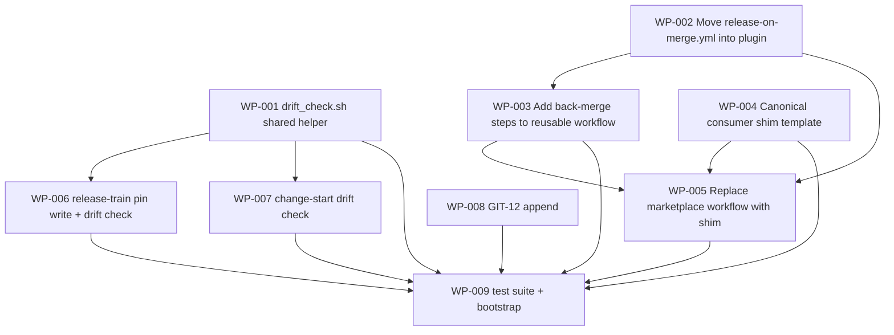

# Work Package Index — auto-back-merge-on-release

> **TDD:** [../TDD.md](../TDD.md)
> **SIZING:** [../SIZING.md](../SIZING.md)
> **ARCH:** [../ARCH.yaml](../ARCH.yaml)
> **Total WPs:** 9
> **Critical path:** WP-002 → WP-003 → WP-005 → WP-009 (4 packages
> serial; the long pole is move workflow → add back-merge steps →
> marketplace shim flip → end-to-end test suite + n=1 dogfood)
> **Peak parallelism:** 7 (at t=0, WP-001 + WP-002 + WP-004 + WP-008
> can all be in flight simultaneously; WP-006 + WP-007 join the
> moment WP-001 lands. WP-003 unblocks once WP-002 lands. WP-005 +
> WP-009 are the tail.)

## Status Summary

| Status | Count |
|---|---|
| pending | 9 |
| in_progress | 0 |
| done | 0 |
| blocked | 0 |

## Primitive Distribution

| Group | Primitive | Count | WPs |
|---|---|---|---|
| GENERATE | Create | 3 | WP-001 (drift_check.sh shared helper), WP-004 (canonical shim template), WP-009 (test suite + bootstrap) |
| EXPAND | Extend | 4 | WP-003 (back-merge step block), WP-006 (release-train pin write + drift check), WP-007 (change-start drift check), WP-008 (GIT-12 append) |
| REORGANISE | Move | 1 | WP-002 (move release-on-merge.yml into plugin as reusable workflow) |
| SUBSTITUTE | Replace | 1 | WP-005 (replace marketplace's workflow with shim — n=1 dogfood) |
| REINFORCE | — | 0 | — (test/instrument work folded into each WP's Red phase per RGB discipline; WP-009 is the consolidated proof artifact) |

> Per `references/change-primitives.md` Ports-vs-Wrappers rule: no
> Wrap WPs in this set. WP-005 is SUBSTITUTE-Replace (the
> marketplace's old workflow is removed wholesale; the shim is a
> direct consumer of GitHub's reusable-workflow contract, not a
> wrapper over internal code). WP-002 is REORGANISE-Move (file moves
> to a new path with two structural adjustments — characterisation
> test enforces byte-equivalence of the steps block).

## Kind Distribution

| Kind | Count | WPs |
|---|---|---|
| backend | 2 | WP-001 (drift_check.sh shared helper + smoke tests), WP-009 (test suite — fixtures, stubs, orchestrator, bootstrap) |
| infra | 4 | WP-002 (move workflow YAML), WP-003 (extend workflow YAML — back-merge steps), WP-004 (shim template YAML + README install section), WP-005 (substitute marketplace workflow with shim) |
| docs | 3 | WP-006 (release-train SKILL.md), WP-007 (change/SKILL.md), WP-008 (git-workflow-standard.md GIT-12 append) |

> **Cross-kind shape:** triggered. WP set spans `backend` (helper +
> tests) + `infra` (YAML) + `docs` (skill prose + standards). Per
> WP-08.5 contract-first ordering, the shared bash helper IS the
> cross-kind contract — every other WP that uses canonical strings
> reads them from `plugins/sulis/scripts/drift_check.sh` (via
> sourcing or via byte-parity-asserted literals). WP-001 is therefore
> at the head of the dep graph: WP-006, WP-007, WP-009 all bind to
> its constants; WP-003 and WP-008 use the same literals enforced by
> parity tests in WP-009.

> **Visual contract:** not applicable. No user-facing visual surface
> in this change. The "user" is the operator who triggers a release;
> the surface is `git log` + the GitHub PR list + the workflow run
> log. Plain-English audit lines are specified in TDD §5.7 (log
> grep-friendliness) — verified by WP-009's static tests, no visual
> design needed.

## Wrap Audit

> All Wrap WPs reviewed for No-Band-Aid-Wrappers compliance.

| WP | Subject | Ownership | Removal Plan | Status |
|---|---|---|---|---|
| (none) | — | — | — | — |

No Wraps proposed. The reusable workflow + shim pattern is
GitHub-native composition (reusable workflows are the canonical
GitHub mechanism for cross-repo CI logic) — the shim is a CONSUMER
of an external GitHub-defined contract, not a wrapper over internal
code. The marketplace's old workflow is being REPLACED (WP-005), not
wrapped — Replace is the right primitive per the cross-group
decision priority (step 5: "Should I REPLACE rather than wrap?").

No wrapper rot detected on existing modules. The previous
back-integration practice was manual — no abstraction layer existed
to rot.

## Characterisation Tests (REORGANISE compliance)

WP-002 is the only REORGANISE WP in the set. Per the
characterisation-tests-before-refactor MUST rule:

| WP | Subject | Characterisation Test |
|---|---|---|
| WP-002 | The 280-line `.github/workflows/release-on-merge.yml` being moved into the plugin | `tests/methodology/test_release_on_merge_yaml_unchanged_behaviour.sh` — diffs the new file's steps block against a captured snapshot of the pre-move file's steps block; asserts byte-equivalent modulo the `on:` + `permissions:` adjustments. Recorded in WP-002 frontmatter. |

## Dependency Graph

## WP Table

| ID | Title | Primitive | Group | Kind | Status | Depends On | Blocks | Token (in/out) | TDD § |
|---|---|---|---|---|---|---|---|---|---|
| WP-001 | Author `plugins/sulis/scripts/drift_check.sh` — the shared dev-behind-main drift helper | create | GENERATE | backend | done | — | WP-006, WP-007, WP-009 | 2k / 2k | §4.2 comp-drift-helper; §5.5 |
| WP-002 | Move `release-on-merge.yml` into the plugin as a reusable workflow (no back-merge yet) | refactor (Move) | REORGANISE | infra | done | — | WP-003, WP-005, WP-009 | 3k / 3k | §4.2 comp-reusable-workflow; §5.1 |
| WP-003 | Add the back-merge step block to the reusable workflow (pin-read + decide+act + post-condition) | extend | EXPAND | infra | pending | WP-002 | WP-005, WP-009 | 4k / 4k | §4.2; §5.2; §5.3; §5.6; §5.7 |
| WP-004 | Author the canonical consumer shim template at `plugins/sulis/templates/shims/release-on-merge.yml` | create | GENERATE | infra | done | — | WP-005, WP-009 | 2k / 2k | §4.2 comp-shim-template; §5.4; §5.8 |
| WP-005 | Replace marketplace's `.github/workflows/release-on-merge.yml` with a shim (n=1 dogfood) | substitute-replace | SUBSTITUTE | infra | pending | WP-002, WP-003, WP-004 | WP-009 | 2k / 2k | §4.2 comp-marketplace-shim; §6.5; §9.1 |
| WP-006 | Extend `/sulis:release-train` SKILL.md — drift-check preflight (Step 1) + `dev-sha-at-open` pin writer (Step 5) | extend | EXPAND | docs | pending | WP-001 | WP-009 | 3k / 3k | §4.2 comp-pin-writer + comp-drift-check-rt; §3; §5.5 |
| WP-007 | Extend `/sulis:change start` preflight — invoke `drift_check.sh` before branch creation | extend | EXPAND | docs | pending | WP-001 | WP-009 | 2k / 2k | §4.2 comp-drift-check-cs; §5.5 |
| WP-008 | Append GIT-12 — Auto-back-merge on release (MUST) — to `git-workflow-standard.md` | extend | EXPAND | docs | done | — | WP-009 | 2k / 3k | §4.2 comp-git12-rule; §3; §6.6 |
| WP-009 | Author the full test suite — unit + regression + chaos + bootstrap-from-zero | create | GENERATE | backend | pending | WP-001, WP-003, WP-004, WP-005, WP-006, WP-007, WP-008 | — | 4k / 5k | §6 (Proof); §9 (Verification Plan) |

**Totals:** ~24k input + ~26k output ≈ 50k tokens for the full WP set
(comfortably under the 20k+12k budget noted in the change brief —
the suite is small enough to fit, with margin).

## Recommended Implementation Order

1. **First wave (parallel, 4 WPs):** WP-001 (drift_check.sh
   helper — head of helper-dep tree), WP-002 (move workflow), WP-004
   (shim template), WP-008 (GIT-12 append) — all four have no
   dependencies and touch disjoint files.

2. **Second wave (parallel, 3 WPs):** WP-003 (back-merge steps —
   needs WP-002), WP-006 (release-train pin write + drift —
   needs WP-001), WP-007 (change-start drift — needs WP-001) — all
   three unblocked after wave 1 lands.

3. **Third wave (serial, 1 WP):** WP-005 (marketplace shim flip —
   needs WP-002 + WP-003 + WP-004 all landed). This is the n=1
   dogfood gate; the next release after this lands exercises the
   full chain.

4. **Fourth wave (serial, 1 WP):** WP-009 (test suite — needs every
   production WP landed). Terminal node.

Critical path: **WP-002 → WP-003 → WP-005 → WP-009** (four sequential
merges). WP-002 + WP-003 carry the load-bearing YAML; WP-005 is the
gate that proves the chain works end-to-end via the next release;
WP-009 is the regression armour.

WP-008 (GIT-12) can be drafted in wave 1 because the standards-doc
rule is a pure append with no code dependencies — landing it early
means WP-006 and WP-009 can reference GIT-12 by name.

## Cross-WP Identifier Canonicalisation (P8)

Per TDD §3 — four cross-component identifiers + the pin format. All
five are sourced from TDD §3 and referenced (not redefined) by every
consuming WP:

| Identifier | Authoring WP | Consuming WPs | Source-of-truth file |
|---|---|---|---|
| `dev-sha-at-open: <40-hex-SHA>` pin format | WP-006 (writer) + WP-003 (reader regex) | WP-008 (worked examples), WP-009 (parity test) | TDD §3 — anchored at `dev-sha-at-open`. Format: `<!-- dev-sha-at-open: [a-f0-9]{40} -->`. ADR-005 (write) + ADR-006 (read). |
| `back-integrate` PR label | WP-001 (`LABEL` constant) | WP-003 (workflow `--label`), WP-006 (drift recovery msg via helper), WP-008 (GIT-12 worked examples), WP-009 (parity test) | TDD §3 + WP-001's `drift_check.sh` `LABEL="back-integrate"`. |
| Back-merge PR title prefix `chore: back-integrate main → dev` | WP-001 (`TITLE_PREFIX` constant) | WP-003 (workflow `--title`), WP-008 (GIT-12 worked examples), WP-009 (parity test) | TDD §3 + WP-001's `drift_check.sh` `TITLE_PREFIX="chore: back-integrate main → dev"`. |
| Back-merge PR base/head (base=`dev`, head=`main`) | WP-001 (`BASE_BRANCH`, `HEAD_BRANCH` constants) | WP-003 (workflow `gh pr create`), WP-008 (worked examples), WP-009 (parity test) | TDD §3 + WP-001's constants. |
| `dev-sha-at-open` regex extraction pattern | WP-003 (workflow grep) | WP-006 (writer format must match), WP-009 (parity test) | ADR-006 + TDD §3. Pattern: `dev-sha-at-open: ([a-f0-9]{40})`. |

WP-009's `test_canonical_strings_parity.sh` is the single test that
enforces these five identifiers stay aligned across the four
sources (`drift_check.sh`, the reusable workflow YAML, the
release-train SKILL.md, GIT-12). Any source drift fails the test
loudly.

## Validation

See [`DECOMPOSE_VALIDATION.md`](./DECOMPOSE_VALIDATION.md) for the
P1..P8 rubric report.
