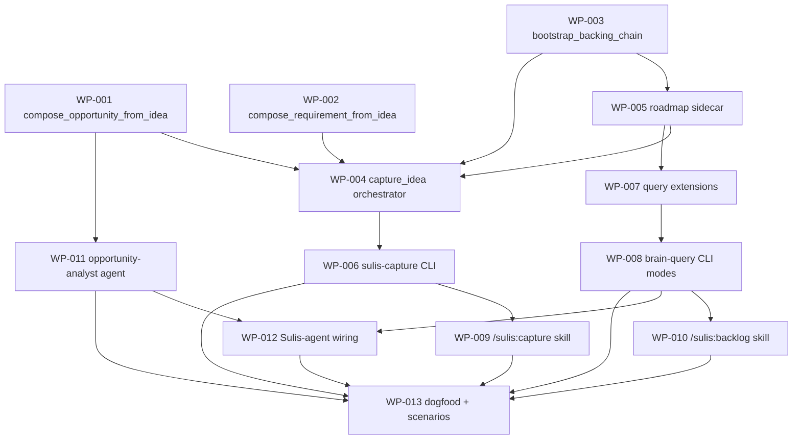

# Work Package Index — Brain as a living backlog + traversable memory

> **Change:** CH-01KT60 · `create` · `brain-backlog-and-traversal`
> **TDD:** [TDD.md](../TDD.md)
> **ARCH:** [ARCH.yaml](../ARCH.yaml) · Tier M
> **Total WPs:** 13
> **Critical path:** WP-003 → WP-005 → WP-004 → WP-006 → WP-009 → WP-013 (6 packages)
> **Peak parallelism:** 5 (WP-001, WP-002, WP-003, WP-007-after-005, and the skill/agent WPs once their deps land)

## How the set is ordered (the bootstrapping circularity)

The two verification scenarios verify the capture/emit path, which does not
exist until built. So the set builds the **machinery first** (WP-001..WP-012)
and does the **dogfood emission last** (WP-013), capturing this change's own
ideas *through* the new capture path — never via `--from-srd`. Three pieces:

- **Capture path:** WP-001, WP-002 (single-idea compose fns) · WP-003 (backing-chain bootstrap) · WP-005 (roadmap sidecar) · WP-004 (orchestrator) · WP-006 (CLI) · WP-009 (`/sulis:capture` skill).
- **Traverse path:** WP-007 (query extensions) · WP-008 (CLI modes) · WP-010 (`/sulis:backlog` skill) · WP-012 (Sulis-agent wiring, FR-08).
- **Opportunity-analyst agent:** WP-011 (the facilitation agent, composes via the store).
- **Dogfood + scenarios (last):** WP-013.

## Status Summary

| Status | Count |
|---|---|
| pending | 13 |
| in_progress | 0 |
| done | 0 |
| blocked | 0 |

## Primitive Distribution

| Group | Primitive | Count | WPs |
|---|---|---|---|
| EXPAND | Extend | 4 | WP-001, WP-002, WP-007, WP-008 |
| EXPAND | Create | 8 | WP-003, WP-004, WP-005, WP-006, WP-009, WP-010, WP-011, WP-013 |
| REORGANISE | Refactor | 1 | WP-012 |
| SUBSTITUTE | Wrap | 0 | — |
| REINFORCE | (orthogonal) | 0 standalone | (RGB Red carries the test discipline per-WP) |

> Every "new module/fn" here is a *consumer* of ports the domain already owns
> (`EntityRepository`, the canonical `TenantDeriver`, the `_brain_query`
> predicates) — EXPAND-Create/Extend, **not** SUBSTITUTE-Wrap (TDD Form
> "Ports & Adapters ≠ Wrappers"). The single internal-code edit (WP-012,
> `sulis.md`) is REORGANISE-Refactor and carries a characterisation test.

## Adapter Distribution

> Canonical adapter values live in
> [`VERIFICATION_QUESTIONS.md`](../../../../plugins/sulis/references/standards/VERIFICATION_QUESTIONS.md)
> (cite, never inline). All WPs are `verification:` Shape 1 (concrete).

| Adapter | Count | WPs |
|---|---|---|
| backend | 13 | WP-001 … WP-013 |
| frontend | 0 | — |
| async | 0 | — |
| contract | 0 | — |
| infra | 0 | — |
| docs | 0 | — |
| methodology | 0 | (skill/agent shape tests live under `tests/methodology/` but the change `kind:` is backend; pytest nodeids are the artifact) |
| (carveout — `na: true`) | 0 | — |

> **Cross-kind note:** This change is **single-kind (`backend`)**. The Python
> scripts, skill bodies, and agent bodies are all verified through the
> backend adapter (pytest nodeids + the run-from-graph scenario harness). No
> producer/consumer *data* contract seam crosses kinds, so WP-08.5's
> `kind: contract` WP is **not required** (the CLI JSON envelopes are
> produced and consumed within the same backend kind; their shape is pinned
> by the CLI integration tests in WP-006/WP-008 per CONTRACT_FIRST CF-03).

## Wrap Audit

> All Wrap WPs reviewed for No-Band-Aid-Wrappers compliance.

| WP | Subject | Ownership | Removal Plan | Status |
|---|---|---|---|---|
| (none) | — | — | — | — |

No Wraps proposed. No wrapper rot detected — every new module consumes a
domain-owned port (Create/Extend), and the one internal edit (WP-012) is a
characterised Refactor, not a wrapper.

## Dependency Graph

## WP Table

| ID | Title | Primitive | Status | Depends On | Blocks | Token (in/out) | TDD § |
|---|---|---|---|---|---|---|---|
| WP-001 | compose_opportunity_from_idea | extend | done | — | WP-004, WP-011 | 6k / 2k | Form inventory |
| WP-002 | compose_requirement_from_idea | extend | done | — | WP-004 | 6k / 2k | Form inventory |
| WP-003 | bootstrap_backing_chain (Tenant+Product) | create | done | — | WP-004, WP-005 | 9k / 4k | ADR-002 |
| WP-004 | capture_idea orchestrator (quick+full gate) | create | done | WP-001, WP-002, WP-003, WP-005 | WP-006 | 12k / 4k | Form dep picture |
| WP-005 | roadmap sidecar reader + writer | create | done | WP-003 | WP-004, WP-007 | 5k / 3k | ADR-001 |
| WP-006 | sulis-capture CLI (JSON envelope) | create | pending | WP-004 | WP-009, WP-013 | 8k / 3k | Form / Proof |
| WP-007 | _brain_query extensions (views + states) | extend | done | WP-005 | WP-008 | 8k / 3k | ADR-006 |
| WP-008 | sulis-brain-query CLI modes | extend | pending | WP-007 | WP-010, WP-012, WP-013 | 7k / 3k | ADR-006 |
| WP-009 | /sulis:capture skill | create | pending | WP-006 | WP-013 | 8k / 4k | FR-01/02/05 |
| WP-010 | /sulis:backlog skill | create | pending | WP-008 | WP-013 | 7k / 4k | FR-07 |
| WP-011 | opportunity-analyst agent | create | done | WP-001 | WP-012, WP-013 | 12k / 6k | FR-11 |
| WP-012 | Sulis-agent traverse + analyst wiring | refactor | pending | WP-008, WP-011 | WP-013 | 9k / 4k | FR-08 |
| WP-013 | dogfood + scenario emission (LAST) | create | pending | WP-006, WP-008, WP-009, WP-010, WP-011, WP-012 | — | 14k / 5k | Proof scenarios |
| WP-AUTO-001 | Auto-draft from SF-001 | Harden | auto-draft | WP-002 | — | ? | — |
| WP-AUTO-002 | Auto-draft from SF-002 | Harden | auto-draft | WP-005 | — | ? | — |

## Recommended Implementation Order

1. **Ready now (no deps):** WP-001, WP-002, WP-003.
2. After WP-003: WP-005.
3. After WP-005: WP-007 (and WP-004 once WP-001+WP-002+WP-005 all land).
4. After WP-007: WP-008. After WP-001: WP-011 (parallel with the capture-side).
5. After WP-004: WP-006. After WP-006: WP-009.
6. After WP-008: WP-010, WP-012 (WP-012 also needs WP-011).
7. **Last:** WP-013 (gated on WP-006, WP-008, WP-009, WP-010, WP-011, WP-012).

## Validation

See [DECOMPOSE_VALIDATION.md](DECOMPOSE_VALIDATION.md). Verdict: **PASS**.
