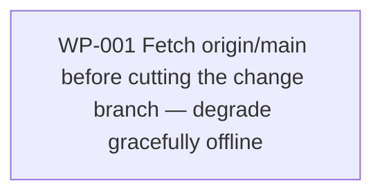

# Work Package Index — change-start-fetch-base

> **Spec:** [../../../.changes/fix-change-start-fetch-base.SPEC.md](../../../.changes/fix-change-start-fetch-base.SPEC.md)
> **Change:** CH-01KTP2 · fix · `01KTP2EA90VM797BXBWTYMCEB4`
> **Total WPs:** 1
> **Critical path:** WP-001 (single contained fix — no dependency chain)
> **Peak parallelism:** 1

## Status Summary

| Status | Count |
|---|---|
| pending | 0 |
| in_progress | 1 |
| done | 0 |
| blocked | 0 |

## Primitive Distribution

| Group | Primitive | Count | WPs |
|---|---|---|---|
| REINFORCE | Fix (add missing `git fetch origin {base_ref}` to `cmd_start`, branch off the fetched tip; pinned by a characterisation test) | 1 | WP-001 |
| EXPAND | Create | 0 | — |
| REORGANISE | Refactor / Move | 0 | — |
| SUBSTITUTE | Wrap | 0 | — |
| CONTRACT | Deprecate / Delete | 0 | — |

> WP-001 reinforces the existing `start` code path against a stale-base
> failure mode. No new component, no structural move, no wrapper. The fetch
> follows the established in-file convention (the `finish` subcommand's
> `git fetch origin {base_ref}` at line ~818), diverging only in failure
> handling: `start` degrades gracefully (logs + falls back to the local ref)
> rather than `emit_error`-ing, so an offline `start` still works.

## Kind Distribution

| Kind | Count | WPs |
|---|---|---|
| backend | 1 | WP-001 (`sulis-change` Python CLI + integration tests + docs-truth fix to `change/SKILL.md`) |

> Single-kind backend, non-visual. No contract WP (no cross-kind data
> contract). No visual-contract WP (no user-facing visual surface — internal
> tooling CLI). The `change/SKILL.md` edit is a docs-truth correction folded
> into the same WP (the doc currently claims behaviour the code does not yet
> exhibit) — not a separate kind.

## Wrap Audit

> All Wrap WPs reviewed for No-Band-Aid-Wrappers compliance.

| WP | Subject | Ownership | Removal Plan | Status |
|---|---|---|---|---|
| (none) | — | — | — | — |

No Wraps proposed. WP-001 is an in-place reinforcement of `cmd_start`; no new
layer over internal code.

## Dependency Graph

Single node; no edges.

## WP Table

| ID | Title | Primitive | Kind | Status | Depends On | Blocks | Token (in/out) | Spec § |
|---|---|---|---|---|---|---|---|---|
| WP-001 | sulis-change start fetches origin/{base_ref} before cutting the change branch | fix | backend | in_progress | — | — | 6k / 7k | SPEC §What this should do; §How we'll know it's done; §What to avoid |

**Totals:** ~6k input + ~7k output ≈ 13k tokens for the WP set.

## Recommended Implementation Order

1. **Sole wave:** WP-001. One contained fix — no ordering to express.

Within WP-001, the RGB cycle orders the work: write the failing integration
tests first — three cases per the handoff: (1) local `main` behind
`origin/main` → branch off the fetched tip, (2) offline / no remote → graceful
fallback to the local ref, (3) explicit `--base <branch>` → same
fetch-then-remote-preferred resolution. See cases 1 and 3 fail against current
code, add the fetch-then-branch-off-fresh step to `cmd_start` (default `main`
and explicit `--base` alike), then confirm all three plus the existing `start`
tests stay green. Finally correct the docs-truth claim in `change/SKILL.md`
(line ~131) so the documented base-resolution matches the now-shipped
behaviour — landed after the code tests pass, never ahead of them.

## Notes

- **Journey-walk exempt:** non-user-facing tooling (the `sulis-change` CLI is
  internal change machinery, not a founder-facing product surface). No TDD,
  no ADR — a single-call hardening with an established in-file convention to
  follow. Recorded here per the change brief's journey-walk-exemption note.
