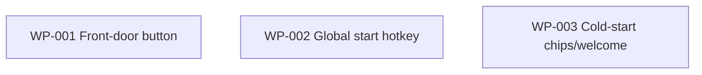

# Work Package Index — cockpit-start-change-button

> **TDD:** [TDD.md](../TDD.md)
> **SIZING:** [SIZING.md](../SIZING.md) — tier **S**
> **Total WPs:** 3
> **Critical path:** none — all three WPs are independent (length 1 each)
> **Peak parallelism:** 3 (all WPs are ready and touch disjoint files)

> ## ⚠️ Branch dependency (MUST read before any implementation)
>
> **These WPs build on `change/create-change-owned-terminal-shared-session`, NOT
> `main`.** The components they edit — `WorkspaceTopBar.tsx`,
> `WorkspaceShell.tsx`, `StartFromIntent.tsx` — and the pieces they reuse — the
> `/start` route, `StartFromIntentPage`, `useStartFromIntent`, the
> `streamStartFromIntent` funnel, the `ProductSwitcher` keydown idiom — exist on
> that in-flight branch and are **absent from `main` today** (verified: all five
> referenced files resolve on `origin/change/create-change-owned-terminal-shared-session`
> and none resolve on this branch's `main` base).
>
> Implementation must start from that branch (or from its merge into this
> change branch). Building against `main` as-is will fail immediately — the
> files don't exist there. This is the SPEC's "depends on the chat + terminal
> work landing first" constraint, made concrete.
>
> **Visual contract:** `.design/cockpit-start-change-button/SIGNOFF.md` is
> `production-approved` (2026-06-08). Treated as a satisfied prerequisite — no
> visual-contract WP is created and no fresh sign-off is required (per the
> change brief).

## Status Summary

| Status | Count |
|---|---|
| pending | 3 |
| in_progress | 0 |
| done | 0 |
| blocked | 0 |

## Primitive Distribution

| Group | Primitive | Count | WPs |
|---|---|---|---|
| EXPAND | Extend | 2 | WP-001, WP-003 |
| EXPAND | Create | 1 | WP-002 |

> WP-002 (`useStartHotkey`) is **create** — a net-new hook, the only genuinely
> new architecture in the change. WP-001 and WP-003 **extend** existing
> components through their existing entry points (`navigate()`; `draft`/`propose()`).
> No Wrap, no Refactor, no Replace — nothing reaches into infrastructure.

## Adapter Distribution

> Canonical adapter values live in
> [`VERIFICATION_QUESTIONS.md`](../../../plugins/sulis/references/standards/VERIFICATION_QUESTIONS.md)
> (cite, never inline). All three WPs are `verification:` Shape 1 (concrete).

| Adapter | Count | WPs |
|---|---|---|
| backend | 0 | — |
| frontend | 3 | WP-001, WP-002, WP-003 |
| async | 0 | — |
| contract | 0 | — |
| infra | 0 | — |
| docs | 0 | — |
| methodology | 0 | — |
| (carveout — `na: true`) | 0 | — |

## Wrap Audit

> All Wrap WPs reviewed for No-Band-Aid-Wrappers compliance.

| WP | Subject | Ownership | Removal Plan | Status |
|---|---|---|---|---|
| (none) | — | — | — | — |

No Wraps proposed. No wrapper rot detected — every WP either extends an existing
component through its existing entry point or creates a net-new hook.

## Dependency Graph

> No edges: the three WPs are fully independent. Each touches a disjoint file
> set and a disjoint test file. All three share one external prerequisite — the
> chat+terminal branch (satisfied when implementation starts from it).

## WP Table

| ID | Title | Primitive | Status | Depends On | Blocks | Token (in/out) | TDD § |
|---|---|---|---|---|---|---|---|
| WP-001 | Front-door "Start something new" button in WorkspaceTopBar | extend | pending | — | — | 7k / 3k | Form — Front-door button |
| WP-002 | Global ⌘N / ⌘K start hotkey mounted in WorkspaceShell | create | pending | — | — | 6k / 3k | Form — Global hotkey |
| WP-003 | Cold-start chips + soft welcome on StartFromIntent empty state | extend | pending | — | — | 8k / 4k | Form — Cold-start empty state |

## Recommended Implementation Order

All three are ready and parallel. There is no enforced order; suggested pickup
for a single executor working sequentially (smallest blast radius first):

1. **WP-002** (new isolated hook + one-line shell mount — smallest, no edits to a busy component).
2. **WP-001** (one button in the top bar; may extract the shared `⌘N` hint constant WP-002 references).
3. **WP-003** (the cold-start block inside `StartFromIntent` — the one new UI piece; largest test surface).

If three executors are available, dispatch all three at once — no merge
collision (disjoint files, disjoint test files).

## File Touch Map (collision check)

| WP | Files created | Files edited |
|---|---|---|
| WP-001 | — | `components/WorkspaceTopBar.tsx`, `tests/WorkspaceTopBar.test.tsx` |
| WP-002 | `api/useStartHotkey.ts`, `tests/useStartHotkey.test.tsx` | `layouts/WorkspaceShell.tsx` |
| WP-003 | — | `components/StartFromIntent.tsx`, `styles/StartFromIntent.module.css`, `tests/StartFromIntent.test.tsx` |

No two WPs create or edit the same file. The only soft coupling is the optional
shared `⌘N` hint constant (WP-001 may extract it; WP-002 references it) — a Blue-step
nicety, not a merge dependency.
