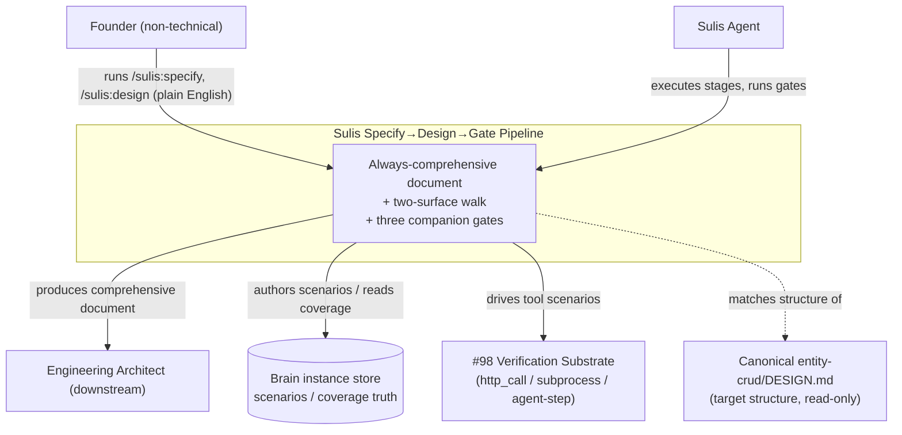
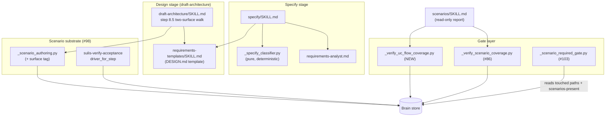
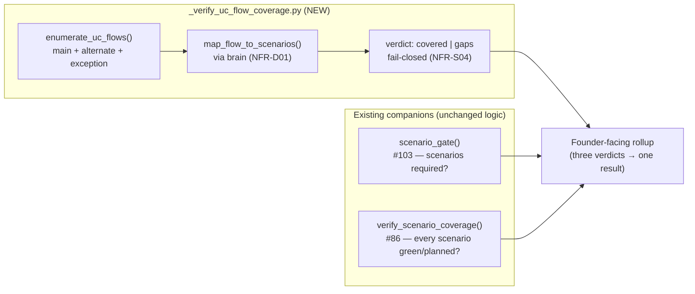

# Comprehensive Spec & Two-Surface Journey Walk — Technical Design

**Status:** Draft
**Version:** 1.0.0
**Created:** 2026-06-09
**Author:** Sulis Engineering Architect (AI)
**Change:** CH-CQRWWR (`01KTPWDWJ7CQRWWRGPQEQ22P1M`) · primitive `harden`
**Slug:** `comprehensive-spec-and-journey-walk`
**SRD:** `.specifications/comprehensive-spec-and-journey-walk/SRD.md` (FR-01..FR-19)
**Classification:** Methodology / tooling change to the Sulis marketplace itself
**Target model:** `features/entity-crud/DESIGN.md` (platform repo) — the comprehensive document this change makes Sulis always produce. This design **eats its own dogfood**: it follows the very Target Structure (FR-11) it specifies.

---

## 1. Executive Summary

Sulis's specify/design stages today treat **depth** (lite/standard/deep) as a
lever on *document thinness*: a lite change writes a ten-line `SPEC.md` and
skips use cases, NFR, threat model, and diagrams; only a deep change (routed to
the requirements specialist) produces the comprehensive document. That is
backwards — the smallest changes get the least design rigour, so the bypasses
that ship broken work (skip use cases, walk one surface, write happy-path-only
scenarios) all live in the lite/standard path.

This change makes three corrections across three phases:

1. **Decouple depth from doc-existence.** The comprehensive design document is
   *always* produced — use cases with flows, measurable NFR, personas, scope,
   problem discovery, threat model. Depth sizes only the *interview*, never
   which sections exist.
2. **Two-surface outside-in journey walk + UC-derived scenarios.** The existing
   single-surface (UI) walk at `draft-architecture/SKILL.md` step 8.5 is
   extended to a second surface — the API/SDK/MCP **tool** surface — so the
   machine consumer's path receives the same outside-in proof the human's
   does. Verifiable scenarios are derived from *every* use-case flow
   (main/alternate/exception) for both surfaces, and a **UC-flow-coverage
   gate** enforces flow-level completeness.
3. **Round out the comprehensive document.** Add an always-on STRIDE threat
   model, architecture-at-levels (C4 context/container/component), Business
   Decision Records (BDR) alongside ADRs, and a mandatory **interface-contract
   section** (the ServiceSpec / schema layer + CF-10 founder-reviewable
   dimensions) for any change with a tool surface.

The design is delta-driven. The structural substrate already exists — the
`_specify_classifier` (pure, deterministic), the #85 UI walk, the #98
verification substrate (scripted `http_call`/`subprocess` + agent-step drivers),
the #103 scenario-required gate, the #86 journey-coverage gate, the brain
instance store. The work is to **decouple, extend, and compose** these, not to
rebuild them. The central design task — the two-surface journey walk over this
change's own journeys (§6.5) — *is* the gap analysis: it tells us, hop by hop,
exactly what already EXISTS (with file+function citations) and what must be
built as a Work Package across all three phases.

---

## 2. Problem Discovery

### 2.1 Problem Statement

Depth and doc-existence are coupled. A founder running `/sulis:specify` on a
"small" change gets a thin spec with no use cases, no measurable non-functional
targets, and no threat model — so the design stage has nothing to walk, the
scenario gate has nothing to require, and incomplete work ships. The smallest
changes — the ones least scrutinised — are exactly where the bypasses live.

### 2.2 Current Behaviour

- **`plugins/sulis/skills/specify/SKILL.md`** (lines 54–56) gates the document
  *shape* on depth: lite → "a ten-line `SPEC.md`"; standard → "a `SPEC.md` with
  goal / in / out / done / avoid"; deep → "a `SPEC.md` plus flow diagrams (the
  requirements specialist runs this)." Use cases, NFR, threat model, and
  personas exist **only** in the deep path.
- **`plugins/sulis/scripts/_specify_classifier.py`** `_DEPTH_PHRASE` (line 236)
  reinforces the coupling in founder-facing prose: lite is described as "a
  quick lite spec (three lines, about thirty seconds)". The founder is told the
  *document* will be three lines, not that the *interview* will be short.
- **`plugins/sulis/skills/draft-architecture/SKILL.md`** step 8.5 walks **one**
  surface — the scenario's journey, hop-by-hop, classified
  EXISTS/planned-WP/GAP, with a sharper bar for host-rendered hops. There is no
  second pass for the machine consumer's (tool) path.
- **`plugins/sulis/scripts/_verify_scenario_coverage.py`** classifies coverage
  per *scenario* within a journey (green / planned / out-of-scope / GAP). It
  has **no UC-flow dimension** (it cannot tell that an exception flow has no
  covering scenario) and **no surface dimension** (it cannot tell that the tool
  surface was never walked).
- **`plugins/sulis/scripts/_scenario_authoring.py`** `assemble_scenario_graph`
  has a `seed` (stable IDs, NFR-05) but **no `surface` parameter** — a scenario
  cannot be tagged UI vs tool as a first-class property.
- The **`decision` brain schema**
  (`plugins/sulis/brain/compiled/product-development/decision.schema.json`) has
  no `kind`/`category` field — there is no way to distinguish a technical ADR
  from a business BDR.
- **`plugins/sulis/skills/requirements-templates/SKILL.md`** carries SRD / UC /
  diagram / NFR / Verification-Plan templates but **no comprehensive
  DESIGN.md / TDD section template** at all — the Target Structure (FR-11) has
  no template to emit from.

### 2.3 Desired Behaviour

Every behavioural change — regardless of depth — produces a comprehensive
design document carrying the full Target Structure (§6 here, FR-11 there).
Depth sizes only the interview. The design stage walks **both** the UI surface
and the tool surface, deriving a verifiable scenario from every UC flow on the
appropriate surface, and three companion gates (UC-flow-coverage,
scenario-required #103, journey-coverage #86) each independently block an
incomplete change. The document always carries a STRIDE threat model, C4
architecture-at-levels, BDRs alongside ADRs, and — for any tool surface — a
founder-reviewable interface contract that the tool-surface walk draws its
operations from.

### 2.4 Why Now?

- **Business driver:** the methodology is the product. A pipeline that lets
  incomplete work through on the cheap path undermines every downstream
  promise ("verified", "covered", "contract-first").
- **Technical driver:** the substrate is ready. #85 walk, #98 substrate,
  #103/#86 gates, the brain, and the canonical `entity-crud/DESIGN.md` target
  all exist. This is the composition layer over them.
- **Lesson driver:** the generalised MCP-Apps lesson ("looks-built-but-isn't-
  wired") applies to *every* tool surface, not just host-rendered UI. The
  one-surface walk leaves the machine consumer's path unproven.

### 2.5 Impact of Not Doing

- Small changes keep skipping use cases, NFR, and threat models — the
  completeness depends on the founder thinking to ask, which the non-technical
  founder cannot.
- Tool surfaces keep shipping unwired (false EXISTS) and contract-as-
  afterthought, with gaps surfacing only at integration.
- Exception flows keep going unverified behind happy-path-only scenarios.

---

## 3. Stakeholders / Personas

| Stakeholder | Role | Interest | Influence |
|-------------|------|----------|-----------|
| Founder | Runs `/sulis:specify`, `/sulis:design`; owns product direction | A complete record for every change without having to know what to ask for | High |
| Sulis agent | Executes the stages; produces artifacts; runs gates | Clear, deterministic rules for what to always produce and what blocks | N/A (automated actor) |
| Engineering architect (downstream) | Consumes the comprehensive document to design implementation | A document with use cases, NFR, contract, and threat model already present | High |

### 3.1 User Personas

**Primary actor: Founder (non-technical, default Novice).**
- Who: the human running `/sulis:specify` and `/sulis:design`.
- Goal: get a complete, reviewable design for any change — small or large —
  without learning what a STRIDE table, a ServiceSpec binding, or an alternate
  flow is.
- Context: plain-English chat; never asked to ratify depth; sees outcomes, not
  mechanism.

**Secondary actor: Sulis agent (automated).**
- Who: the Claude agent executing the specify/design stages.
- Goal: always produce the full document; walk both surfaces; derive a
  scenario per flow; run three gates; never bypass under token/time pressure.
- Context: deterministic classifier + scripted gates + brain as source of
  truth — the discipline is mechanical, not discretionary.

---

## 4. Requirements

### 4.1 Functional Requirements

Full text in the SRD. Recap by phase:

| ID | Requirement (recap) | Priority |
|----|---------------------|----------|
| FR-01 | Comprehensive document produced for EVERY behavioural change regardless of depth | Must |
| FR-02 | Depth sizes ONLY the intake, never which sections exist | Must |
| FR-03 | Classifier classifies intake size; never consulted for doc-section emission | Must |
| FR-04 | Depth proposal sentence describes interview size, not document completeness | Must |
| FR-05 | Design artifact restructured from legacy TDD shape toward the comprehensive DESIGN.md shape | Must |
| FR-06 | NFR always-on with measurable targets | Must |
| FR-07 | UI surface walk, hop-by-hop, each hop EXISTS/planned-WP/GAP (retained #85) | Must |
| FR-08 | Tool (API/SDK/MCP) surface walk — the second surface | Must |
| FR-09 | Tool EXISTS requires BOTH handler AND ServiceSpec binding cited | Must |
| FR-10 | Verifiable scenarios derived from every UC flow for both surfaces | Must |
| FR-11 | Comprehensive document contains the mandatory Target Structure in order | Must |
| FR-12 | UC-flow-coverage gate blocks if any flow has no covering scenario | Must |
| FR-13 | UC-flow-coverage gate is a companion to #103 and #86 — all three apply | Must |
| FR-14 | Tool-surface scenarios driven via the #98 substrate, no new mechanism | Must |
| FR-15 | Always-on STRIDE threat model section | Must |
| FR-16 | Architecture-at-levels (C4 context/container/component) | Must |
| FR-17 | BDR alongside ADR | Must |
| FR-18 | Mandatory interface-contract section (schema + 4 CF-10 dimensions) for tool surfaces | Must |
| FR-19 | Contract-first for cross-kind seams; tool-walk operations ⊆ contract | Must |

### 4.2 Non-Functional Requirements (measurable)

Full text in `NFR.md`. Architecturally-significant targets:

#### Performance
- **Depth classification:** `classify_depth` returns < 5 ms; 1000 calls < 5 s
  total (NFR-01). Pure function — no I/O (C-03).
- **Always-comprehensive cost:** producing the full section set at lite depth
  adds ≤ 1.6× the legacy lite SPEC token cost (NFR-02). The scaffold + headers
  + `n/a` justifications are cheap; full interview-derived detail is not added
  at lite.
- **Gates:** UC-flow-coverage + scenario-required + journey-coverage complete
  in < 3 s combined for ≤ 20 flows (NFR-03).
- **Two-surface walk:** ≤ 1 extra agent turn over single-surface for a journey
  of ≤ 15 hops (NFR-S01).

#### Security (methodology integrity — the "attackers" are bypasses)
- **No false EXISTS:** 0 tool hops classified EXISTS without a binding citation
  (NFR-S02).
- **No fake green:** 0 green tool scenarios without a real driven round-trip /
  deposited passing TestResult (NFR-S03).
- **Fail closed:** any uncovered flow with no out-of-scope record ⇒ blocking
  `gaps`; absence of coverage is a gap, never silently passed (NFR-S04).

#### Reliability
- **Degrade detail, not existence:** under token pressure all mandatory
  sections remain present (possibly `n/a — <justification>`); none dropped
  (NFR-R01).
- **Deferred, not dropped:** an undrivable tool scenario gets a deferred
  infrastructure-need entry, never a silent skip (NFR-R02).

#### Determinism & Data Integrity
- **Reproducible classification:** re-running the walk on an unchanged worktree
  yields an identical table (NFR-04). Stable scenario IDs from the same seed
  (NFR-05, reuses existing `seed`).
- **Brain is truth:** coverage verdict derives from `find_scenarios_for_journey`
  + `find_passing_testresults_for_scenario`, not an agent claim (NFR-D01).
- **Both tables + contract persisted:** the produced document carries a UI
  table AND a tool table (NFR-D02), plus an interface-contract section with the
  walk's operations ⊆ contract operations (NFR-D03).

### 4.3 Constraints

| ID | Constraint | Impact |
|----|------------|--------|
| C-01 | Document MUST match the canonical `entity-crud/DESIGN.md` section structure | Section names/ordering are fixed by the target, not invented |
| C-02 | `## Verification Plan` heading fixed verbatim by ADR-001 (verification-by-design) | P-VER regex anchors on it; no renaming |
| C-03 | Depth classifier stays deterministic and pure (no I/O) | Reuse `classify_depth`'s shape; change semantics, not purity |
| C-04 | Tool-surface walking reuses the #98 substrate (scripted + agent-step) | No new driver mechanism (FR-14) |
| C-05 | Scenario coverage reuses the brain as objective source of truth | Extend `_verify_scenario_coverage.py`; don't bypass the brain |
| C-06 | Founder-facing output stays in founder English (FE-01..10) | No internal IDs / jargon in `/sulis:specify` / `/sulis:design` chat |

### 4.4 Assumptions

| ID | Assumption | Risk if invalid | Status |
|----|------------|-----------------|--------|
| A-01 | `entity-crud/DESIGN.md` is the agreed Target Structure | FR-11 section set would be wrong | Confirmed (read + matched, §6.5 model) |
| A-02 | #98 substrate already drives tool calls (scripted `http_call`/`subprocess` + agent-step) | FR-14 would need new driver work | **Confirmed** — `driver_for_step` + `http_call` driver present in `sulis-verify-acceptance` (lines 48–60) |
| A-03 | Every behavioural change has a UI or tool surface, or is explicitly exempt (pure docs/infra) | The two-surface walk would mis-fire on a surfaceless change | Mitigated — the #85 exemption path is retained and extended |
| A-04 | Always-comprehensive document cost at lite is bounded | FR-01 too expensive to be always-on | Bounded by NFR-02 + NFR-R01 (degrade detail, not existence) |

### 4.5 Dependencies

| Dependency | Type | Status | Classification |
|------------|------|--------|----------------|
| #98 verification substrate (`sulis-verify-acceptance`, `_scenario_authoring.py`) | Internal | Ready | **Consume** (FR-14 — no new driver) |
| #85 UI journey walk (`draft-architecture/SKILL.md` step 8.5) | Internal | Ready | **Extend** (second surface) |
| #103 scenario-required gate (`_scenario_required_gate.py`) | Internal | Ready | **Compose** (companion) |
| #86 journey-coverage gate (the `_verify_scenario_coverage.py` read) | Internal | Ready | **Compose** (companion) + **Extend** (UC-flow dimension) |
| `_specify_classifier.py` | Internal | Ready | **Modify** (semantics + wording; keep purity) |
| `requirements-templates/SKILL.md` / TDD template | Internal | Ready | **Create** (no DESIGN.md template exists today) |
| `decision` brain schema | Internal (vendored compiled) | Ready | **Extend** (add ADR/BDR `kind`) — see ADR-006 |
| Canonical `entity-crud/DESIGN.md` target | External (platform repo) | Ready | **Reference** (read-only) |
| `CONTRACT_FIRST_STANDARD.md` (CF-01..12) | Internal | Ready | **Reference** (FR-18/FR-19 ground in CF-01/CF-05/CF-10) |

### 4.6 STRIDE Threat Model

The system under design is a **methodology pipeline**; its "attackers" are the
**bypasses** by which a change advances while skipping the discipline. The
threat actor is usually the *agent under shortcut pressure* (token/time budget)
or the *founder who doesn't know to ask* for completeness.

#### 4.6.1 STRIDE Analysis

| Category | Threat (against the methodology) | Applicable? | Mitigation | Status |
|----------|----------------------------------|-------------|------------|--------|
| **S**poofing | A change claims a hop EXISTS that is not actually wired (false EXISTS) | Yes | EXISTS requires cited file+function; tool EXISTS requires the ServiceSpec binding too (FR-09, NFR-S02) | Mitigated |
| **S**poofing (contract) | A tool surface ships with no interface contract, or one integratable-but-not-reviewable (missing CF-10 dimensions) — looks designed but the founder can't review the seam | Yes | The interface contract is a mandatory Solution-Design section carrying the four CF-10 dimensions (FR-18); the walk's operations must be ⊆ the contract (FR-19); absence ⇒ design stage does not complete (NR-07/08, MUC-07) | Mitigated |
| **T**ampering | A flow is silently dropped so no scenario is required for it | Yes | UC-flow-coverage gate enumerates ALL flows; an uncovered flow ⇒ `gaps` (FR-12). An out-of-scope flow MUST be recorded (NR-05); the brain is truth so a once-emitted flow can't be hidden (NFR-D01) | Mitigated |
| **R**epudiation | A business decision (scope cut) is made with no record | Yes | BDR captures business decisions, distinct from ADR (FR-17) | Mitigated |
| **I**nformation disclosure | N/A — methodology produces design docs, no sensitive runtime data | N/A | Founder English already strips internal IDs from founder-facing output (C-06) | N/A |
| **D**enial of service | The always-comprehensive document makes specify so slow/expensive founders skip it | Yes | Bounded token cost (NFR-02); depth still sizes the interview to keep small changes light; degrade detail not existence (NFR-R01) | Mitigated |
| **E**levation of privilege | A change skips the design stage entirely (no walk, no scenarios) | Yes | Gates are companions and each runs on every behavioural change (FR-13); the pure-docs exemption is explicit + recorded | Mitigated |

#### 4.6.2 Trust Boundary

```
┌───────────────────────────────────────────────────────────────┐
│  UNTRUSTED-FOR-COMPLETENESS: Founder's stated intent           │
│  (they may not know what to ask for)                           │
│  ═════════════════════════════════════════════════════════════ │ <- TB-01
│  THE AGENT: always produces the full document, walks both      │
│  surfaces, derives a scenario per flow                         │
│  ═════════════════════════════════════════════════════════════ │ <- TB-02
│  TRUSTED, COMPLETE RECORD: the comprehensive design document   │
│  + the brain scenario/coverage truth + the three gates         │
└───────────────────────────────────────────────────────────────┘
```

| Boundary | From | To | What crosses | Discipline enforced |
|----------|------|----|--------------|---------------------|
| TB-01 | Founder intent | Agent | Depth-sized intake (founder English) | Completeness must NOT depend on the founder asking — the agent always produces the full structure (FR-01) |
| TB-02 | Agent | Trusted record | The document + brain scenarios + gate verdicts | EXISTS/binding citations, UC-flow coverage, contract ⊆ walk — each mechanically checked, fail-closed (NFR-S02/S03/S04) |

The whole point: the agent crosses the completeness boundary by *always*
producing the full document, so completeness never depends on the founder
thinking to ask for it.

#### 4.6.3 Attack Surface

| Entry point | Type | Bypass it enables | Protection |
|-------------|------|-------------------|------------|
| Depth classification | deterministic call | "small ⇒ thin doc" (MUC-01) | FR-03: classifier output never consulted for section emission |
| The journey walk | agent step | one-surface walk (MUC-05); false EXISTS (MUC-02) | FR-08 two tables; FR-09 binding bar; NFR-D02 both persisted |
| Scenario derivation | agent step | happy-path-only (MUC-03); silent flow drop (MUC-04); fake-green (MUC-06) | FR-10 every flow; FR-12 UC-flow gate; NFR-S03 real drive |
| The contract section | doc section | contract-as-afterthought (MUC-07) | FR-18 mandatory + CF-10; FR-19 walk ⊆ contract |

#### 4.6.4 Threat Model Summary

| Metric | Value |
|--------|-------|
| STRIDE threats identified | 6 (+1 contract-spoofing sub-threat) |
| Trust boundaries documented | 2 |
| Attack-surface entry points | 4 |
| Unmitigated HIGH risks | 0 |
| Pre-mortem risks tracked | 4 (cost backlash, tool-walk theatre, gate fatigue, hollow contracts — see MISUSE_CASES.md) |

---

## 5. Scope

### 5.1 In Scope

- Decoupling depth from doc-existence in `specify/SKILL.md`,
  `_specify_classifier.py`, and the requirements-analyst path.
- A comprehensive DESIGN.md template in `requirements-templates/SKILL.md`
  matching the Target Structure (FR-11), incl. STRIDE, C4, BDR, and the
  interface-contract section.
- Extending `draft-architecture/SKILL.md` step 8.5 to a two-surface walk (UI
  table + tool table) with the tool-EXISTS binding bar.
- A surface dimension on scenario authoring (`_scenario_authoring.py`).
- A UC-flow-coverage gate (`_verify_uc_flow_coverage.py`) composing with #103
  and #86.
- The interface-contract section + a contract-⊆-walk assertion
  (`_assert_walk_subset_of_contract.py`).
- An ADR/BDR `kind` on the `decision` brain entity + emitter support.
- The fixture harness scripts the scenarios assume (`_drive_specify.py`,
  `_assert_doc_sections.py`, `_assert_interface_contract.py`, etc.) as test
  Work Packages.
- Surfacing the tool-surface scenarios + UC-flow coverage in
  `scenarios/SKILL.md` (read-only report).

### 5.2 Out of Scope

- Implementation of the WPs (this is design; `/sulis:plan-work` decomposes).
- The brain entity schema beyond the ADR/BDR `kind` and the scenario `surface`
  tag (no new entity types).
- Runtime products built *by* the methodology.
- A new driver mechanism for the tool surface — FR-14 forbids it; the #98
  substrate is reused.
- The Phase-2 contract-first *flip to MUST-at-write-time* (CF-07.5 Phase 2) —
  remains out of scope per CONTRACT_FIRST_STANDARD ADR-002.

### 5.3 MVP vs Future

**MVP (this change, all three phases):** decouple + always-on docs; two-surface
walk + UC-derived scenarios + UC-flow-coverage gate; STRIDE + C4 + BDR +
interface contract.

**Future:**
- Mechanical enforcement of the CF-10 "Lovable Test" via decompose-validation
  P7 (today a hand-held bar — see MISUSE_CASES.md pre-mortem 4).
- A unified founder-facing verdict surface across the three gates (pre-mortem 3
  — see BDR-002).
- Automatic emission of the contract section from the brain compiler.

---

## 6. Use Cases

The two actors are the **founder** and the **Sulis agent**. Full text in the
SRD §6 (UC-01..UC-06) with main/alternate/exception flows. Recap of the flow
inventory the UC-flow-coverage gate must enumerate:

| UC | Actor | Flows (main / alternate / exception) |
|----|-------|--------------------------------------|
| UC-01 Founder specifies at lite depth | Founder | main; 2a, 3a; 5a, 5b |
| UC-02 Agent produces doc regardless of depth | Agent | main; 3a, 3b; 2a, 4a, 4b |
| UC-03 Agent walks UI surface | Agent | main; 3a; 3b |
| UC-04 Agent walks tool surface | Agent | main; 3a; 2a, 4a, 6a |
| UC-05 Agent derives scenarios both surfaces | Agent | main; 2a; 2b, 3a |
| UC-06 UC-flow-coverage gate blocks | Founder + Agent | main; 2a; 2b, 3a |

Each flow is the source of ≥1 verifiable scenario (the SRD §7 coverage matrix
maps each to SC-01..SC-19). The UC-flow-coverage gate (FR-12) enumerates *all*
of these — main, alternate, AND exception — and requires a covering scenario or
a recorded out-of-scope decision for each.

### 6.5 THE CENTRAL DESIGN TASK — Two-Surface Journey Walk (this change's own journeys)

This is the heart of the design and *is* its gap analysis. We walk this
change's own two journeys outside-in, hop by hop, classifying each
`EXISTS (file+function)` / `planned-WP` / `GAP`. We dogfood the very discipline
being specified: the UI surface is the founder running specify/design and
reading the produced document; the tool surface is the specify/design machinery
a machine consumer drives.

The interface contract these walks draw their tool operations from is in §7.6.

#### Surface A — UI surface walk (the founder's path)

The founder's journey: *propose depth → answer interview → receive the
comprehensive document → read it → ship through the gate*. Each hop is the
founder-facing surface as the founder experiences it.

| # | Hop (founder action → what handles it) | Status | Evidence / disposition |
|---|----------------------------------------|--------|------------------------|
| A1 | Founder runs `/sulis:specify`; agent gathers the three signals | **EXISTS** | `specify/SKILL.md` Step 1 (signal gathering) + `_specify_classifier.paths_touch_founder_surface` |
| A2 | Agent proposes depth in plain English (interview size, NOT doc thinness) | **GAP → WP** | `_specify_classifier.proposal_sentence` + `_DEPTH_PHRASE`/`_DEPTH_ALT` EXIST but say "three lines" / "the deep version, with the flows drawn out" — they describe **doc thinness**. FR-04 needs reworded phrases. → **WP (Phase 1)** |
| A3 | Founder answers the depth-sized interview | **EXISTS** | `specify/SKILL.md` Step 4 lite/standard/deep modes (the interview itself stays; only its *coupling to doc shape* is severed) |
| A4 | Agent produces the comprehensive document with ALL mandatory sections | **GAP → WP** | Today lite writes a 10-line `SPEC.md` (lines 54–56); standard a 5-section `SPEC.md`; only deep produces the full doc via the analyst. FR-01/02/05 need the full Target Structure always. → **WP (Phase 1)** + the template **GAP** below |
| A5 | Founder reads a complete document (use cases, NFR, threat model, personas, scope, contract) | **GAP → WP** | No DESIGN.md template exists in `requirements-templates/SKILL.md` (only SRD/UC/NFR/Verification-Plan). The comprehensive structure has nothing to emit from. → **WP (Phase 1 + Phase 3)** |
| A6 | Founder ships; the gate reports `covered` or `gaps` in plain English | **EXISTS (partial)** | `_scenario_required_gate.py` (#103) + the `_verify_scenario_coverage.py` read (#86) EXIST and report. The **UC-flow** dimension of the verdict is a GAP (see tool walk T7). The founder-facing reporting surface EXISTS in `scenarios/SKILL.md` but lacks the UC-flow + surface view → **WP (Phase 2)** |

**UI walk verdict:** A1, A3 EXIST. A2, A4, A5 are GAP→WP (Phase 1 + the
template). A6 is partially EXISTS — the gate plumbing is there; the UC-flow
dimension and the founder-facing rollup are GAP→WP (Phase 2). No bare GAP
remains: every GAP has a planned WP.

#### Surface B — Tool surface walk (the machine consumer's path)

The machine consumer drives the specify/design machinery as a tool: the
classifier → the doc emitter → the journey-walk producer → the scenario author
→ the gates. Per FR-09, a tool hop is **EXISTS only if BOTH the handler AND its
binding are cited**; a serving handler with no binding is a GAP. The
"operations" walked are drawn from the interface contract (§7.6); per FR-19 no
walked operation may be absent from the contract.

| # | Operation (machine call → handler) | Binding | Status | Evidence / disposition |
|---|------------------------------------|---------|--------|------------------------|
| T1 | `classify_depth(primitive, file_count, founder_facing)` → `DepthDecision` | Pure function call (library binding — in-process; no transport) | **EXISTS** | `_specify_classifier.classify_depth` (lines 139–230). Pure, deterministic (C-03 honoured). FR-03 forbids consulting its output for doc-section emission — that's a **wiring** change at the caller (A4), not a change to this handler |
| T2 | Emit the comprehensive document (all mandatory sections) from depth-sized intake | Skill step (agent binding) reading a template | **GAP → WP** | No comprehensive-doc emitter and no template. `requirements-templates/SKILL.md` has SRD/UC/NFR templates but no DESIGN.md Target-Structure template. → **WP (Phase 1: emitter + template); WP (Phase 3: STRIDE/C4/BDR/contract sub-templates)** |
| T3 | Walk the UI surface, classify each hop, emit the UI `## Journey Walk` table | Skill step 8.5 (agent binding) over `find_scenarios_for_journey` + codebase cites | **EXISTS** | `draft-architecture/SKILL.md` step 8.5 (a)–(e). The UI table, the EXISTS/planned-WP/GAP classification, and the sharper host-rendered bar all EXIST. Binding: the brain read (`_brain_query.find_scenarios_for_journey`) + the skill's documented procedure |
| T4 | Walk the TOOL surface, classify each operation with the binding bar, emit the second table | Skill step 8.5 (agent binding) — **does not exist as a second pass** | **GAP → WP** | Step 8.5 walks one surface. FR-08 needs a second table covering every tool operation; FR-09 needs the binding-citation bar; NFR-D02 needs both tables persisted. → **WP (Phase 2)** |
| T5 | Tag a derived scenario with its surface (UI or tool) and author it into the brain | `assemble_scenario_graph(...)` (library binding) → `sulis-author-scenario` | **GAP → WP** | `assemble_scenario_graph` (`_scenario_authoring.py` lines 51–60) has `name/verifies/exercises/tenant/seed/steps` but **no `surface` parameter**. Per-step `mechanism`/`tool_ref` distinguish driver type but there's no first-class surface tag (FR-10, UC-05 2a). → **WP (Phase 2)** |
| T6 | Drive a tool scenario for real (round-trip), deposit a passing TestResult | `driver_for_step` → `http_call`/`subprocess`/agent-step (the #98 substrate) | **EXISTS** | `sulis-verify-acceptance` `driver_for_step` + `http_call` driver (lines 48–60). Binding: the substrate resolves the per-step driver. FR-14 satisfied — **no new mechanism**; A-02 confirmed. (The dev-tier real endpoint + credential is a deferred infra need — §10, not a code GAP) |
| T7 | UC-flow-coverage check: for every UC flow, is there a covering scenario? → `covered`/`gaps` | `_verify_uc_flow_coverage.py` (library binding) over the brain | **GAP → WP** | `_verify_scenario_coverage.py` (EXISTS, 139 lines) classifies per-*scenario*, not per-*UC-flow*, and has no surface dimension. FR-12 needs a flow-level enumeration; NFR-S04 needs fail-closed; NFR-D01 needs brain-sourced. → **WP (Phase 2)** |
| T8 | Scenario-required check (#103) | `scenario_gate(...)` (library binding) | **EXISTS** | `_scenario_required_gate.py` `scenario_gate` (lines 80–140). Companion, unchanged — FR-13 |
| T9 | Journey-coverage check (#86) | `verify_scenario_coverage(...)` read (library binding) | **EXISTS** | `_verify_scenario_coverage.py` `verify_scenario_coverage` (lines 85–139). Companion; the UC-flow dimension is added *alongside* (T7), not in place of — FR-13 |
| T10 | Assert the tool-walk operations are a subset of the contract operations | `_assert_walk_subset_of_contract.py` (library binding) over the doc | **GAP → WP** | No contract section and no subset assertion exist. FR-19 needs walk ⊆ contract; NFR-D03 needs it persisted + checked. → **WP (Phase 3)** |
| T11 | Record a business decision as a BDR distinct from an ADR | `sulis-emit-decision` + `decision` schema (library/subprocess binding) | **GAP → WP** | `sulis-emit-decision --from-adr` EXISTS but the `decision` schema has no `kind` to separate ADR/BDR (schema properties: `title/state/context/decision/options_considered/consequences/supersedes`; no `kind`). FR-17 needs the distinction. → **WP (Phase 3)** — see ADR-006 |

**Tool walk verdict:** T1, T3, T6, T8, T9 EXIST with cited handlers + bindings.
T2, T4, T5, T7, T10, T11 are GAP→WP across the three phases. No bare GAP remains
— every GAP maps to a planned Work Package. The dev-tier real tool endpoint is a
recorded **deferred infrastructure need** (`tool-drive-sandbox`, §10), not a
blocking GAP, per NFR-R02.

#### Gap analysis rollup (by phase)

| Phase | EXISTS (reuse / extend in place) | GAP → WP (build) |
|-------|----------------------------------|------------------|
| **P1 — decouple depth from doc-existence** | `classify_depth` (T1, pure — keep); the interview modes (A3); `proposal_sentence` mechanism (A2) | Reword `_DEPTH_PHRASE`/`_DEPTH_ALT` (A2, FR-04); sever doc-shape coupling in `specify/SKILL.md` + analyst path (A4, FR-01/02/03/05); comprehensive-doc emitter + the DESIGN.md template (A4/A5/T2, FR-01/06/11) |
| **P2 — two-surface walk + UC-derived scenarios + gate** | UI walk step 8.5 (T3, FR-07); #98 substrate (T6, FR-14); #103 (T8); #86 read (T9) | Tool-surface walk + second table + binding bar (T4, FR-08/09); surface tag on scenario authoring (T5, FR-10); UC-flow-coverage gate (T7, FR-12); the founder-facing UC-flow + surface view in `scenarios/SKILL.md` (A6) |
| **P3 — STRIDE + C4 + BDR + contract** | `sulis-emit-decision` emitter mechanism (T11) | STRIDE/C4 sub-templates (T2/A5, FR-15/16); interface-contract section + CF-10 dimensions (T2/A5, FR-18); contract-⊆-walk assertion (T10, FR-19); ADR/BDR `kind` on the `decision` schema + emitter (T11, FR-17) |

This rollup is the input `/sulis:plan-work` decomposes into Work Packages. The
EXISTS column is the reuse/extend surface (Check-before-building, EP-03); the
GAP column is the net-new surface.

---

## 7. Solution Design

### 7.1 Solution Overview

The change is a **composition over an existing substrate**, organised as three
phases that can ship in sequence (BDR-001 records the ordering). The load-
bearing design decisions:

- **Depth decouples from doc-existence by removing a branch, not adding one**
  (ADR-001). The classifier stays pure; the doc emitter stops reading depth to
  decide *which* sections exist and reads it only to decide *how much detail* to
  populate.
- **One comprehensive-document structure, emitted always** (ADR-002), modelled
  on the canonical `entity-crud/DESIGN.md`. Depth tunes detail; structure is
  invariant.
- **The tool surface is a second walk pass with a sharper EXISTS bar**
  (ADR-003), reusing step 8.5's procedure and the binding bar already proven
  for host-rendered hops.
- **The UC-flow-coverage gate is a third companion script** (ADR-004), not a
  rewrite of the existing two — three distinct verdicts, one founder-facing
  rollup.
- **Tool scenarios reuse the #98 substrate** (ADR-005), gaining only a
  first-class `surface` tag — no new driver.
- **The interface contract is a mandatory doc section the tool walk reads its
  operations from** (ADR-007), enforced by a walk-⊆-contract assertion.
- **ADR vs BDR is a `kind` discriminator on the existing `decision` entity**
  (ADR-006), not a new entity type.

### 7.2 Architecture-at-Levels (C4)

Per FR-16, three distinct levels.

#### 7.2.1 Level 1 — System Context



#### 7.2.2 Level 2 — Container

The "containers" are the deployable/maintainable units of the methodology
pipeline (skills + scripts + brain + substrate).



#### 7.2.3 Level 3 — Component (the gate-layer internals)

The newest, most load-bearing container — the three-gate composition (FR-13).



### 7.3 Data Flow — the decoupled depth → intake → document path

```
Founder runs /sulis:specify
        │
        ▼
[Gather signals: primitive, file_count, founder_facing]
        │
        ▼
[classify_depth() → DepthDecision]   ── PURE, no I/O (C-03, NFR-01)
        │
        │  depth ∈ {lite, standard, deep}
        ▼
[proposal_sentence() → "I'll ask a few quick questions" ]  ── interview size, NOT doc shape (FR-04)
        │
        ▼
[Run the depth-sized INTERVIEW]   ── lite = few questions; deep = full session
        │
        │  intake (sized by depth)
        ▼
┌─────────────────────────────────────────────────────────┐
│  EMIT THE COMPREHENSIVE DOCUMENT                          │
│  structure = INVARIANT (Target Structure, FR-11)         │
│  detail    = f(intake)   — depth tunes detail ONLY       │
│  depth is NEVER read to decide WHICH sections exist (FR-03)│
└─────────────────────────────────────────────────────────┘
        │
        ▼
[Document on disk: §1..§10 all present; thin sections → "n/a — <justification>"]   (NFR-R01)
        │
        ▼
[Design stage: two-surface walk → UI table + tool table]   (FR-07, FR-08)
        │
        ▼
[Derive a surface-tagged scenario per UC flow → brain]   (FR-10, T5)
        │
        ▼
[Ship gate: UC-flow-coverage + scenario-required + journey-coverage]   (FR-12, FR-13)
        │
        ▼
[Verdict: covered | gaps]   ── fail-closed (NFR-S04); brain-sourced (NFR-D01)
```

The contrast with today: the current path has a branch *here* — `if depth ==
lite: write 10-line SPEC; elif standard: write 5-section SPEC; else: full doc`.
ADR-001 removes that branch. The post-change path has no doc-shape branch on
depth; only a detail-tuning function reads it.

### 7.4 Component Model — what changes, by file

| File | Change kind | What changes | FR | Phase |
|------|-------------|--------------|----|----|
| `_specify_classifier.py` | **Modify** (semantics + wording) | Reword `_DEPTH_PHRASE`/`_DEPTH_ALT` to describe interview size; keep `classify_depth` pure (C-03) | FR-03, FR-04 | 1 |
| `specify/SKILL.md` | **Modify** | Sever the depth→doc-shape coupling (lines 54–56); depth sizes interview; always route to the comprehensive emitter | FR-01, FR-02, FR-05 | 1 |
| `requirements-analyst.md` | **Modify** | Always-comprehensive path regardless of depth; the analyst's full structure becomes the default emit, not the deep-only emit | FR-01, FR-11 | 1 |
| `requirements-templates/SKILL.md` | **Create** (no DESIGN.md template today) | Add a comprehensive DESIGN.md Target-Structure template (§1..§10), incl. STRIDE, C4-levels, BDR, interface-contract sub-templates | FR-05, FR-06, FR-11, FR-15, FR-16, FR-17, FR-18 | 1 + 3 |
| `draft-architecture/SKILL.md` | **Modify** (extend step 8.5) | Add the tool-surface walk pass + second table + the FR-09 binding bar; draw tool operations from the §7.6 contract | FR-08, FR-09, FR-19 | 2 |
| `_scenario_authoring.py` | **Modify** (add param) | Add a first-class `surface` ∈ {ui, tool} to `assemble_scenario_graph`; keep `seed` stability (NFR-05) | FR-10 | 2 |
| `_verify_uc_flow_coverage.py` | **Create** | The UC-flow-coverage gate: enumerate all flows, map to scenarios via brain, fail-closed verdict | FR-12, FR-13, NFR-S04, NFR-D01 | 2 |
| `scenarios/SKILL.md` | **Modify** | Surface the tool-surface scenarios + UC-flow coverage + surface tag in the read-only report | FR-10, FR-12 | 2 |
| `decision.schema.json` + `_decision_emission.py` + `sulis-emit-decision` | **Modify** (add `kind`) | Add `kind ∈ {adr, bdr}` discriminator; emitter accepts `--kind`/infers from source dir | FR-17 | 3 |
| `_assert_walk_subset_of_contract.py` | **Create** | Assert every tool-walk operation appears in the contract section | FR-19, NFR-D03 | 3 |
| Fixture harness scripts (`_drive_specify.py`, `_assert_doc_sections.py`, `_assert_interface_contract.py`, `_verify_uc_flow_coverage` fixtures) | **Create** | The drivable shape the SC-01..SC-19 scenarios assume | FR-01..19 verification | 1–3 |

### 7.5 The three-gate composition (FR-13 detail)

The three gates are **distinct in logic, unified in report**:

| Gate | Question | Source | Verdict | Status |
|------|----------|--------|---------|--------|
| Scenario-required (#103) | Is this change in scope for scenarios (user-facing OR declares NFRs)? Then ≥1 scenario or a logged exemption | touched paths + scenarios-present | `ok` / `required_missing` | EXISTS — `_scenario_required_gate.py` |
| Journey-coverage (#86) | Is every scenario in the journey green / planned / out-of-scope? | brain (`find_scenarios_for_journey`) | `covered` / `gaps` | EXISTS — `_verify_scenario_coverage.py` |
| UC-flow-coverage (NEW) | Does every UC flow (main + alternate + exception) have a covering scenario (or recorded out-of-scope)? | brain + the UC flow inventory | `covered` / `gaps` | **NEW** — `_verify_uc_flow_coverage.py` |

Per BDR-002, the three stay separate in logic (each can independently block) but
report through one founder-facing rollup to avoid gate fatigue (MISUSE_CASES.md
pre-mortem 3). The UC-flow gate is a *superset check* of #86: #86 checks hops
*within* a scenario's journey; the UC-flow gate checks a *scenario exists per
flow* at all. Neither subsumes the other (GLOSSARY "NOT the Same As").

### 7.6 Interface Contract / ServiceSpec (FR-18 — MANDATORY: this change exposes a tool surface)

This change's tool surface is the specify/design machinery driven as a tool
(§6.5 Surface B). Per FR-18 the contract carries, per operation, the schema
layer (operations, input/output types, three-category errors per CF-03) PLUS
the four CF-10 founder-reviewable dimensions. The tool-surface walk (T1–T11)
draws its operations from this contract; per FR-19 every walked operation must
appear here (the walk is a subset). The transport binding is **library /
in-process** for the pure-function and script handlers and **agent-step** for
the skill-driven ones (CONTRACT_FIRST_STANDARD CF-08).

**Note on scope of the contract:** these are *internal* tool operations
(scripts + skill steps), so the lightweight tier of CONTRACT_FIRST_STANDARD
applies — schema + three-category errors + the CF-10 dimensions, no multi-
language codegen. The CF-10 audience is "operator/agent", and the plain-language
guide is written so the founder reviewing this design can understand what each
operation does without reading the code.

#### Operation: `classify_depth`

| Dimension | Value |
|-----------|-------|
| **Schema** | in: `{primitive: str?, file_count: int?, founder_facing: bool}`; out: `DepthDecision{depth: "lite"\|"standard"\|"deep", reason: str, signals: dict}` |
| **Errors** | Protocol: none (in-process). Expected: none (total function — every input yields a decision; unknown ⇒ `standard`). Internal: none (pure). |
| **Auth / permissions** | none (internal pure function) |
| **Audience** | operator / agent |
| **User guide** | *Decides how big the specify interview should be.* Use it at the start of specify. Prerequisite: the three signals gathered. Next step: `proposal_sentence` renders the founder-facing line, then run the sized interview. **It does NOT decide which document sections exist** (FR-03). |
| **Error fixes** | n/a — total, pure. |

#### Operation: `emit_comprehensive_document`

| Dimension | Value |
|-----------|-------|
| **Schema** | in: `{intake, depth, target_structure}`; out: `DESIGN.md` with §1..§10 all present |
| **Errors** | Expected: `MissingMandatorySection` ⇒ the design stage does not complete (UC-02 4a). Internal: template-parse failure. |
| **Auth / permissions** | none (agent runs in the change worktree) |
| **Audience** | operator / agent (produces the founder-facing document) |
| **User guide** | *Writes the full design document — always, regardless of depth.* Use it after the interview. Prerequisite: the depth-sized intake. Next step: the two-surface walk. A thin section is marked `n/a — <justification>`, never dropped (NFR-R01). |
| **Error fixes** | `MissingMandatorySection` — cause: a section the structure requires wasn't emitted; user-fix: none (agent re-emits); developer-fix: the template is missing the section. |

#### Operation: `walk_tool_surface`

| Dimension | Value |
|-----------|-------|
| **Schema** | in: `{journey_workflow_id, contract_operations}`; out: tool `## Journey Walk` table[`{operation, handler, binding, status: EXISTS\|planned-WP\|GAP}`] |
| **Errors** | Expected: `OperationNotInContract` ⇒ the operation must be added to the contract first (UC-04 2a, FR-19); `BindingAbsent` ⇒ classify GAP (FR-09, NFR-S02). Internal: brain read failure. |
| **Auth / permissions** | none |
| **Audience** | operator / agent |
| **User guide** | *Walks the machine consumer's path and classifies each tool operation.* Use it at design step 8.5 after the UI walk. Prerequisite: the interface contract section (this §7.6) exists. Next step: a bare GAP blocks design completion. |
| **Error fixes** | `OperationNotInContract` — cause: the walk references an operation the contract never declared; developer-fix: add it to §7.6 first. `BindingAbsent` — cause: a handler serves but isn't wired; developer-fix: add the ServiceSpec binding, or classify GAP and plan a WP. |

#### Operation: `author_scenario` (with `surface`)

| Dimension | Value |
|-----------|-------|
| **Schema** | in: `{name, verifies[], exercises, tenant, seed, steps[], surface: "ui"\|"tool"}`; out: `{scenarios, workflows, steps}` brain bundle |
| **Errors** | Expected: `UnverifiableJourney` ⇒ rejected at authoring (no observable check / outcome) (UC-05 2b); `UndrivableTool` ⇒ recorded deferred, never green (UC-05 3a, NFR-R02). |
| **Auth / permissions** | none |
| **Audience** | operator / agent |
| **User guide** | *Turns a use-case flow into a drivable, observable check tagged with its surface.* Use it once per UC flow. Prerequisite: the flow has an observable outcome. Next step: drive it via the #98 substrate (`http_call`/`subprocess`/agent-step). |
| **Error fixes** | `UnverifiableJourney` — cause: no `asserts` on the outcome; developer-fix: add an observable check. `UndrivableTool` — cause: no sandbox/credential; user-fix: record the deferred infra need; developer-fix: provision the dev-tier endpoint. |

#### Operation: `verify_uc_flow_coverage`

| Dimension | Value |
|-----------|-------|
| **Schema** | in: `{uc_flows[], journey_workflow_id, planned, out_of_scope}`; out: `{verdict: "covered"\|"gaps", uncovered_flows[]}` |
| **Errors** | Expected: `gaps` (≥1 uncovered flow with no out-of-scope record) — fail-closed (NFR-S04). Internal: brain unreadable ⇒ `error`. |
| **Auth / permissions** | none |
| **Audience** | operator / agent (verdict shown to founder in plain English) |
| **User guide** | *Checks every use-case flow has a covering scenario before ship.* Use it at the ship/review gate, alongside #103 and #86. Prerequisite: the UC flow inventory + authored scenarios. Next step: `gaps` blocks; the agent reports the uncovered flow in plain English. |
| **Error fixes** | `gaps` — cause: an alternate/exception flow has no scenario; user-fix: cover it or record out-of-scope; developer-fix: n/a. |

#### Operation: `emit_decision` (with `kind` ∈ {adr, bdr})

| Dimension | Value |
|-----------|-------|
| **Schema** | in: `--from-adr <path>` / `--from-bdr <path>` + `kind`; out: `decision` entity with `kind`, `state`, `context`, `decision`, `options_considered`, `consequences` |
| **Errors** | Expected: `MalformedDecisionDoc` ⇒ rejected at write, no partial persistence (existing behaviour). Internal: schema validation failure. |
| **Auth / permissions** | none |
| **Audience** | operator / agent |
| **User guide** | *Records a decision in the brain — technical (ADR) or business (BDR).* Use it after writing an ADR or BDR file. Prerequisite: the decision doc with Context/Decision/Options/Consequences. Next step: the cockpit golden-thread view reads it. |
| **Error fixes** | `MalformedDecisionDoc` — cause: a required section is missing; developer-fix: add the section and re-run. |

**Contract completeness check (FR-19, NFR-D03):** every operation T1–T11 walked
in §6.5 Surface B appears as an operation above (T2=emit_comprehensive_document,
T4=walk_tool_surface, T5=author_scenario, T7=verify_uc_flow_coverage,
T11=emit_decision; T1=classify_depth; T3/T6/T8/T9/T10 are sub-operations of
walk/verify named in the table). The tool-walk is therefore a subset of this
contract — the `_assert_walk_subset_of_contract.py` check (T10) enforces this
mechanically once built.

### 7.7 Solution-internal references (Respect-Don't-Restate)

- The #98 substrate's driver model is documented at `sulis-verify-acceptance`
  (`driver_for_step`); this design **reuses** it (FR-14) and does not restate
  how drivers resolve.
- The host-rendered EXISTS bar is documented at
  `references/mcp-ui-surface-patterns.md` § "Done = wired + legible" and in step
  8.5; the tool-surface binding bar (FR-09) is the **generalisation** of that
  same bar to all tool operations, not a new rule.
- The Target Structure is the canonical `entity-crud/DESIGN.md`; this design
  matches it (C-01) and references it rather than reproducing its rationale.

---

## 8. Technical Decisions (ADRs) + Business Decisions (BDRs)

| ID | Title | Kind |
|----|-------|------|
| ADR-001 | Depth decouples from doc-existence by removing the doc-shape branch | technical |
| ADR-002 | One comprehensive-document structure, emitted always, modelled on the canonical | technical |
| ADR-003 | Tool surface is a second walk pass with the generalised binding-EXISTS bar | technical |
| ADR-004 | UC-flow-coverage is a third companion gate, not a rewrite | technical |
| ADR-005 | Tool scenarios reuse the #98 substrate; add only a `surface` tag | technical |
| ADR-006 | ADR vs BDR is a `kind` discriminator on the existing `decision` entity | technical |
| ADR-007 | The interface contract is a mandatory doc section the tool-walk reads operations from | technical |
| BDR-001 | Ship the three phases in sequence (P1 → P2 → P3) | business |
| BDR-002 | Three distinct gates, one founder-facing verdict rollup | business |

Full text in `adrs/` and `bdrs/`.

---

## 9. Migration / Rollback / Security / Performance

### 9.1 Migration

- **`decision` schema `kind` field (ADR-006):** additive, optional with a
  default of `adr` (every existing decision is implicitly an ADR). Existing
  `.brain/instances/.../decision/*.jsonld` need no rewrite — the absent `kind`
  reads as `adr`. A backfill is optional, not required.
- **The DESIGN.md template:** net-new; no migration. Existing `TDD.md` artifacts
  are not rewritten — the new structure applies to changes specified *after*
  this ships.
- **Scenario `surface` tag (ADR-005):** additive, optional; absent reads as
  `ui` (the current single-surface default), so existing scenarios are
  unaffected and `seed` stability (NFR-05) is preserved.

### 9.2 Rollback

Each phase is independently reversible:
- **P1:** restore the depth→doc-shape branch in `specify/SKILL.md` + the
  original `_DEPTH_PHRASE`/`_DEPTH_ALT`. The classifier itself is unchanged
  (pure), so no behavioural risk there.
- **P2:** remove the tool-walk pass from step 8.5, the `surface` param, and the
  `_verify_uc_flow_coverage.py` registration. #103/#86 continue unchanged.
- **P3:** drop the `kind` field (reads as `adr`), the STRIDE/C4/BDR/contract
  sub-templates, and the subset assertion.

No data migration to reverse; all schema changes are additive-optional.

### 9.3 Security (methodology integrity)

The "security" of a methodology is its fail-closed gates. The three load-bearing
defences:
- **No false EXISTS** (FR-09, NFR-S02) — a tool hop without a cited binding is a
  GAP. Enforced at the walk (T4) and in the EXISTS classification rule.
- **Fail-closed coverage** (FR-12, NFR-S04) — absence of a covering scenario is
  a gap, never a silent pass. Enforced in `_verify_uc_flow_coverage.py`'s
  default-deny verdict.
- **Brain is truth** (NFR-D01) — coverage derives from brain queries, not agent
  claims, so a dropped flow can't be hidden if it was ever emitted.

### 9.4 Performance

Per §4.2 NFR targets — classification < 5 ms (pure), gates < 3 s combined for
≤ 20 flows, two-surface walk ≤ +1 turn, always-comprehensive doc ≤ 1.6× legacy
lite cost. No hot-path concern: the pipeline runs once per specify/design
invocation, not in a request loop.

---

## Verification Plan

<!-- VERIFICATION_QUESTIONS source: plugins/sulis/references/standards/VERIFICATION_QUESTIONS.md v1.0.0 -->

### What user-observable behaviour are we verifying?

We verify that the Sulis specify/design process, driven on a fixture
behavioural change, (a) produces a comprehensive design document containing
every mandatory section *regardless of the depth chosen* — a founder observes a
complete document for a tiny change; (b) walks BOTH the UI and the tool surface
outside-in with every hop classified — an agent observes two journey tables;
(c) derives a verifiable scenario from every use-case flow on both surfaces; and
(d) blocks at the coverage gate with a `gaps` verdict when a flow is
deliberately left uncovered, and `covered` when it is covered. The founder-
observable outcome is a complete document for a small change and a clear
covered/gaps result that responds correctly to a deliberately uncovered flow.

### Verification environment(s)

- **Local dev / CI** — drive `/sulis:specify` + `/sulis:draft-architecture` on a
  fixture change in a scratch worktree; assert the produced document's section
  set, both journey-walk tables, the surface-tagged scenario set per flow, and
  the gate verdict. Deterministic; no external credentials. Test targets:
  pytest nodeids under `plugins/sulis/scripts/tests/` + methodology fixtures
  under `tests/methodology/`.
- **Dev tier** — drive a tool-surface scenario for real against a running Sulis
  tool endpoint via the #98 substrate, confirming tool scenarios are
  observed-or-blocked. Requires the `tool-drive-sandbox` deferred need.
- Difference: local/CI proves *structure + gate logic*; dev tier proves the
  tool-surface scenarios actually drive a real round-trip.

### Bootstrap-from-zero case

A fresh clone at the merge SHA, no prior change: the verification creates a
fixture change (worktree + manifest via `_drive_specify.py`), runs specify at
depth=lite from zero intake context, and asserts the comprehensive document is
produced with all §1..§10 sections present (`_assert_doc_sections.py`). The
dependency chain that must resolve: the sulis plugin installed; `SCRIPTS_DIR`
resolvable; `_specify_classifier`, `_scenario_authoring`, `_brain_query`
importable. Seed data: the fixture change manifest (primitive, slug, one
user-facing path so the surface heuristic fires). Credentials: none for the
structure/gate checks; a dev-tier tool credential only for the real tool-drive
variant (T6 / SC-08–SC-09 real-drive).

### Per-integration verification strategy

| Integration | Approach | Classification | TDD concretion (shape · artifact · seam) |
|-------------|----------|----------------|------------------------------------------|
| Depth classifier (`_specify_classifier.py`) | Real — call `classify_depth`; assert depth never gates doc-existence | existing | **concrete** · `plugins/sulis/scripts/tests/test_specify_classifier.py::test_depth_never_gates_doc_existence` · library seam (in-process call) |
| Comprehensive-doc emitter + template | Real — drive specify on a fixture; assert §1..§10 present | deferred (harness is a WP) | **deferred** · `methodology-fixture-change` · agent-step seam at `_drive_specify.py` |
| #98 substrate (`sulis-verify-acceptance`) | Real — drive a tool scenario; observe round-trip | existing | **concrete** · `tests/methodology/test_tool_scenario_drives.py` · `driver_for_step` substrate seam; resilience: the substrate's existing per-driver timeout |
| Scenario coverage (`_verify_scenario_coverage.py`) + UC-flow gate (NEW) | Real — feed a journey with one uncovered flow; assert `gaps` | existing (#86) / deferred (UC-flow WP) | **concrete** for #86 · `plugins/sulis/scripts/tests/test_verify_uc_flow_coverage.py::test_uncovered_flow_yields_gaps` · library seam over the brain |
| Brain instance store | Real — author surface-tagged scenarios; read back via `_brain_query` | existing | **concrete** · `tests/methodology/test_scenario_surface_roundtrip.py` · brain-port seam |
| Interface-contract section (FR-18/FR-19) | Real — drive specify on a tool-surface fixture; assert the contract carries the four CF-10 dimensions per operation and tool-walk operations ⊆ contract | deferred (assertion scripts are WPs) | **deferred** · `_assert_interface_contract.py`, `_assert_walk_subset_of_contract.py` · agent-step + library seam |
| `decision` schema `kind` (FR-17) | Real — emit a BDR; assert `kind: bdr` distinct from `adr` | deferred (schema change is a WP) | **deferred** · `tests/methodology/test_bdr_distinct_from_adr.py` · subprocess seam at `sulis-emit-decision` |
| Canonical `entity-crud/DESIGN.md` target | Reference only — compare produced section set against it | out-of-scope (read-only reference) | n/a |
| `CONTRACT_FIRST_STANDARD.md` (CF-01..12) | Reference only — the doctrine FR-18/FR-19 ground in | out-of-scope (read-only reference) | n/a |
| Tool endpoint (dev tier, real call) | Real where credentials exist; recorded otherwise | deferred (sandbox-dependent) | **deferred** · `tool-drive-sandbox` |

### Per-kind verification adapter

This change's `kind` is **methodology**. Per the canonical per-kind adapter
(`references/standards/VERIFICATION_QUESTIONS.md`): methodology changes are
verified by driving the methodology stage on a fixture input and asserting the
produced *artifacts and gate verdicts* match the specification — not by
deploying a service. The adapter: drive specify/design on the fixture change;
assert the comprehensive document section set (`_assert_doc_sections.py`), both
journey-walk tables (NFR-D02), the surface-tagged scenario set per flow, and the
covered/gaps verdict under both a fully-covered and a deliberately-uncovered
fixture. Methodology fixtures live under `tests/methodology/`.

### Infrastructure needs surfaced (deferred)

- **`tool-drive-sandbox`** — a dev-tier tool endpoint + credential so
  tool-surface scenarios (T6, SC-08 / SC-09 real-drive variant) can be driven
  for real in CI, not only attested. Until present, those scenarios verify
  structure locally and are driven on dev tier ad hoc. Canonical need
  identifier: `tool-drive-sandbox`.
- **`methodology-fixture-change`** — a reusable fixture change (worktree +
  manifest) the verification spins up from zero, reducing per-run setup.
  Singleton need; surface to founder for defer-or-draft at slice end. Canonical
  need identifier: `methodology-fixture-change`.

---

## Sizing Report

Per `SIZING.md`: computed tier **L** (sFPC 17 → M; ASR 36 → L; take the higher).
Per-pillar coverage is substantial (the substrate exists), so this document
**references** existing mechanisms (#98, #85, #103, #86, the brain, the
canonical) rather than restating them, and concentrates new prose on the
deltas surfaced by the §6.5 two-surface walk.

- **Doc length:** ~750 lines — within the tier-L target band (~600–900) for a
  change whose own artifact must carry the full Target Structure (dogfood).
- **ADRs produced:** 7 (each affects more than one component or locks a
  technology/structural choice; no existing ADR registry for this change to
  collide with — this is a fresh `.architecture/{slug}/`).
- **BDRs produced:** 2 (phase sequencing; gate-rollup — both genuine
  business/sequencing decisions, FR-17).
- **Authoritative sources referenced (not restated):** the #98 substrate,
  step 8.5 host-rendered bar, the canonical `entity-crud/DESIGN.md`,
  CONTRACT_FIRST_STANDARD CF-01/05/10.
- **Circuit breakers triggered:** none (length within band; ADR count within
  tier-L max).
