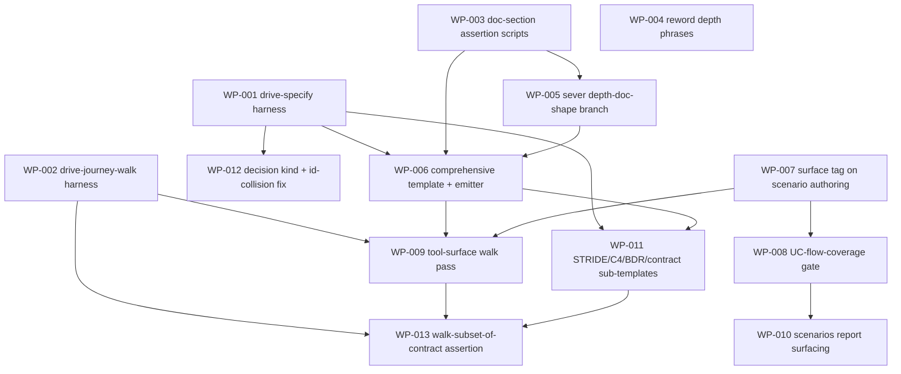

# Work Package Index — comprehensive-spec-and-journey-walk

> **TDD:** [DESIGN.md](../DESIGN.md)
> **SIZING:** [SIZING.md](../SIZING.md)
> **Total WPs:** 13
> **Critical path:** WP-003 → WP-005 → WP-006 → WP-009 → WP-013 (5 packages)
> **Peak parallelism:** 4 (the four foundational WPs WP-001/002/003/004 + WP-007 run with no inter-dependencies)

The change is a methodology / tooling change to the Sulis marketplace; the
verification adapter is **methodology** (drive the specify/design stage on a
fixture, assert the produced artifacts and gate verdicts). Work splits across
the three phases BDR-001 fixed (ship P1 → P2 → P3 in sequence), plus a
foundational fixture/assertion harness the scenarios drive.

## Status Summary

| Status | Count |
|---|---|
| pending | 13 |
| in_progress | 0 |
| done | 0 |
| blocked | 0 |

## Phase Split

| Phase | WPs | Theme |
|---|---|---|
| Harness (foundational) | WP-001, WP-002, WP-003 | Fixture drivers + document-section assertion scripts the SC-01..SC-19 scenarios invoke |
| P1 — decouple depth from doc-existence | WP-004, WP-005, WP-006 | Reword phrases (FR-04); sever the depth→doc-shape branch (FR-01/02/03/05); comprehensive template + always-comprehensive emitter (FR-01/06/11) |
| P2 — two-surface walk + UC-derived scenarios + gate | WP-007, WP-008, WP-009, WP-010 | Surface tag (FR-10); UC-flow-coverage gate (FR-12/13); tool-surface walk + binding bar (FR-08/09/19); scenarios-report surfacing |
| P3 — round-out | WP-011, WP-012, WP-013 | STRIDE/C4/BDR/contract sub-templates (FR-15/16/18); decision kind + @id-collision fix (FR-17); walk-⊆-contract integration (FR-19) |

## Primitive Distribution

| Group | Primitive | Count | WPs |
|---|---|---|---|
| EXPAND | Create | 5 | WP-001, WP-002, WP-003, WP-008, WP-013 |
| EXPAND | Extend | 5 | WP-007, WP-009, WP-010, WP-011, WP-012 |
| REORGANISE | Refactor | 2 | WP-004, WP-005 |
| SUBSTITUTE | Wrap | 0 | — |
| REINFORCE | (orthogonal — all WPs carry Red/Green/Blue) | — | — |

> No Wraps proposed; no wrapper rot detected. The two REORGANISE-Refactor WPs
> (WP-004 reword, WP-005 sever-branch) each carry a `characterisation_test` per
> the REORGANISE doctrine (CLAUDE.md EP-07).

## Adapter Distribution

> Per-adapter count across the WP set — canonical adapter values live in
> [`VERIFICATION_QUESTIONS.md`](../../../plugins/sulis/references/standards/VERIFICATION_QUESTIONS.md)
> (cite, never inline). This change's `kind` is **methodology**; every WP's
> behavioural test drives the stage on a fixture and asserts the artifact.

| Adapter | Count | WPs |
|---|---|---|
| methodology | 13 | WP-001 … WP-013 |
| (carveout — `na: true`) | 0 | — |

## Wrap Audit

> All Wrap WPs reviewed for No-Band-Aid-Wrappers compliance.

| WP | Subject | Ownership | Removal Plan | Status |
|---|---|---|---|---|
| (none) | — | — | — | — |

No Wraps proposed. No wrapper rot detected on existing modules.

## Scenario Coverage (#86 — every in-scope scenario covered by a WP DoD)

| Scenario | Verifies | Covering WP (DoD) |
|---|---|---|
| SC-01 always-comprehensive-at-lite | FR-01/02/11 | WP-006 (via WP-001 + WP-003) |
| SC-02 same-section-set-across-depths | FR-02 | WP-006 |
| SC-03 unpopulated-section-marked-na | FR-11 | WP-006 |
| SC-04 no-doc-branch-on-depth | FR-03 | WP-005 (asserter built in WP-003) |
| SC-05 nfr-always-on | FR-06 | WP-006 |
| SC-06 ui-walk-classifies-all-hops | FR-07 | WP-009 (via WP-002) |
| SC-07 ui-bare-gap-blocks | FR-07 | WP-009 (via WP-002) |
| SC-08 tool-walk-second-table | FR-08 | WP-009 |
| SC-09 tool-no-binding-is-gap | FR-09 | WP-009 |
| SC-10 every-flow-has-scenario | FR-10 | WP-009 |
| SC-11 undrivable-tool-recorded-deferred | FR-10 | WP-009 |
| SC-12 all-flows-covered-passes | FR-12/13 | WP-008 |
| SC-13 uncovered-flow-blocks | FR-12 | WP-008 |
| SC-14 happy-path-only-flagged | FR-12 | WP-008 |
| SC-15 stride-section-present | FR-15 | WP-011 |
| SC-16 c4-three-levels-present | FR-16 | WP-011 |
| SC-17 bdr-recorded-distinct-from-adr | FR-17 | WP-012 |
| SC-18 contract-section-carries-cf10 | FR-18 | WP-011 |
| SC-19 walk-operations-subset-of-contract | FR-19 | WP-013 |

All 19 in-scope scenarios are covered by a WP's Definition of Done.

## Dependency Graph

## WP Table

| ID | Title | Primitive | Status | Depends On | Blocks | Token (in/out) | TDD § |
|---|---|---|---|---|---|---|---|
| WP-001 | Build the drive-specify fixture harness | create | pending | — | WP-006, WP-011, WP-012 | 6k / 4k | 7.4 |
| WP-002 | Build the drive-journey-walk fixture harness | create | pending | — | WP-009, WP-013 | 6k / 4k | 7.4 |
| WP-003 | Build the document-section assertion scripts | create | pending | — | WP-005, WP-006 | 5k / 5k | 7.4 |
| WP-004 | Reword the depth proposal phrases to describe interview size | refactor | pending | — | — | 4k / 2k | 7.4 |
| WP-005 | Sever the depth-to-document-shape branch in specify and the analyst path | refactor | pending | WP-003 | WP-006 | 7k / 4k | 7.3 |
| WP-006 | Add the comprehensive DESIGN.md template and always-comprehensive emitter | create | pending | WP-001, WP-003, WP-005 | WP-009, WP-011 | 9k / 7k | 7.4 |
| WP-007 | Add a first-class surface tag to scenario authoring | extend | pending | — | WP-008, WP-009 | 5k / 3k | 7.4 |
| WP-008 | Build the UC-flow-coverage gate | create | pending | WP-007 | WP-010 | 7k / 5k | 7.4 |
| WP-009 | Extend step 8.5 to a two-surface walk with the tool-surface binding bar | extend | pending | WP-002, WP-006, WP-007 | WP-013 | 9k / 6k | 7.4 |
| WP-010 | Surface the tool scenarios and UC-flow coverage in the scenarios report | extend | pending | WP-008 | — | 5k / 3k | 7.4 |
| WP-011 | Add STRIDE, C4, BDR, and the CF-10 interface-contract sub-templates | extend | pending | WP-001, WP-006 | WP-013 | 8k / 6k | 7.4 |
| WP-012 | Add the ADR/BDR kind discriminator and fix the multi-decision id collision | extend | pending | WP-001 | — | 7k / 5k | 7.4 |
| WP-013 | Build the walk-operations-subset-of-contract assertion (contract-first integration) | create | pending | WP-009, WP-011 | — | 6k / 4k | 7.4 |

## Recommended Implementation Order

1. **WP-001, WP-002, WP-003, WP-004, WP-007** — no dependencies; run in parallel (peak parallelism 4–5).
2. **WP-005** (after WP-003).
3. **WP-006** (after WP-001, WP-003, WP-005).
4. **WP-008** (after WP-007), **WP-009** (after WP-002, WP-006, WP-007), **WP-011** (after WP-001, WP-006), **WP-012** (after WP-001) — parallel.
5. **WP-010** (after WP-008), **WP-013** (after WP-009, WP-011).

## Contract-First Ordering (CF-05)

The interface-contract section (FR-18) is a producer→consumer seam:
- **Producer:** WP-006 stubs the contract-section skeleton; WP-011 fills it to
  full CF-10.
- **Consumer:** WP-009's tool-surface walk draws its operations from the contract
  section.
- **Integration (last):** WP-013 asserts walk operations ⊆ contract operations
  (FR-19). It `dependsOn` both the producer (WP-011) and the consumer (WP-009),
  never the reverse — the contract-first decomposition rule (CF-05).
