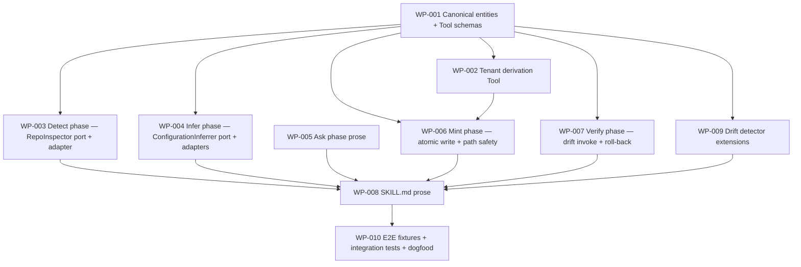

# Work Package Index — discover-project

> **TDD:** [../TDD.md](../TDD.md)
> **SIZING:** [../SIZING.md](../SIZING.md)
> **Total WPs:** 10
> **Critical path:** WP-001 → WP-009 → WP-008 → WP-010 (4 packages serial; the
> long pole is canonical → drift extensions → skill conformance → E2E dogfood)
> **Peak parallelism:** 6 (after WP-001 unblocks, WP-002..WP-007 + WP-009 can
> all be in flight simultaneously — they're independent Python modules /
> drift-detector tweaks reading the same canonical instance set)

## Status Summary

| Status | Count |
|---|---|
| pending | 10 |
| in_progress | 0 |
| done | 0 |
| blocked | 0 |

## Primitive Distribution

| Group | Primitive | Count | WPs |
|---|---|---|---|
| GENERATE | Create | 9 | WP-001, WP-002, WP-003, WP-004, WP-005, WP-006, WP-007, WP-008, WP-010 |
| EXPAND | Extend | 1 | WP-009 (drift detector gains HTML-comment parser + `--cross-tenant-refs-allowed-for` flag) |
| SUBSTITUTE | Wrap | 0 | — |
| REORGANISE | Refactor / Move / Decompose | 0 | — |
| REINFORCE | Test / Instrument / Harden | 0 | — (test work folded into each WP's Red phase per RGB discipline) |

> Adapters for ports are counted as Create per the Ports-vs-Wrappers rule
> in `references/change-primitives.md`. WP-003 (`LocalFilesystemInspector
> implements RepoInspector`) and WP-004 (`LLMConfigurationInferrer +
> NullConfigurationInferrer implement ConfigurationInferrer`) are Create,
> not Wrap — the domain owns the port, the adapters satisfy it.

## Kind Distribution

| Kind | Count | WPs |
|---|---|---|
| contract | 1 | WP-001 (canonical entity instances + Tool schemas — these ARE the contract per Path A) |
| backend | 7 | WP-002, WP-003, WP-004, WP-006, WP-007, WP-009, WP-010 (Python helpers + drift detector extensions + integration tests) |
| docs | 2 | WP-005 (Ask-phase prose), WP-008 (`SKILL.md`) |

> Cross-kind shape: **not triggered** (no `frontend` or `async` kinds in the
> set). Single-kind backend + docs work with one contract WP at the head.
> Contract-first ordering nevertheless holds: WP-001 lands first; every
> backend + docs WP `dependsOn: [WP-001]` directly or transitively.
> Visual contract: not applicable (no user-facing visual surface — the skill
> is CLI prose).

## Wrap Audit

> All Wrap WPs reviewed for No-Band-Aid-Wrappers compliance.

| WP | Subject | Ownership | Removal Plan | Status |
|---|---|---|---|---|
| (none) | — | — | — | — |

No Wraps proposed. The adapters for the three ports (`RepoInspector`,
`ConfigurationInferrer`, `TenantDeriver`) are Create per the
Ports-vs-Wrappers discriminator — the public face of each adapter is the
*port the domain owns*, not the external system's interface. No wrapper
rot detected on existing modules.

## Dependency Graph

## WP Table

| ID | Title | Primitive | Kind | Status | Depends On | Blocks | Token (in/out) | TDD § |
|---|---|---|---|---|---|---|---|---|
| WP-001 | Author canonical entities + Tool schemas at instances/discover-project/ | create | contract | done | — | WP-002, WP-003, WP-004, WP-006, WP-007, WP-009 | 6k / 8k | Form #1-6; Canonical Identifiers |
| WP-002 | Author derive-consumer-tenant Tool + Python implementation + fixed vectors | create | backend | pending | WP-001 | WP-006 | 3k / 3k | Form #8 (`tenant.py`); ADR-002 |
| WP-003 | Implement Detect phase — RepoInspector port + LocalFilesystemInspector adapter | create | backend | pending | WP-001 | WP-008 | 4k / 4k | Form Ports #1; Armor External deps (git CLI) |
| WP-004 | Implement Infer phase — ConfigurationInferrer port + LLM and Null adapters + token budget | create | backend | pending | WP-001 | WP-008 | 4k / 4k | Form Ports #2; Armor External deps (LLM); ADR-006 |
| WP-005 | Author Ask-phase prose — confirm/override + ambiguous fields + per-field diff (`--update`) | create | docs | done | — | WP-008 | 2k / 3k | FR-009, FR-011; ADR-005 |
| WP-006 | Implement Mint phase — atomic write + path safety + signal handler + slug derivation | create | backend | pending | WP-001, WP-002 | WP-008 | 4k / 4k | Armor Atomic write semantics; Form §Slug derivation |
| WP-007 | Implement Verify phase — drift invoke scoped to entity + roll-back on failure | create | backend | pending | WP-001 | WP-008 | 3k / 3k | Armor §Cross-tenant drift; FR-008 |
| WP-008 | Author plugins/sulis/skills/discover-project/SKILL.md with 5 phase sections + canonical annotations | create | docs | dependency_blocked | WP-003, WP-004, WP-005, WP-006, WP-007, WP-009 | WP-010 | 5k / 5k | Form #7; ADR-001, ADR-003 |
| WP-009 | Extend drift detector — HTML-comment annotation parser + --cross-tenant-refs-allowed-for flag | extend | backend | pending | WP-001 | WP-008 | 4k / 3k | Armor §Cross-tenant; ADR-001, ADR-002 |
| WP-010 | Build 4 fixture consumer repos + integration test + dogfood marketplace verification | create | backend | dependency_blocked | WP-008 | — | 5k / 6k | Proof §Integration tests |

**Totals:** ~40k input + ~43k output ≈ 83k tokens for the full WP set.

## Recommended Implementation Order

1. **First wave (sole):** WP-001 (canonical entities — the contract; no deps), WP-005 (Ask prose — no deps on code; can run truly in parallel from t=0)
2. **Second wave (parallel, 6 WPs):** WP-002 (tenant), WP-003 (Detect), WP-004 (Infer), WP-006 (Mint — extra dep on WP-002), WP-007 (Verify), WP-009 (drift extensions) — all unblocked by WP-001
3. **Third wave (serial):** WP-008 (`SKILL.md`) — depends on all 6 backend phases + WP-005 prose + WP-009 annotations
4. **Fourth wave (serial):** WP-010 (E2E + dogfood) — depends on WP-008

Critical path: **WP-001 → {WP-002, WP-003..WP-007, WP-009 in parallel} →
WP-008 → WP-010** (4 sequential merges).

WP-005 has no code dependencies — it can be authored at t=0 alongside
WP-001 and held for WP-008 to consume. The parallelism peak is in wave 2:
6 WPs simultaneously after WP-001 merges.

## Validation

See [`DECOMPOSE_VALIDATION.md`](./DECOMPOSE_VALIDATION.md) for the
P1..P8 rubric report.
