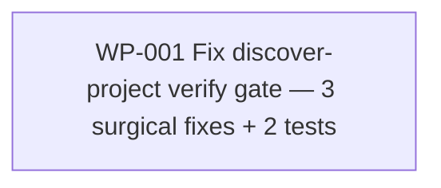

# Work Package Index — discover-verify-scope

> **Spec:** [../../../.changes/fix-discover-verify-scope.SPEC.md](../../../.changes/fix-discover-verify-scope.SPEC.md)
> **Change:** CH-01KT48 · fix
> **Total WPs:** 1
> **Critical path:** WP-001 (single contained fix — no dependency chain)
> **Peak parallelism:** 1 (the three bug fixes are not independently shippable;
> they share the discover-project verify path and the same regression test)

## Status Summary

| Status | Count |
|---|---|
| pending | 1 |
| in_progress | 0 |
| done | 0 |
| blocked | 0 |

## Primitive Distribution

| Group | Primitive | Count | WPs |
|---|---|---|---|
| REORGANISE | Refactor (fixes 2 + 3, in-place corrections) | 1 | WP-001 |
| EXPAND | Extend (fix 1, `--scope` mode added alongside existing modes) | (folded) | WP-001 |
| REINFORCE | Test (real-subprocess + consumer-repo regression) | (folded) | WP-001 |
| SUBSTITUTE | Wrap | 0 | — |

> WP-001 is a composite fix (`composite_of: [REORGANISE, REINFORCE]`).
> Group is REORGANISE because the two in-place corrections (`_DEFAULT_DRIFT_DETECTOR`
> resolution; `primary_branch` derivation) are the structural changes pinned by
> a characterisation test; the `--scope` extension and the two new tests fold
> into the same WP because they cannot ship independently — the consumer-repo
> regression test only passes when all three fixes land.

## Kind Distribution

| Kind | Count | WPs |
|---|---|---|
| backend | 1 | WP-001 (Python script + two `_discovery` modules + tests) |

> Single-kind backend, non-visual. No contract WP (no cross-kind data contract).
> No visual-contract WP (no user-facing visual surface — CLI + library code).

## Wrap Audit

> All Wrap WPs reviewed for No-Band-Aid-Wrappers compliance.

| WP | Subject | Ownership | Removal Plan | Status |
|---|---|---|---|---|
| (none) | — | — | — | — |

No Wraps proposed. Fix 1 extends an internal script the change owns (Extend).
Fixes 2 and 3 are in-place corrections to existing functions (Refactor). No
new wrapper layer over internal code.

## Dependency Graph

Single node; no edges.

## WP Table

| ID | Title | Primitive | Kind | Status | Depends On | Blocks | Token (in/out) | Spec § |
|---|---|---|---|---|---|---|---|---|
| WP-001 | Fix the discover-project verify gate that rolls back every mint in consumer repos | fix | backend | done | — | — | 8k / 6k | SPEC §Scope; §Acceptance; §Constraints |

**Totals:** ~8k input + ~6k output ≈ 14k tokens for the WP set.

## Recommended Implementation Order

1. **Sole wave:** WP-001. There is no ordering to express — one contained fix.

Within WP-001, the RGB cycle orders the work: write the two failing tests
first (real-subprocess `--scope` + consumer-repo regression), see them fail
against current code, then apply the three fixes, then confirm the existing
release-train CI characterisation tests stay green.

## Validation

See [`DECOMPOSE_VALIDATION.md`](./DECOMPOSE_VALIDATION.md) for the
decompose-rubric report (single-WP set — several phases trivially satisfied
or N/A for a contained fix).
