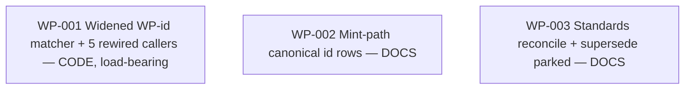

# Work Package Index — extend-unique-wp-ids

> **Spec:** [../../../.changes/extend-unique-wp-ids.SPEC.md](../../../.changes/extend-unique-wp-ids.SPEC.md)
> **TDD:** [../TDD.md](../TDD.md) · **ADRs:** [ADR-001](../adrs/ADR-001-single-source-wp-id-matcher.md), [ADR-002](../adrs/ADR-002-additive-backcompat-and-supersession.md)
> **Change:** CH-5DMB1N · extend · `01KTR381SP5DMB1N8RBKHCVV9Q`
> **Total WPs:** 3
> **Critical path:** WP-001 (the matcher — the only code; nothing depends on it but it is the load-bearing piece)
> **Peak parallelism:** 3 (all three WPs are independent)

> **⚠️ Id-scheme carve-out (chicken-and-egg — ADR-002):** this change's own WP
> ids are the **bare** `WP-001` / `WP-002` / `WP-003`, NOT the new
> `CH-5DMB1N-WP-NNN` prefixed shape. The parser and `run-all` loop don't
> understand prefixed ids until *this* change ships, so these WPs must use the
> current scheme to be executable. Prefixed minting switches on for the **next**
> change created after CH-5DMB1N merges.

## Status Summary

| Status | Count |
|---|---|
| pending | 0 |
| in_progress | 0 |
| done | 3 |
| blocked | 0 |

## Primitive Distribution

| Group | Primitive | Count | WPs |
|---|---|---|---|
| REINFORCE | Extend (widen the WP-id matcher to a new shape; reinforce its five consumers; pinned by a both-shapes regression guard) | 1 | WP-001 |
| REINFORCE | Document (mint surfaces + normative standards catch up to the shipped prefixed shape) | 2 | WP-002, WP-003 |
| EXPAND | Create | 0 | — |
| REORGANISE | Refactor / Move | 0 | — |
| SUBSTITUTE | Wrap | 0 | — |
| CONTRACT | Deprecate / Delete | 0 | — |

> **Why no Wrap, no Refactor, no Create-at-WP-level.** The widened matcher is
> the EP-03-mandated shared primitive extracted once and consumed by five
> existing call sites — an *extension* of an existing recognition surface, not a
> new component (not EXPAND-Create) and not a wrapper over internal code (not
> SUBSTITUTE-Wrap). The two docs WPs reinforce the documented/instructional
> truth against the shipped behaviour.

## Kind Distribution

| Kind | Count | WPs |
|---|---|---|
| backend | 1 | WP-001 (`_wpxlib.py` matcher + 5 rewired sites + `_p_ver_rubric.py` + unit fixtures) |
| docs | 2 | WP-002 (mint/agent surfaces), WP-003 (standards + supersession) |

> Single backend WP (the only code); two docs WPs cleanly separable from it
> (constraint 5). No contract WP (no cross-kind data contract). No visual WP
> (no user-facing surface — WP ids are FE-06-stripped from founder output).

## Wrap Audit

> All Wrap WPs reviewed for No-Band-Aid-Wrappers compliance.

| WP | Subject | Ownership | Removal Plan | Status |
|---|---|---|---|---|
| (none) | — | — | — | — |

No Wraps proposed. WP-001 extends an existing recognition surface in place; no
new layer over internal code.

## Dependency Graph

Three independent nodes; no edges. All three may run in parallel; all three
SHOULD land in the same change (the docs describe the shape WP-001 implements).

## WP Table

| ID | Title | Primitive | Kind | Status | Depends On | Blocks | Token (in/out) | Spec § |
|---|---|---|---|---|---|---|---|---|
| WP-001 | Widened WP-id matcher (prefixed + legacy bare) defined once, consumed by all five callers | extend | backend | done | — | — | 14k / 10k | §Scope 2; §Acceptance; §Constraints (single-source matcher, back-compat) |
| WP-002 | Mint path: teach the prefixed `{CH-HANDLE}-WP-NNN` id in plan-work + design + agent surfaces | extend | docs | done | — | — | 6k / 4k | §Scope 1 |
| WP-003 | Reconcile WORK_PACKAGE_STANDARD id row + CW-04; supersede the parked `canonicalise-cross-wp-ids` effort | extend | docs | done | — | — | 6k / 4k | §Scope 3, §Scope 5 |

**Totals:** ~26k input + ~18k output ≈ 44k tokens for the WP set.

## Recommended Implementation Order

All three WPs are independent and may start immediately. Suggested ordering for
a single executor:

1. **WP-001 first** — the load-bearing code. RGB within it: write the both-shapes
   regression guard + prefixed-id fixtures (see them go RED), define the shared
   `is_wp_id` / `wp_nnn_suffix` matcher once, rewire all five call sites, see
   GREEN, then hygiene (grep for residual `startswith("WP-")` / `removeprefix`).
2. **WP-002 + WP-003 in parallel** (or back-to-back) — the docs/standards catch
   up to the shipped shape. They describe what WP-001 made true; landing them
   after the code keeps docs-truth honest (don't ship the "minted as prefixed"
   prose ahead of the parser that understands it).

A parallel orchestrator can dispatch all three at once — they touch disjoint
files (one `.py` cluster, two markdown clusters). The only soft ordering is the
docs-truth preference above; there is no hard `dependsOn` edge.

## Notes

- **Journey-walk exempt:** non-user-facing internal tooling (WP ids are
  change/run-all machinery, FE-06-stripped from founder output). No founder
  journey scenario — `n/a — non-founder-facing` (Spec §Verification Plan). The
  load-bearing verification is the wpx pytest suite's both-shapes guard.
- **Supersedes** the parked `canonicalise-cross-wp-ids` effort (empty stub, no
  design) — folded into this change per ADR-002 §4; retired by WP-003.
- **Follow-up tracked:** dropping legacy bare-id support is a separate future
  change, already on the task list ("Drop legacy bare WP-NNN id back-compat (one
  release after CH-5DMB1N)") so the deprecation is actioned, not forgotten.
