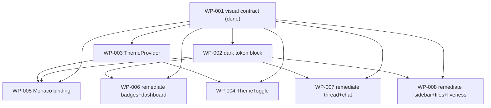

# Work Packages — feat-dark-mode (Dark mode for the cockpit)

> Change: CH-01KTHP · feat · Tier S
> Source: `.architecture/feat-dark-mode/TDD.md` + `WP-001` Downstream
> Decomposed: 2026-06-07 · 8 WPs (1 signed-off contract + 7 implementation)
> Validation: `DECOMPOSE_VALIDATION.md` — **PASS**

## ▶ Ready to start (3)

These have no unmet dependencies once WP-001 (the visual contract) is signed
off — and it is (`signed_off_at` + `provenance: production-approved`). So all
three can start now, in parallel:

- WP-002 — Add the dark token block to `tokens.css`            (frontend, small)
- WP-003 — Theme context layer (provider, hook, resolver, root wiring) (frontend, medium)
- WP-001 — Dark-theme visual contract (DONE — sign-off gate)   (frontend, gate)

## ⏸ Blocked — waiting on a dependency (4)

- WP-004 — ThemeToggle in the Shell top bar                    (frontend, medium)
       └─ waiting on WP-003 (needs `useTheme()`)
- WP-005 — Monaco binding via `monacoThemeFor()` in both wrappers (frontend, medium)
       └─ waiting on WP-002 + WP-003
- WP-006 — Tokenise the dashboard change-card surface          (frontend, medium)
       └─ waiting on WP-002 (edits `tokens.css` after the dark block lands)
- WP-007 — Tokenise the conversation-view panels               (frontend, medium)
       └─ waiting on WP-002 (references the dark token values)
- WP-008 — Tokenise the navigation-chrome stragglers           (frontend, small)
       └─ waiting on WP-002 (references the dark token values)

> Note: WP-006/007/008 become ready the moment WP-002 closes. WP-007 and
> WP-008 reference existing tokens only (no `tokens.css` edit) so they can run
> in parallel with each other and with WP-006. WP-006 edits `tokens.css`, so
> it serialises after WP-002 (peer-collision avoidance) but parallel with
> WP-007/008 (different files).

## ✅ Done (1)

- WP-001 — Dark-theme visual contract (founder sign-off gate)  (frontend, gate)
       └─ signed off 2026-06-07; provenance: production-approved

---

## Full WP table

| ID | Title | kind | primitive | group | dependsOn | est. tokens | status |
|---|---|---|---|---|---|---|---|
| WP-001 | Dark-theme visual contract (sign-off gate) | frontend | REINFORCE-Document | reinforce | — | ~5k | done |
| WP-002 | Dark token block in `tokens.css` | frontend | EXPAND-Extend | expand | WP-001 | ~5k | done |
| WP-003 | Theme context layer (provider, hook, resolver, root wiring) | frontend | EXPAND-Create | expand | WP-001 | ~10k | done |
| WP-004 | ThemeToggle in the Shell top bar | frontend | EXPAND-Create | expand | WP-001, WP-003 | ~8k | done |
| WP-005 | Monaco binding via `monacoThemeFor()` | frontend | SUBSTITUTE-Replace | substitute | WP-001, WP-002, WP-003 | ~7k | done |
| WP-006 | Tokenise the dashboard change-card surface | frontend | REORGANISE-Refactor | reorganise | WP-001, WP-002 | ~9k | done |
| WP-007 | Tokenise the conversation-view panels | frontend | REORGANISE-Refactor | reorganise | WP-001, WP-002 | ~9k | done |
| WP-008 | Tokenise the navigation-chrome stragglers | frontend | REORGANISE-Refactor | reorganise | WP-001, WP-002 | ~7k | done |

## Verification shapes (per WP)

All **concrete** (ADR-003 shape 1) — every WP ships its own Vitest spec the
moment it lands. None deferred, none trivial-carveout. (WP-001 is `na: true`,
justified: it is a design-time sign-off artifact, not shipped code.)

| WP | adapter | artifact |
|---|---|---|
| WP-002 | frontend | `tests/tokens.dark.test.ts` |
| WP-003 | frontend | `tests/theme/resolveInitialTheme.test.ts`, `tests/theme/ThemeProvider.test.tsx` |
| WP-004 | frontend | `tests/ThemeToggle.test.tsx` (+ jest-axe) |
| WP-005 | frontend | `tests/theme/monacoThemeFor.test.ts`, `tests/MonacoFile.test.tsx`, `tests/MonacoDiff.test.tsx` |
| WP-006 | frontend | `tests/no-raw-colours.badges.test.ts` |
| WP-007 | frontend | `tests/no-raw-colours.thread-chat.test.ts` |
| WP-008 | frontend | `tests/no-raw-colours.sidebar-files-liveness.test.ts` |

## Dependency Graph

## Recommended Implementation Order

A valid topological sort (parallelism noted):

1. **WP-001** — already done (gate).
2. **WP-002** and **WP-003** — in parallel (independent; both only need WP-001).
3. **WP-004** (after WP-003) · **WP-005** (after WP-002 + WP-003) · **WP-006 / WP-007 / WP-008** (after WP-002).
   - WP-004, WP-005, and the three remediation WPs can all run concurrently once their deps close.
   - Among remediation: WP-006 edits `tokens.css`; WP-007/008 don't — so all three touch disjoint files and parallelise safely.

## Peer-collision summary

- Only **WP-002** and **WP-006** modify `tokens.css`. They are sequenced
  (WP-006 `dependsOn` WP-002), never parallel → no concurrent edit of the same
  file. No two WPs **create** the same file (all new test specs are uniquely
  named; the theme helpers live in distinct files).
