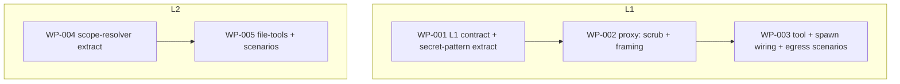

# Work Package Index — harden-agent-execution-boundary (L1 + L2)

> **TDD:** [../TDD.md](../TDD.md) · **ARCH:** [../ARCH.yaml](../ARCH.yaml)
> **Change:** CH-E22SX6 · `harden` · tier M
> **Scope:** L1 (safe-fetch proxy) + L2 (scoped file-tools). **L3 is the next
> phase** — not decomposed here.
> **Total WPs:** 5
> **Two independent tracks:**
> - **L1:** WP-001 → WP-002 → WP-003 (contract → proxy/scrub/framing → tool + spawn wiring + egress scenarios)
> - **L2:** WP-004 → WP-005 (scope-resolver extract → file-tools + scenarios)
> The tracks share **no files**; both are joinable at t=0.
> **Critical path:** WP-001 → WP-002 → WP-003 (3 serial on the L1 track).
> **Peak parallelism:** 2 (WP-001 and WP-004 both in flight at t=0).

## Status Summary

| Status | Count |
|---|---|
| pending | 5 |
| in_progress | 0 |
| done | 0 |
| blocked | 0 |

## WP Table

| ID | Title | Primitive | Status | Depends On | Blocks |
|---|---|---|---|---|---|
| WP-001 | L1 contract — FetchGateway/OutboundFetcher ports + extract secret-pattern catalogue | abstract | pending | — | WP-002, WP-003 |
| WP-002 | L1 proxy — scrub-before-DNS + content-as-untrusted-data framing | create | pending | WP-001 | WP-003 |
| WP-003 | L1 safe-fetch tool + spawn-env wiring + no-egress / open-web scenarios | create | pending | WP-002 | — |
| WP-004 | L2 scope-resolver — generalise within_change_scope to a multi-root allowlist | abstract | pending | — | WP-005 |
| WP-005 | L2 file-tools — read/write/move/remove over the resolver + the L2 scenarios | create | pending | WP-004 | — |

## WP Detail (extra columns — second table, non-canonical header)

| ID | Kind | Group | Scenarios satisfied | Verification artifact | Token (in/out) |
|---|---|---|---|---|---|
| WP-001 | contract | REORGANISE | (contract + extract; no scenario directly) | tests/unit/test_safe_fetch_gateway_contract.py | 10k / 8k |
| WP-002 | backend | EXPAND | SC-L1.3, SC-L1.4 (framing half) | tests/unit/test_safe_fetch_proxy.py | 9k / 8k |
| WP-003 | backend | EXPAND | SC-L1.1, SC-L1.2, SC-L1.4 (egress half) | tests/integration/test_safe_fetch_scenarios.py | 11k / 9k |
| WP-004 | backend | REORGANISE | SC-L2.2/2.3/2.4 (decision half) | tests/unit/test_file_scope.py | 9k / 7k |
| WP-005 | backend | EXPAND | SC-L2.1, SC-L2.2, SC-L2.3, SC-L2.4, SC-L2.5 | tests/integration/test_file_tools_scenarios.py | 9k / 8k |

**Totals:** ~48k input + ~40k output ≈ 88k tokens (tier M).

## Scenario Coverage (all in-scope scenarios accounted for)

| Scenario | WP(s) | Honest-limit note |
|---|---|---|
| SC-L1.1 open-web research preserved | WP-003 | live leg → recorded fixture in CI (need `safe-fetch-live-url`) |
| SC-L1.2 no raw egress | WP-003 | proxy-correctness half under harness shim; prod denial = L3 (`l3-os-egress-denial`) |
| SC-L1.3 secret scrub on outbound | WP-002 | refuse-before-DNS; Rule-of-Two exclusion (WP-003) is the primary control |
| SC-L1.4 injection lands, can't act | WP-002 (framing) + WP-003 (zero-egress) | framing ≠ sanitisation; wall = L3 |
| SC-L2.1 in-scope ops succeed | WP-005 | — |
| SC-L2.2 out-of-scope read refused | WP-004 (decision) + WP-005 (tool) | incl. `/tmp`→`/private/tmp` canonical case |
| SC-L2.3 out-of-scope write/move/remove refused | WP-004 (decision) + WP-005 (tool) | #130 cross-worktree-deletion replay |
| SC-L2.4 traversal/symlink escape refused | WP-004 (decision) + WP-005 (tool) | mirrors #130 case set |
| SC-L2.5 honest boundary (NOT a wall) | WP-005 | asserts subprocess bypass + docstrings L3 ownership |

> **L3 scenarios (SC-L3.1–3.5) are out of scope** for this decomposition —
> the next phase. SC-L1.2/1.4 production enforcement and SC-L2.5's wall are all
> owned by the deferred need `l3-os-egress-denial`.

## Contract-First / Cross-Kind (CF)

> **WP-001 is a `kind: contract` WP — and that is the right call for the L1
> seam.** The agent-facing tool (consumer) and the proxy (producer) are a
> producer/consumer boundary; CONTRACT_FIRST pins the `FetchGateway` /
> `OutboundFetcher` data contract before either side is built (CF-01,
> `contract_type: data`). CF-07 conformance: WP-002's proxy and WP-001's
> in-memory fake both satisfy the same contract test.
>
> The set is **single implementation-kind** (all WPs `backend`; WP-001 is
> `contract`). CF-01's *cross-kind* mandate (≥2 of backend/frontend/async) does
> not apply — but the L1 seam is a genuine data producer/consumer boundary, so
> a contract WP is warranted on its own merit, not by the cross-kind rule.
>
> **L2's resolver↔tools seam is in-process, same author, same track** (WP-004
> produces `_file_scope`, WP-005 consumes it via `dependsOn`). Its contract is
> pinned by WP-004's `test_file_scope.py` public-surface assertions — no
> separate contract WP needed (a single-module Python API, not a cross-process
> seam).

## Primitive Distribution

| Group | Primitive | Count | WPs |
|---|---|---|---|
| EXPAND | Create | 3 | WP-002 (proxy), WP-003 (tool + wiring), WP-005 (file-tools) |
| REORGANISE | Abstract | 2 | WP-001 (extract `_secret_patterns`), WP-004 (extract shared scope core) |
| SUBSTITUTE | — | 0 | — (no Wrap/Replace/Strangle) |
| CONTRACT | — | 0 | — |
| REINFORCE | — | 0 | — (test work folded into each WP's Red per RGB) |

> **No Wrap WPs.** The proxy (WP-002) and tool (WP-003) are EXPAND-Create
> adapters for ports the **domain owns** (`FetchGateway`/`OutboundFetcher`) —
> the HTTP client is *called by* the adapter, not wrapped at the architecture
> seam (Ports-vs-Wrappers / Stripe-rule discriminator). The file-tools (WP-005)
> compose the `_file_scope` resolver. No wrapper over internal code anywhere.

## Wrap Audit

| WP | Subject | Ownership | Removal Plan | Status |
|---|---|---|---|---|
| (none) | — | — | — | — |

No Wraps proposed. The cross-group decision priority lands on REUSE/COMPOSE
(extract the shared `_secret_patterns` + scope-core; compose them) and
EXPAND-Create (new adapters for domain-owned ports), never on Wrap.

## Characterisation Tests (REORGANISE compliance)

> Two REORGANISE-Abstract WPs extract shared primitives out of existing code →
> **characterisation-test-before-refactor MUST applies to both** (Non-Negotiable #3).

| WP | Subject extracted from | Characterisation pin |
|---|---|---|
| WP-001 | `_anonymiser.py` (secret regexes → `_secret_patterns`) | `test_anonymiser_characterisation.py` — pins `anonymise()` output over a secret-bearing corpus; must stay green after the extract |
| WP-004 | `_worktree_safety.py` (scope core → `_file_scope`) | existing `test_worktree_safety.py` — `within_change_scope` re-expressed via the shared core must keep ALL its cases green (no regression for `git_worktree_remove`/`wpx-worktree`) |

## Dependency Graph

> The two subgraphs share no node and no file — fully parallel tracks.

## Peer-Collision Risk (P6)

| File | Created by | Modified by | Resolution |
|---|---|---|---|
| `_secret_patterns.py` | WP-001 (sole) | — | No collision |
| `_safe_fetch/ports.py` | WP-001 (sole) | — | No collision |
| `_anonymiser.py` | — | WP-001 (sole) | No collision |
| `_safe_fetch/proxy.py`, `framing.py` | WP-002 (sole) | — | No collision |
| `_safe_fetch/tool.py` | WP-003 (sole) | — | No collision |
| `_session_manager/manager.py` | — | WP-003 (sole) | No collision |
| `_file_scope.py` | WP-004 (sole) | — | No collision |
| `_worktree_safety.py` | — | WP-004 (sole) | No collision |
| `_file_tools.py` | WP-005 (sole) | — | No collision |

No two WPs Create or Modify the same file. Each module has a single owning WP.

## Recommended Implementation Order

1. **First wave (parallel, 2 WPs):** **WP-001** (L1 contract + secret-pattern
   extract — head of L1) and **WP-004** (scope-resolver extract — head of L2).
   Disjoint files, no shared dependency.
2. **Second wave (parallel, 2 WPs):** **WP-002** (proxy — needs WP-001's ports +
   `_secret_patterns`) and **WP-005** (file-tools — needs WP-004's resolver).
3. **Third wave (1 WP):** **WP-003** (tool + spawn wiring + egress scenarios —
   needs WP-002's real proxy gateway). Terminal node of the L1 track.

Critical path: **WP-001 → WP-002 → WP-003** (three serial merges on L1). The L2
track (WP-004 → WP-005) runs fully in parallel and is off the critical path.

**Test-first ordering is enforced by the graph:** every WP authors its failing
tests in Red before the implementation. The two REORGANISE WPs (001, 004)
additionally confirm their characterisation pin is green *before* the extract.

## Cross-WP Identifier Canonicalisation (P8)

| Identifier | Authoring WP | Consuming WPs | Source-of-truth |
|---|---|---|---|
| `FetchGateway` / `OutboundFetcher` / `FetchRequest` / `FetchResult` | WP-001 | WP-002, WP-003 | TDD §Form + WP-001 Contract |
| `find_secrets` / `SecretHit` (`_secret_patterns`) | WP-001 | WP-002 | TDD §Armor L1 + WP-001 Contract |
| `within_allowed_scope` / `resolve_allowed_roots` / `AllowedRoots` (`_file_scope`) | WP-004 | WP-005 | TDD §Form + WP-004 Contract |
| `deny_raw_egress` (test-only harness) | WP-003 | — | ADR-005 |
| `l3-os-egress-denial`, `safe-fetch-live-url` (deferred needs) | TDD §Verification Plan | — | TDD §Verification Plan §6 |

No ULID or `dna:*:*` literal is invented inline. The change-id literal in WP
frontmatter is the real change ULID (`01KTZVX7RBE22SX6DNHA4Y6Y7B`).

## Open Questions — resolved at decompose

1. **Where does the proxy run (separate process now, or in-process gateway)?**
   → **In-process gateway behind the `FetchGateway` port now**, launched
   out-of-the-agent-process when L3's sandbox lands (the proxy is the
   allow-listed egress L3 permits). The port boundary means moving it to a
   separate process later is an adapter swap, not a rewrite. *No WP needed —
   folded into the port design (WP-001) and ADR-001.*
2. **SC-L1.1 live network flake in CI** → **recorded fixture in CI; opt-in
   marked live test locally.** Deferred need `safe-fetch-live-url` records the
   fixture/endpoint. *Folded into WP-003.*

## Validation

Single-kind backend set with one warranted `kind: contract` WP (the L1 data
seam). Both REORGANISE WPs carry their characterisation pin. All in-scope
scenarios (SC-L1.1–1.4, SC-L2.1–2.5) are covered by named automated pytest
artifacts; the honest-limit scenarios (SC-L1.2/1.4 egress, SC-L2.5) assert what
they confine and name L3 as the production owner.
