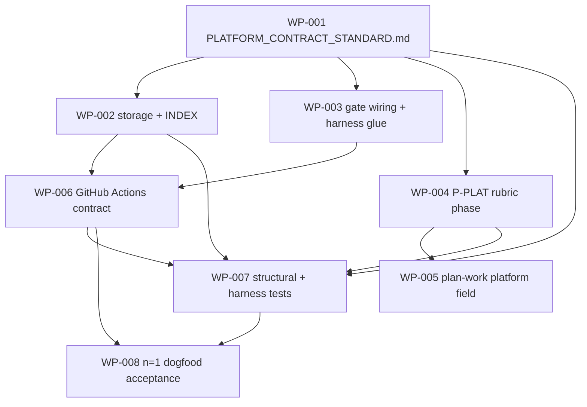

# Work Package Index — platform-contract-standard

> **TDD:** [../TDD.md](../TDD.md)
> **SIZING:** [../SIZING.md](../SIZING.md)
> **Total WPs:** 8
> **Critical path:** WP-001 → WP-003 → WP-006 → WP-007 → WP-008 (5 packages serial)
> **Peak parallelism:** 3 (after WP-001 lands: WP-002, WP-003, WP-004 can run together)

## Status Summary

| Status | Count |
|---|---|
| pending | 8 |
| in_progress | 0 |
| done | 0 |
| blocked | 0 |

## Primitive Distribution

| Group | Primitive | Count | WPs |
|---|---|---|---|
| GENERATE / EXPAND | Create | 4 | WP-001, WP-002, WP-006, WP-007, WP-008 (5 — see note) |
| EXPAND | Extend | 1 | WP-005 |
| REINFORCE | Gate | 2 | WP-003, WP-004 |
| SUBSTITUTE | Wrap | 0 | — |
| REORGANISE | Refactor / Move / Decompose | 0 | — |

> **Create count clarification:** WP-001, WP-002, WP-006 are `create` /
> EXPAND-Create (net-new methodology artifacts); WP-007, WP-008 are `create` /
> EXPAND (net-new test suites). WP-003 + WP-004 are REINFORCE-Gate (the
> defence-in-depth pair: prose front leg + rubric enforcement leg). WP-005 is
> EXPAND-Extend (`plan-work` gains two frontmatter keys).
>
> **No Wraps proposed.** Implementing the GitHub Actions contract by *running*
> the harness is EXPAND-Create (we author an instance the harness produces), not
> SUBSTITUTE-Wrap — we dispatch the harness, we do not wrap it (TDD lines
> 99-104; change-primitives "Ports & Adapters vs Wrappers").
>
> **No REORGANISE** — this is a methodology *extension*, not a refactor of
> existing methodology. REINFORCE-Test work is folded into each WP's Red phase;
> WP-007 + WP-008 are the test-authoring WPs by primary purpose.

## Kind Distribution

| Kind | Count | WPs |
|---|---|---|
| methodology | 6 | WP-001..006 (standard, storage, gate-wiring, rubric phase, plan-work field, the n=1 contract) |
| backend | 2 | WP-007 (structural/conformance + harness-refusal tests), WP-008 (n=1 dogfood acceptance) |

> Cross-kind shape: **not triggered.** Six methodology WPs + two backend WPs
> (the backend WPs are *tests* of the methodology WPs, not application code
> sharing a frontend/backend seam). The change's primary `kind:` is
> `methodology`; `documentation` + `contract` are secondary adapters exercised
> inside WP-006 (link-resolution, conformance) and WP-007 (schema invariants).
> Visual contract: **not applicable** (ships methodology, not user-facing UI).

## Adapter Distribution

> Every WP carries `verification:` per the verification-by-design ADR-003. This
> WP set additionally **dogfoods this change's own new field** — WP-006 carries
> `platform: github-actions` / `touch-class: read-only`.

| Adapter | Shape | Count | WPs |
|---|---|---|---|
| methodology (Shape 1 concrete) | adapter + artifact | 8 | WP-001..008 |
| methodology (Shape 2 deferred) | adapter + deferred-to-follow-on | 0 (1 partial) | WP-006 (the *repeatable* probe pipeline + branch-protection probe defer; the conformance assertion is concrete) |
| methodology (Shape 3 trivial carveout) | na + justification | 0 | — |

All 8 WPs use Shape 1 for their primary verification artifact. WP-006 *also*
carries two Shape-2 deferrals for the parts it cannot ship now (the repeatable
probe pipeline `scratch-github-actions-probe-repo`; the branch-protection probe
`paid-private-repo-for-branch-protection-probe`); its conformance assertion is
concrete and lands with the WP.

## platform: / touch-class: declarations (this change's own new field — dogfood)

| WP | platform | touch-class | Why |
|---|---|---|---|
| WP-006 | `github-actions` | `read-only` | Authoring the contract *reads* GitHub docs + runs read-only probes; it does not write to or deploy through GitHub. First use of the field WP-005 makes `plan-work` emit. |
| (all others) | — | — | Touch no third-party platform. |

## Wrap Audit

> All Wrap WPs reviewed for No-Band-Aid-Wrappers compliance.

| WP | Subject | Ownership | Removal Plan | Status |
|---|---|---|---|---|
| (none) | — | — | — | — |

No Wraps proposed. No wrapper rot detected. The harness is *dispatched*
(EXPAND-Create), not wrapped.

## Dependency Graph

No cycles. WP-001 is the keystone (everything roots at it, directly or
transitively). WP-008 is the terminal sink. **Shared-file collision avoided:**
`draft-architecture/SKILL.md` and `specify/SKILL.md` have exactly one owner
(WP-003 — it bundles the gate-detection prose *and* the harness-invocation step
precisely so the harness-glue and gate-wiring do not collide on
`draft-architecture/SKILL.md`, per the discover-project lesson). The rubric
(WP-004), `plan-work` (WP-005), the standard (WP-001), the storage dir (WP-002),
and the contract (WP-006) each have a single distinct owner.

## WP Table

| ID | Title | Primitive | Kind | Status | Depends On | Blocks | Token (in/out) | TDD § |
|---|---|---|---|---|---|---|---|---|
| WP-001 | Author `PLATFORM_CONTRACT_STANDARD.md` (schema + harness-binding + relationship-to-siblings) | create | methodology | pending | — | WP-002, WP-003, WP-004, WP-006, WP-007 | 5k / 6k | Form §component 1 (line 77); A-1..A-8; FR-001/003/004/005/016 |
| WP-002 | Create `platform-contracts/` storage dir + derived `INDEX.md` | create | methodology | pending | WP-001 | WP-006, WP-007 | 2k / 2k | Form §component 2 (line 78); FR-010/011; ADR-002 |
| WP-003 | Wire design-phase gate + harness-invocation glue into `specify` + `draft-architecture` | extend | methodology | pending | WP-001 | WP-006 | 5k / 4k | Form §components 3+4 (lines 79-80); A-7; FR-002/003/014; ADR-001/004 |
| WP-004 | Append P-PLAT (Phase 10) to `decompose-validation-rubric.md` | extend | methodology | pending | WP-001 | WP-005, WP-007 | 4k / 4k | Form §component 6 (line 82); A-7/A-8; FR-015; ADR-006 |
| WP-005 | Extend `plan-work` to emit `platform:` / `touch-class:` field | extend | methodology | pending | WP-004 | WP-007 | 4k / 3k | OAQ-4 (line 206); FR-015; ADR-006 |
| WP-006 | Produce the GitHub Actions Platform Contract (run harness, ground 3 rules) | create | methodology | pending | WP-002, WP-003 | WP-007, WP-008 | 6k / 5k | Form §component 5 (line 81); Proof §3 (lines 177-191); FR-009; ADR-004/005 |
| WP-007 | Structural / conformance tests + harness-refusal behavioural test | create | backend | pending | WP-001, WP-002, WP-004, WP-006 | WP-008 | 4k / 7k | Proof §1+2 (lines 160-175); FR-006/015 |
| WP-008 | n=1 dogfood acceptance — three rules become real assertions | create | backend | pending | WP-006, WP-007 | — | 4k / 5k | Proof §3 (lines 177-191); FR-009; UC-005 |

**Totals:** ~34k input + ~36k output ≈ 70k tokens for the full WP set.

## Recommended Implementation Order

1. **First wave (serial — keystone):** WP-001. Until the standard (the schema)
   exists, nothing else can conform to or enforce it.
2. **Second wave (parallel — 3-way):** WP-002 (storage), WP-003 (gate wiring +
   harness glue), WP-004 (P-PLAT rubric phase). All read WP-001 only; disjoint
   file surface (`platform-contracts/` vs the two design skills vs the rubric).
3. **Third wave (parallel — 2-way):** WP-005 (plan-work field — needs WP-004),
   WP-006 (the GitHub Actions contract — needs WP-002 + WP-003, the load-bearing
   dependency: it *runs the harness* via the WP-003 glue and *conforms* to the
   WP-002-stored schema).
4. **Fourth wave (serial):** WP-007 (structural + harness tests — needs WP-001,
   002, 004, 006).
5. **Fifth wave (terminal):** WP-008 (n=1 dogfood acceptance — needs WP-006 +
   WP-007).

Critical path: **WP-001 → WP-003 → WP-006 → WP-007 → WP-008** (5 serial). The
load-bearing chain is the harness-glue (WP-003) → the grounded contract
(WP-006) → the dogfood proof (WP-008). Parallelism peak: 3 (second wave).

## Validation

See [`DECOMPOSE_VALIDATION.md`](./DECOMPOSE_VALIDATION.md) for the P1..P8 rubric
report.

> **Note:** P-VER (Phase 9) and **P-PLAT (Phase 10, created by WP-004 of this
> very change)** are not yet in force for validating *this* WP set — a gate
> cannot self-apply before it exists. This set is validated against the current
> live rubric (P1..P8). After this change merges, future WP sets touching a
> gated platform will be additionally validated against P-PLAT.
>
> However, **WP-006 already carries the new `platform:` / `touch-class:`
> frontmatter field** — the first dogfood of the field WP-005 introduces. WP-007
> + WP-008 will be the first tests to exercise P-PLAT detection against
> synthetic WP sets.
