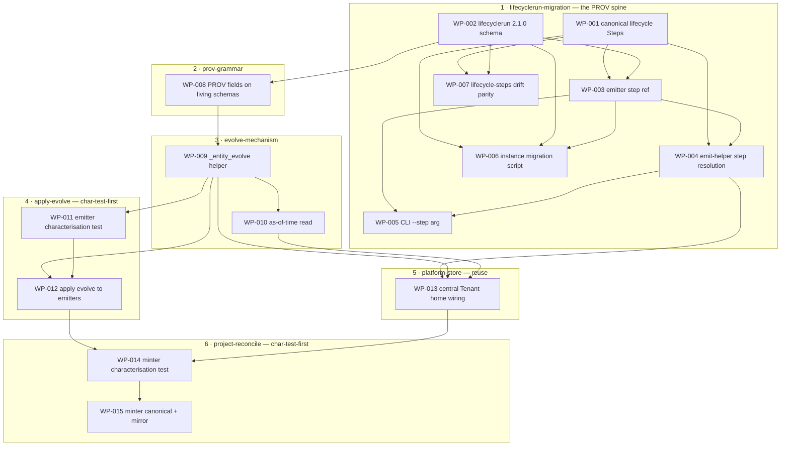

# Work Package Index — product-project-opportunity-evolution

> **TDD:** [../TDD.md](../TDD.md)
> **SIZING:** [../SIZING.md](../SIZING.md)
> **ARCH:** [../ARCH.yaml](../ARCH.yaml)
> **Change:** CH-01KT61 (`feat`, `founder_facing: false`)
> **Total WPs:** 15
> **Critical path:** WP-002 → WP-008 → WP-009 → WP-011 → WP-012 → WP-014 → WP-015
> (7 packages serial — the long pole is schema-bump → PROV-grammar → evolve-helper →
> emit-characterisation → apply-evolve → minter-characterisation → minter-reconcile)
> **Peak parallelism:** 3 (after the evolve helper WP-009 lands, WP-010 + WP-011 + WP-012's
> precursors are in flight; WP-013 is serialised *after* WP-004 + WP-010 because all three
> edit shared files — `_brain_emit_helper.py` (WP-004) and `_brain_query.py` (WP-010) — so
> it cannot run in their wave without a peer-collision).

## Status Summary

| Status | Count |
|---|---|
| pending | 15 |
| in_progress | 0 |
| done | 0 |
| blocked | 0 |

## Primitive Distribution

| Group | Primitive | Count | WPs |
|---|---|---|---|
| GENERATE | Create | 4 | WP-001, WP-006, WP-008, WP-009 |
| SUBSTITUTE | Strangle | 4 | WP-002, WP-003, WP-004, WP-005 |
| EXPAND | Extend | 2 | WP-007, WP-010 |
| REORGANISE | Refactor | 2 | WP-012, WP-015 |
| REINFORCE | Test | 2 | WP-011, WP-014 |
| REUSE | Reuse | 1 | WP-013 |

> **One-line:** 4 Create · 4 Substitute-Strangle · 2 Extend · 2 Refactor ·
> 2 Reinforce-Test · 1 Reuse.

> The two REORGANISE-Refactor WPs (WP-012 apply-evolve, WP-015 minter-reconcile)
> each carry a `characterisation_test:` field and `dependsOn` a REINFORCE-Test WP
> (WP-011, WP-014) that pins the baseline FIRST — per the Characterisation-Tests-
> Before-Refactor MUST. The four SUBSTITUTE-Strangle WPs (the LifecycleRun
> breaking swap) carry `removal_plan` where they introduce a deprecated surface
> (WP-002 the `step_name` field; WP-005 the `--step-name` CLI alias). WP-013 is
> `reuse` — the existing file adapter at the existing central Tenant home (ADR-005);
> its Blue gate asserts no new persistence code, the proof that it is reuse not build.

## Kind Distribution

| Kind | Count | WPs |
|---|---|---|
| contract | 3 | WP-001 (canonical Steps), WP-002 (lifecyclerun 2.1.0 schema), WP-008 (PROV grammar fields) |
| backend | 12 | WP-003, WP-004, WP-005, WP-006, WP-007, WP-009, WP-010, WP-011, WP-012, WP-013, WP-014, WP-015 |

> **Cross-kind seam:** not triggered. The kind set is {contract, backend} — no
> `frontend` or `async` kind. `founder_facing: false`: this is grammar / store /
> emitter work with no visual contract, so no `WP_FRONTEND_STANDARD` and no
> visual-contract WP. Contract-first ordering nevertheless holds: the three
> `contract` WPs (the brain grammar / schema the rest consumes) land at the head;
> every backend WP `dependsOn` a contract WP directly or transitively. WP-008 (the
> PROV grammar) is the data contract WP-009/WP-012 write against; WP-002 (the
> v2.1.0 schema) is the contract WP-003/WP-006/WP-008 consume.

## Wrap Audit

> All Wrap WPs reviewed for No-Band-Aid-Wrappers compliance.

| WP | Subject | Ownership | Removal Plan | Status |
|---|---|---|---|---|
| (none) | — | — | — | — |

No Wrap WPs proposed. The decision-priority walk landed on **Reuse** for the
Platform store (WP-013 — existing file adapter at the existing central Tenant
home, ADR-005), **Refactor** for the two emitter/minter changes (WP-012, WP-015 —
edited in place, gated by characterisation tests, never a translation layer), and
**Create** for the evolve helper (WP-009 — a new helper *above* the port the
domain owns, which is EXPAND-Create per the Ports-vs-Wrappers rule, not a Wrap
over the SDK). The four SUBSTITUTE-Strangle WPs are the breaking LifecycleRun
field swap (a deprecate-then-replace, with `removal_plan`), not wraps. No wrapper
rot on existing modules: `_entity_evolve` sits above the port; the emitters
delegate to it rather than being wrapped.

## Dependency Graph

> The build-order spine from TDD §Build Order: pieces 1→2→3 are a strict chain
> (WP-002 → WP-008 → WP-009). Pieces 4 (WP-011/012) and 5 (WP-013) both depend on
> piece 3 (WP-009). Piece 5's WP-013 additionally `dependsOn` WP-004 and WP-010 —
> not for build-order reasons but for **peer-collision serialisation**: all three
> edit shared files (`_brain_emit_helper.py` with WP-004, `_brain_query.py` with
> WP-010), so WP-013 lands after them rather than alongside (P6). Piece 6
> (WP-014/015) is the join — WP-014 `dependsOn` both WP-012 (piece 4) and WP-013
> (piece 5), and transitively piece 3.

## WP Table

| ID | Title | Primitive | Kind | Status | Depends On | Blocks | Token (in/out) | TDD § |
|---|---|---|---|---|---|---|---|---|
| WP-001 | Author canonical lifecycle Step instances | create | contract | pending | — | WP-003, WP-004, WP-006, WP-007 | 4k / 3k | Form #1; Canonical Identifiers |
| WP-002 | Bump lifecyclerun schema 1.0.0 → 2.1.0 + vendor compiled | substitute-strangle | contract | pending | — | WP-003, WP-006, WP-007, WP-008 | 3k / 3k | Form #3; ADR-004 |
| WP-003 | Update _lifecyclerun_emission compose to step + step_label | substitute-strangle | backend | pending | WP-001, WP-002 | WP-004, WP-005, WP-006 | 3k / 3k | Form #3; ADR-004 |
| WP-004 | Resolve Step refs in the 3 _brain_emit_helper helpers | substitute-strangle | backend | pending | WP-001, WP-003 | WP-005, WP-013 | 3k / 3k | Form #3; Canonical Identifiers (name→ULID map) |
| WP-005 | Migrate sulis-emit-lifecyclerun CLI to --step (--step-name deprecated alias) | substitute-strangle | backend | pending | WP-003, WP-004 | — | 2k / 2k | Form #3; ADR-004 |
| WP-006 | Build migrate_lifecyclerun_v1_to_v2 + migrate marketplace store | create | backend | pending | WP-001, WP-002, WP-003 | — | 4k / 4k | Form #4; ADR-004 |
| WP-007 | Wire lifecycle-steps canonical into the drift detector | extend | backend | pending | WP-001, WP-002 | — | 3k / 2k | Proof §Drift-detector parity |
| WP-008 | Add was_generated_by to living schemas + @context PROV maps + vendor copies | create | contract | pending | WP-002 | WP-009 | 3k / 3k | Form #2; ADR-002 |
| WP-009 | Build _entity_evolve — close/open-window + was_generated_by + allowlist | create | backend | pending | WP-008 | WP-010, WP-011, WP-012, WP-013 | 4k / 5k | Form #5; Armor §Window invariants; ADR-003 |
| WP-010 | Add as-of-time window read to _brain_query | extend | backend | pending | WP-009 | WP-013 | 3k / 3k | Form #6; ADR-003 |
| WP-011 | Characterisation test pinning current living-entity emit behaviour | test | backend | pending | WP-009 | WP-012 | 3k / 3k | Form §Change-primitive (4 apply-evolve) |
| WP-012 | Refactor Product/Opportunity/Project emitters to call evolve_entity | refactor | backend | pending | WP-009, WP-011 | WP-014 | 4k / 4k | Form §Change-primitive (4 apply-evolve); ADR-003 |
| WP-013 | Point living-entity emit base_dir at central Tenant home + prove cross-repo read | reuse | backend | pending | WP-004, WP-009, WP-010 | WP-014 | 4k / 4k | Form #7, #8; ADR-005 |
| WP-014 | Characterisation test pinning minter path-safety + MUC-003 | test | backend | pending | WP-012, WP-013 | WP-015 | 3k / 3k | Form §Change-primitive (6 project-reconcile) |
| WP-015 | Refactor minter to canonical save + mirror; update discover-project Mint prose | refactor | backend | pending | WP-014 | — | 4k / 4k | Form #9, #10; ADR-006 |

**Totals:** ~50k input + ~49k output ≈ 99k tokens for the full WP set.

## Recommended Implementation Order

1. **Wave 1 (parallel, 2 WPs):** WP-001 (canonical Steps), WP-002 (lifecyclerun 2.1.0 schema) — both head-of-graph, no deps.
2. **Wave 2 (parallel, 3 WPs):** WP-003 (emitter step ref), WP-007 (drift parity), WP-008 (PROV grammar) — unblocked by WP-001/WP-002.
3. **Wave 3 (parallel, 3 WPs — peak):** WP-004 (emit-helper resolution), WP-006 (instance migration), WP-009 (`_entity_evolve`) — unblocked by wave 2.
4. **Wave 4 (parallel, 3 WPs — peak):** WP-005 (CLI), WP-010 (as-of read), WP-011 (emit characterisation test) — unblocked by WP-009 (+ WP-003/WP-004 for WP-005).
5. **Wave 5 (parallel, 2 WPs):** WP-012 (apply-evolve refactor — needs WP-009 + WP-011), WP-013 (central home wiring — needs WP-009 **and** WP-004 + WP-010 for shared-file serialisation, so it lands here not wave 4).
6. **Wave 6 (sole):** WP-014 (minter characterisation test) — needs WP-012 + WP-013 (the piece-3+4+5 join).
7. **Wave 7 (sole):** WP-015 (minter reconcile refactor) — needs WP-014.

Critical path: **WP-002 → WP-008 → WP-009 → WP-011 → WP-012 → WP-014 → WP-015**
(7 sequential merges). Peak parallelism is 3 (waves 3 and 4). WP-013 is serialised
out of wave 4 into wave 5 because it shares `_brain_emit_helper.py` with WP-004 and
`_brain_query.py` with WP-010 — running it in their wave would risk a peer-collision
on those files (P6).

## Validation

See [`DECOMPOSE_VALIDATION.md`](./DECOMPOSE_VALIDATION.md) for the
P1..P8 + P-VER + P-PLAT rubric report.
