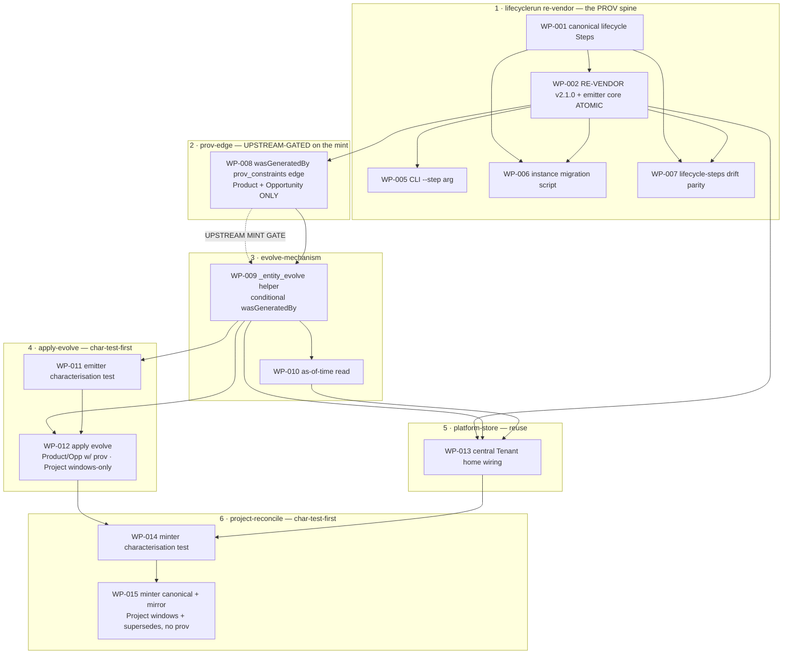

# Work Package Index — product-project-opportunity-evolution

> **TDD:** [../TDD.md](../TDD.md)
> **SIZING:** [../SIZING.md](../SIZING.md)
> **ARCH:** [../ARCH.yaml](../ARCH.yaml)
> **Change:** CH-01KT61 (`feat`, `founder_facing: false`)
> **Total WPs:** 13
> **Critical path:** WP-001 → WP-002 → WP-008 → WP-009 → WP-011 → WP-012 → WP-014 → WP-015
> (8 packages serial — Step defs → re-vendor+emitter lockstep → prov-edge (upstream-gated) →
> evolve-helper → emit-characterisation → apply-evolve → minter-characterisation → minter-reconcile)
> **Peak parallelism:** 3 (after WP-002 lands, WP-005 + WP-006 + WP-007 are in flight)
> **UPSTREAM GATE:** WP-008 (and everything it blocks: WP-009→WP-015) cannot land until the
> mint-request `wasGeneratedBy-provenance-edge-2026-06-03` is ACCEPTED → walked → recompiled →
> re-vendored. See "Upstream Dependency" below.

## What changed in this re-cut (15 → 13)

> Reworked 2026-06-03 against a brain-governance review. The design DIRECTION was right;
> specific mechanics were corrected.

| Action | WPs | Why |
|---|---|---|
| **Collapsed 3 → 1 (atomic)** | old WP-002 (author v2.1.0 schema) + old WP-003 (`_lifecyclerun_emission` step+step_label) + old WP-004 (`_brain_emit_helper` resolution) → **new WP-002** (surgical re-vendor of canonical v2.1.0 + emitter-core migration, ONE atomic WP) | ADR-004 + the `brain/compiled/README.md` mandate lockstep: schema + `_brain_emit_helper` move together. Any split leaves a reject-on-invalid window. LifecycleRun v2.1.0 is ALREADY MINTED upstream (DR-009 + DR-013) — the action is re-vendor, not author. `step_label` + `used`-on-run DROPPED (not in canonical; DR-013 rejected payload-on-run-record). |
| **Reshaped** | old WP-008 (snake_case `was_generated_by` on Product/Opportunity/**Project**) → **new WP-008** (`prov_constraints` `wasGeneratedBy` edge on **Product + Opportunity ONLY**, upstream-gated) | PROV is NOT greenfield: `wasGeneratedBy` already in the PD `_predicate_map`, already wired on 5 entities as `prov_constraints`. Reuse the convention, not a new snake_case wire field. **Project dropped** — `prov:Plan`, type violation. The grammar change is routed through the mint (upstream gate). |
| **Narrowed** | WP-009 (evolve helper), WP-012 (apply-evolve) | Provenance write is now **conditional** — Product/Opportunity get `wasGeneratedBy`; Project gets windows + supersedes but **no prov edge** (`generated_by=None`). `used` parameter removed from the helper. |
| **Kept (terminology corrected)** | WP-001 (Step = `prov:Plan`; run *instantiates* it via `sulis:viaStep`, not "typed by" it) | The `step` ref decision was correct; only the word was loose. |
| **Kept intact** | WP-005, WP-006, WP-007, WP-010, WP-011, WP-013, WP-014, WP-015 | Largely unchanged (deps re-pointed from old WP-003/WP-004 to the merged WP-002; `step_label` corrected to `run_id`). |

WP IDs 003 and 004 are intentionally retired (absorbed into WP-002, recorded in its
`composite_of`). The remaining IDs are stable to preserve the dependency graph.

## Status Summary

| Status | Count |
|---|---|
| pending | 12 |
| blocked (upstream gate) | 1 (WP-008) |
| in_progress | 0 |
| done | 0 |

## Primitive Distribution

| Group | Primitive | Count | WPs |
|---|---|---|---|
| GENERATE | Create | 3 | WP-001, WP-006, WP-009 |
| SUBSTITUTE | Strangle | 3 | WP-002, WP-005, WP-008 |
| EXPAND | Extend | 2 | WP-007, WP-010 |
| REORGANISE | Refactor | 2 | WP-012, WP-015 |
| REINFORCE | Test | 2 | WP-011, WP-014 |
| REUSE | Reuse | 1 | WP-013 |

> **One-line:** 3 Create · 3 Substitute-Strangle · 2 Extend · 2 Refactor ·
> 2 Reinforce-Test · 1 Reuse.

> The two REORGANISE-Refactor WPs (WP-012 apply-evolve, WP-015 minter-reconcile)
> each carry a `characterisation_test:` field and `dependsOn` a REINFORCE-Test WP
> (WP-011, WP-014) that pins the baseline FIRST — per the Characterisation-Tests-
> Before-Refactor MUST. The three SUBSTITUTE-Strangle WPs carry `removal_plan`:
> WP-002 (the breaking `step_name`→`step` swap + the atomic re-vendor; `composite_of`
> records the three absorbed moves), WP-005 (the `--step-name` CLI deprecated alias),
> WP-008 (the replaced Product 1.0.0 / Opportunity 2.0.0 schemas). WP-013 is `reuse`
> — the existing file adapter at the existing central Tenant home (ADR-005); its
> Blue gate asserts no new persistence code, the proof that it is reuse not build.

## Kind Distribution

| Kind | Count | WPs |
|---|---|---|
| contract | 3 | WP-001 (canonical Steps), WP-002 (re-vendor lifecyclerun 2.1.0 + emitter), WP-008 (prov_constraints edge re-vendor) |
| backend | 10 | WP-005, WP-006, WP-007, WP-009, WP-010, WP-011, WP-012, WP-013, WP-014, WP-015 |

> **Cross-kind seam:** not triggered. Kind set is {contract, backend} — no `frontend`
> or `async`. `founder_facing: false`: grammar / store / emitter work, no visual
> contract. Contract-first ordering holds: the three `contract` WPs land at the head;
> every backend WP `dependsOn` a contract WP directly or transitively. WP-002 (the
> re-vendored v2.1.0 schema + emitter core) is the contract WP-005/WP-006/WP-007/WP-008
> consume; WP-008 (the prov edge) is the data contract WP-009/WP-012 write against.

## Upstream Dependency (the load-bearing gate)

> **WP-008 starts `blocked`.** Everything it blocks (WP-009 → WP-010 → WP-011 →
> WP-012 → WP-013 → WP-014 → WP-015) is transitively gated.

The `wasGeneratedBy` edge on Product + Opportunity is a **brain grammar change**, not
an in-repo author. It is routed through the mint-request
`.specifications/business-dna/mint-requests/wasgeneratedby-provenance-edge-2026-06-03.md`
(currently a PROPOSAL). The in-repo WP-008 can only land once:

1. the mint is **ACCEPTED** by the founder + ontology owner;
2. a `/sulis-brain:mint-coach` **walk** runs the discipline (compile → admission gate →
   C1–C7 rubric → Decision Record);
3. the bumped **Product 1.1.0 + Opportunity 2.1.0** compiled schemas are **re-vendored**
   into canonical compiled output.

Only then does WP-008 re-vendor those two compiled schemas into
`plugins/sulis/brain/compiled/product-development/`, and only then can WP-009 (the evolve
helper that writes the edge) proceed.

**WPs that CAN land before the gate clears** (no provenance dependency): WP-001, WP-002,
WP-005, WP-006, WP-007 — the entire LifecycleRun re-vendor + migration spine. The
LifecycleRun v2.1.0 schema is **already minted** (DR-009 + DR-013), so its re-vendor (WP-002)
is unblocked immediately. WP-002's emitter migration does NOT depend on the Product/
Opportunity prov edge — it is the run-side `step_name`→`step` swap only.

**Project requires NO brain edit** — it stays `prov:Plan` at schema_version 1.0.0, excluded
from the mint. Its WP work (WP-014, WP-015) is bitemporal windows + supersedes only.

## Dependency Graph

> Build-order spine: pieces 1→2→3 are a strict chain (WP-002 → WP-008 → WP-009).
> Pieces 4 (WP-011/012) and 5 (WP-013) both depend on piece 3 (WP-009). Piece 5's
> WP-013 additionally `dependsOn` WP-002 and WP-010 for **peer-collision
> serialisation**: WP-013 edits `_brain_emit_helper.py` (also touched by WP-002's
> Step-resolution edit) and `_brain_query.py` (also touched by WP-010), so it lands
> after them. Piece 6 (WP-014/015) is the join — WP-014 `dependsOn` WP-012 (piece 4)
> + WP-013 (piece 5), transitively piece 3.

## Wrap Audit

> All Wrap WPs reviewed for No-Band-Aid-Wrappers compliance.

| WP | Subject | Ownership | Removal Plan | Status |
|---|---|---|---|---|
| (none) | — | — | — | — |

No Wrap WPs proposed. The decision-priority walk landed on **Reuse** for the
Platform store (WP-013), **Refactor** for the two emitter/minter changes (WP-012,
WP-015 — edited in place, gated by characterisation tests), **Create** for the evolve
helper (WP-009 — a new helper *above* the port the domain owns, EXPAND-Create per the
Ports-vs-Wrappers rule, not a Wrap over the SDK), and **Substitute-Strangle** for the
three breaking/replace WPs (WP-002 the re-vendor+emitter swap, WP-005 the CLI alias,
WP-008 the prov-edge schema replacement) — each a deprecate-then-replace with a
`removal_plan`, not a wrap. No wrapper rot on existing modules.

## WP Table

| ID | Title | Primitive | Kind | Status | Depends On | Blocks | Token (in/out) | TDD § |
|---|---|---|---|---|---|---|---|---|
| WP-001 | Author canonical lifecycle Step instances (prov:Plan defs) | create | contract | pending | — | WP-002, WP-006, WP-007 | 4k / 3k | Form #1; Canonical Identifiers |
| WP-002 | RE-VENDOR canonical lifecyclerun v2.1.0 + migrate emitter core (ATOMIC lockstep) | substitute-strangle | contract | pending | WP-001 | WP-005, WP-006, WP-007, WP-008, WP-013 | 5k / 5k | Form #3; ADR-001, ADR-004 |
| WP-005 | Migrate sulis-emit-lifecyclerun CLI to --step (--step-name deprecated alias) | substitute-strangle | backend | pending | WP-002 | — | 2k / 2k | Form #3; ADR-004 |
| WP-006 | Build migrate_lifecyclerun_v1_to_v2 + migrate marketplace store | create | backend | pending | WP-001, WP-002 | — | 4k / 4k | Form #4; ADR-004 |
| WP-007 | Wire lifecycle-steps canonical into the drift detector | extend | backend | pending | WP-001, WP-002 | — | 3k / 2k | Proof §Drift-detector parity |
| WP-008 | Re-vendor the upstream-minted wasGeneratedBy prov_constraints edge on Product + Opportunity | substitute-strangle | contract | **blocked (upstream mint)** | WP-002 | WP-009 | 3k / 2k | Form #2; ADR-002 |
| WP-009 | Build _entity_evolve — close/open-window + CONDITIONAL wasGeneratedBy + allowlist | create | backend | pending | WP-008 | WP-010, WP-011, WP-012, WP-013 | 4k / 5k | Form #5; ADR-002, ADR-003 |
| WP-010 | Add as-of-time window read to _brain_query | extend | backend | pending | WP-009 | WP-013 | 3k / 3k | Form #6; ADR-003 |
| WP-011 | Characterisation test pinning current living-entity emit behaviour | test | backend | pending | WP-009 | WP-012 | 3k / 3k | Form §Change-primitive (4 apply-evolve) |
| WP-012 | Refactor Product/Opp (w/ prov) + Project (windows-only) emitters to call evolve_entity | refactor | backend | pending | WP-009, WP-011 | WP-014 | 4k / 4k | Form §Change-primitive (4); ADR-003 |
| WP-013 | Point living-entity emit base_dir at central Tenant home + prove cross-repo read | reuse | backend | pending | WP-002, WP-009, WP-010 | WP-014 | 4k / 4k | Form #7, #8; ADR-005 |
| WP-014 | Characterisation test pinning minter path-safety + MUC-003 | test | backend | pending | WP-012, WP-013 | WP-015 | 3k / 3k | Form §Change-primitive (6 project-reconcile) |
| WP-015 | Refactor minter to canonical save + mirror (Project windows+supersedes, no prov); update prose | refactor | backend | pending | WP-014 | — | 4k / 4k | Form #9, #10; ADR-006 |

**Totals:** ~46k input + ~44k output ≈ 90k tokens for the full WP set (down from
~99k — the 3→1 collapse removed duplicated schema/emitter scaffolding; the narrowed
prov WP dropped Project + the snake_case grammar authoring).

## Recommended Implementation Order

1. **Wave 1 (sole):** WP-001 (canonical Steps — prov:Plan defs) — head of graph.
2. **Wave 2 (sole):** WP-002 (the ATOMIC re-vendor + emitter-core lockstep) — the
   whole `step_name`→`step` swap lands here as one WP (no reject-on-invalid window).
3. **Wave 3 (parallel, 3 WPs — peak):** WP-005 (CLI), WP-006 (instance migration),
   WP-007 (drift parity) — all unblocked by WP-002, independent code surfaces.
   **+ WP-008 starts here IF the upstream mint has cleared** (else it waits).
4. **Wave 4 (sole, gated):** WP-009 (`_entity_evolve`) — needs WP-008's prov edge
   (upstream-gated).
5. **Wave 5 (parallel, 2 WPs):** WP-010 (as-of read), WP-011 (emit characterisation
   test) — unblocked by WP-009.
6. **Wave 6 (parallel, 2 WPs):** WP-012 (apply-evolve refactor — needs WP-009 +
   WP-011), WP-013 (central home wiring — needs WP-009 + WP-002 + WP-010 for
   shared-file serialisation).
7. **Wave 7 (sole):** WP-014 (minter characterisation test) — needs WP-012 + WP-013.
8. **Wave 8 (sole):** WP-015 (minter reconcile refactor) — needs WP-014.

Critical path: **WP-001 → WP-002 → WP-008 → WP-009 → WP-011 → WP-012 → WP-014 →
WP-015** (8 sequential merges, WP-008 gated on the upstream mint). Peak parallelism
is 3 (wave 3). The pre-gate spine (WP-001, WP-002, WP-005, WP-006, WP-007) can all
land while the mint is in review.

## Validation

See [`DECOMPOSE_VALIDATION.md`](./DECOMPOSE_VALIDATION.md) for the
P1..P8 + P-VER + P-PLAT rubric report.
