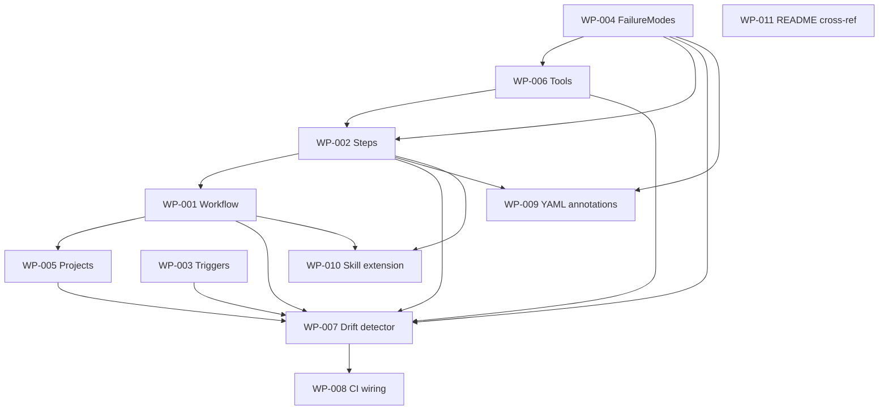

# Work Package Index — release-train-as-entities

> **TDD:** [../TDD.md](../TDD.md)
> **SIZING:** [../SIZING.md](../SIZING.md)
> **Total WPs:** 11
> **Critical path:** WP-004 → WP-006 → WP-002 → WP-001 → WP-007 → WP-008 (6 packages)
> **Peak parallelism:** 4 (after WP-004 + WP-006 unblock, several entity-authoring WPs run together)

## Status Summary

| Status | Count |
|---|---|
| pending | 11 |
| in_progress | 0 |
| done | 0 |
| blocked | 0 |

## Primitive Distribution

| Group | Primitive | Count | WPs |
|---|---|---|---|
| GENERATE | Create | 7 | WP-001, WP-002, WP-003, WP-004, WP-005, WP-006, WP-007 |
| EXPAND | Extend | 4 | WP-008, WP-009, WP-010, WP-011 |
| SUBSTITUTE | Wrap | 0 | — |
| REORGANISE | Refactor / Move / Decompose | 0 | — |
| REINFORCE | Test / Instrument / Harden | 0 | — (test fixtures live inside WP-007's RGB DoD, not as separate WPs) |

> No Wraps proposed. No REORGANISE primitives (no existing release-train
> implementation being refactored — release-on-merge.yml gains annotations
> only, treated as `extend` per ADR-002). REINFORCE-Test work folded into
> each WP's Red phase per the standard's RGB discipline.

## Kind Distribution

| Kind | Count | WPs |
|---|---|---|
| contract | 6 | WP-001..006 (canonical entity instances ARE the contract) |
| backend | 1 | WP-007 (drift detector script) |
| infra | 2 | WP-008, WP-009 (CI workflow + annotations) |
| docs | 2 | WP-010, WP-011 (skill extension + README cross-ref) |

> Cross-kind shape: not triggered (no multi-kind ∈ {backend, frontend, async}).
> Single backend consumer (WP-007) reads multi-contract WPs (WP-001..006).
> Visual contract: not applicable (`founder_facing: false`).

## Wrap Audit

> All Wrap WPs reviewed for No-Band-Aid-Wrappers compliance.

| WP | Subject | Ownership | Removal Plan | Status |
|---|---|---|---|---|
| (none) | — | — | — | — |

No Wraps proposed. No wrapper rot detected on existing modules.

## Dependency Graph

## WP Table

| ID | Title | Primitive | Kind | Status | Depends On | Blocks | Token (in/out) | TDD § |
|---|---|---|---|---|---|---|---|---|
| WP-001 | Author release-train Workflow instance | create | contract | done | WP-002 | WP-005, WP-007, WP-010 | 3k / 2k | Form #1 |
| WP-002 | Author 15 Step instances | create | contract | done | WP-004, WP-006 | WP-001, WP-007, WP-009, WP-010 | 6k / 8k | Form #2; Steps table |
| WP-003 | Author 2 Trigger instances | create | contract | done | — | WP-007 | 1k / 1k | FR-007 |
| WP-004 | Author 8 FailureMode instances | create | contract | done | — | WP-002, WP-006, WP-007, WP-009 | 2k / 3k | FR-008 |
| WP-005 | Author 4 Project instances | create | contract | done | WP-001 | WP-007 | 2k / 2k | FR-001 |
| WP-006 | Author 17 Tool catalogue (5 primary + 12 stub) | create | contract | done | WP-004 | WP-002, WP-007 | 4k / 6k | FR-005, ADR-003 |
| WP-007 | Build drift detector script + tests | create | backend | done | WP-001..006 | WP-008 | 8k / 10k | FR-015, ADR-002 |
| WP-008 | Wire drift detector into branch-ci.yml | extend | infra | pending | WP-007 | — | 2k / 1k | FR-015 |
| WP-009 | Add canonical annotations to release-on-merge.yml | extend | infra | done | WP-002, WP-004 | — | 3k / 1k | ADR-002, FR-012 |
| WP-010 | Extend `/sulis:release-train` for dry-run-walks-canonical | extend | docs | done | WP-001, WP-002 | — | 4k / 2k | FR-011 |
| WP-011 | Cross-reference Configuration Vocabulary in marketplace README | extend | docs | done | — | — | 2k / 1k | FR-016, UC-004 |

**Totals:** ~37k input + ~37k output ≈ 74k tokens for the full WP set.

## Recommended Implementation Order

1. **First wave (parallel):** WP-003 (Triggers), WP-004 (FailureModes), WP-011 (README cross-ref) — no deps
2. **Second wave (parallel):** WP-006 (Tools — needs WP-004)
3. **Third wave:** WP-002 (Steps — needs WP-004 + WP-006)
4. **Fourth wave (parallel):** WP-001 (Workflow — needs WP-002), WP-009 (YAML annotations — needs WP-002 + WP-004)
5. **Fifth wave (parallel):** WP-005 (Projects — needs WP-001), WP-010 (Skill extension — needs WP-001 + WP-002)
6. **Sixth wave:** WP-007 (drift detector — needs WP-001..006)
7. **Seventh wave:** WP-008 (CI wiring — needs WP-007)

Critical path: WP-004 → WP-006 → WP-002 → WP-001 → WP-007 → WP-008 (6 packages serial).
Parallelism peak: 4 (third wave can have WP-001 in flight while WP-009 + WP-010 + WP-011 also run).

## Validation

See [`DECOMPOSE_VALIDATION.md`](./DECOMPOSE_VALIDATION.md) for the
P1..P6 rubric report.
