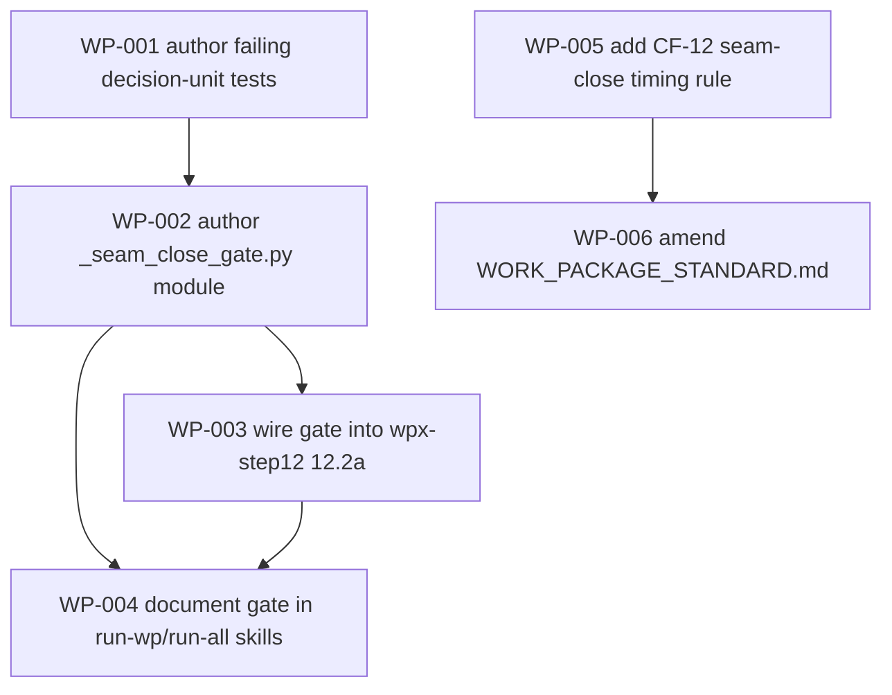

# Work Package Index — seam-dod-gate

> **TDD:** [../TDD.md](../TDD.md)
> **ARCH:** [../ARCH.yaml](../ARCH.yaml)
> **Change:** CH-01KTP7 · `feat` · tier S
> **Total WPs:** 6
> **Critical path:** WP-001 → WP-002 → WP-003 → WP-004 (4 packages
> serial: author failing decision tests → implement the gate module →
> wire it into the done-transition → document it in the build-loop
> skills). The two standards WPs (WP-005 → WP-006) are a parallel
> 2-package track joinable at t=0.
> **Peak parallelism:** 2 (at t=0, WP-001 and WP-005 can both be in
> flight — disjoint files, no shared dependency).

## Status Summary

| Status | Count |
|---|---|
| pending | 0 |
| in_progress | 0 |
| done | 6 |
| blocked | 0 |

## Contract-First / Cross-Kind Exemption (CF)

> **No `kind: contract` WP in this set — and that is correct.**
> This change is **single-kind internal methodology machinery** (all WPs
> are `kind: methodology`; no `backend`+`frontend`+`async`
> implementation seam of its own). CF-01 / WP-08.5 require a `kind:
> contract` WP **only when the WP set spans ≥2 implementation kinds**
> (backend / frontend / async). It does not. There is **no
> producer/consumer contract seam of its own** here, so no contract WP is
> needed (the CF exemption: single-kind sets are not checked —
> `_wpxlib.validate_cross_kind_contract_wiring` returns clean for
> `len(kinds_present) < 2`). The change *builds* a gate that fires on
> *other* changes' seams; it has none.
>
> This exemption is itself a **test case** in the change: WP-001's
> `test_unrelated_wp_done_is_noop` asserts the gate no-ops cleanly when
> the just-`done` WP is part of no seam — exactly the path every WP in
> *this* change hits at its own done-transition.

## Primitive Distribution

| Group | Primitive | Count | WPs |
|---|---|---|---|
| GENERATE | Create | 2 | WP-001 (failing decision-unit tests), WP-002 (`_seam_close_gate.py` module) |
| EXPAND | Extend | 4 | WP-003 (wire into `wpx-step12`), WP-004 (document in run-wp/run-all), WP-005 (CF-12 append), WP-006 (WP-standard amendment) |
| REORGANISE | — | 0 | — (no existing-code refactor; no characterisation-test-before-refactor obligation) |
| SUBSTITUTE | — | 0 | — (no Wrap / Replace / Strangle; the gate is new code consuming existing modules by import) |
| CONTRACT | — | 0 | — |
| REINFORCE | — | 0 | — (test work is folded into each WP's Red per RGB discipline; WP-001 is the consolidated test-first artifact) |

> Per `references/change-primitives.md` Ports-vs-Wrappers rule: **no Wrap
> WPs.** WP-002 implements a new pure-decision module that *imports and
> calls* existing modules (`_acceptance_gate`, `_brain_query`, `_wpxlib`) —
> that is composition/reuse, not a wrapper over internal code. WP-003 is
> EXPAND-Extend (adds step 12.2a through `wpx-step12`'s existing
> command structure), not a wrap. No REORGANISE, so no
> characterisation-test-before-refactor obligation is triggered (WP-003's
> existing `wpx-step12` integration tests serve as characterisation safety
> for the unchanged flip/worktree behaviour, but no structural refactor of
> existing code occurs).

## Kind Distribution

| Kind | Count | WPs |
|---|---|---|
| methodology | 6 | WP-001 (decision-unit tests), WP-002 (gate module), WP-003 (wpx-step12 wiring + wiring tests), WP-004 (run-wp/run-all skill docs), WP-005 (CF-12 standard), WP-006 (WP-standard amendment) |

> **Single-kind set.** All six WPs are `kind: methodology` — internal
> methodology machinery whose verification is structural pytest assertions
> (the `methodology` adapter; P-VER 9.08 — kind and adapter agree). WP-004/005/006
> edit skill / standards prose but their verification is doc-shape assertions
> (the `methodology` adapter shape), not link/readability checks (the
> `documentation` adapter); they are kept `methodology` so kind and adapter
> match. `methodology` is **not** one of the *implementation* kinds
> (backend/frontend/async) CF-01 gates on — the set carries no
> cross-implementation-kind seam, so the CF exemption holds (see the
> Contract-First exemption box above).

## Wrap Audit

> All Wrap WPs reviewed for No-Band-Aid-Wrappers compliance.

| WP | Subject | Ownership | Removal Plan | Status |
|---|---|---|---|---|
| (none) | — | — | — | — |

No Wraps proposed. `_seam_close_gate` (WP-002) is a new module that
imports `_acceptance_gate.gate_decision`, the `_brain_query` read seams,
and the `_wpxlib` INDEX parser — composition of existing primitives, not
a wrapper layer over them. The cross-group decision priority lands on
EXPAND/Create (reuse + compose existing pieces; create the one new pure
decision), never on Wrap. No existing wrapper rot in the touched modules.

## Characterisation Tests (REORGANISE compliance)

> No REORGANISE primitive in the set → no characterisation-test-before-
> refactor MUST is triggered.

The one place existing code is touched is WP-003 (`wpx-step12`). That is
an EXPAND-Extend (a new step 12.2a is *added* after the existing flip;
no existing step is restructured). WP-003's DoD nonetheless re-runs the
existing `wpx-step12` integration tests
(`tests/integration/test_wpx_step12.py`, `…_idempotence.py`) as a
behaviour-safety check that the flip + worktree-remove path is unchanged
for the no-seam / not-closed case — characterisation in spirit, no
structural refactor in fact.

## Dependency Graph

> WP-005 → WP-006 is a **shared-test-file create-before-append** edge
> (rubric P6), not a semantic dependency — WP-005 creates
> `test_seam_close_standards_presence.py`; WP-006 appends one assertion to
> it. WP-003 → WP-004 is the same shape on
> `test_seam_close_gate_wiring.py`.

## WP Table

| ID | Title | Primitive | Group | Kind | Status | Depends On | Blocks | Token (in/out) | TDD § |
|---|---|---|---|---|---|---|---|---|---|
| WP-001 | Author the failing decision-unit tests (6 ACs + correctness cases) | create | GENERATE | methodology | done | — | WP-002 | 8k / 6k | §Proof; §Test surface File 1 |
| WP-002 | Author the pure-decision seam-close gate module `_seam_close_gate.py` | create | GENERATE | methodology | done | WP-001 | WP-003, WP-004 | 9k / 7k | §Form (the one new module); §Detection + Resolution; §Verdict semantics |
| WP-003 | Wire the seam-close gate into `wpx-step12 wrap` (step 12.2a) | extend | EXPAND | methodology | done | WP-002 | — | 7k / 5k | §How the gate hooks into the build loop; §Test surface File 2 |
| WP-004 | Document the seam-close gate in the build-loop skills (run-wp, run-all) | extend | EXPAND | methodology | done | WP-002, WP-003 | — | 5k / 4k | §How the gate hooks (skills document); §Test surface File 2 (two doc assertions) |
| WP-005 | Add CF-12 (seam-close DoD timing rule) to CONTRACT_FIRST_STANDARD.md | extend | EXPAND | methodology | done | — | WP-006 | 4k / 3k | §Where the standards changes land — CF-12 |
| WP-006 | Amend WORK_PACKAGE_STANDARD.md — seam-close DoD wording + contract-WP `implements:` | extend | EXPAND | methodology | done | WP-005 | — | 4k / 3k | §Where the standards changes land — WP standard |

**Totals:** ~37k input + ~28k output ≈ 65k tokens for the full WP set
(comfortably small; tier S).

## Recommended Implementation Order

1. **First wave (parallel, 2 WPs):** **WP-001** (failing decision-unit
   tests — head of the code track) and **WP-005** (CF-12 standard append
   — head of the standards track). Disjoint files, no shared dependency.

2. **Second wave (parallel, 2 WPs):** **WP-002** (the gate module — needs
   WP-001's tests to code against) and **WP-006** (WP-standard amendment —
   needs WP-005's shared test file to append to).

3. **Third wave (1 WP):** **WP-003** (wire into `wpx-step12` — needs the
   `evaluate` module from WP-002).

4. **Fourth wave (1 WP):** **WP-004** (document the gate in run-wp/run-all
   — needs WP-002 for the real behaviour and WP-003 for the shared wiring-
   test file it appends to). Terminal node.

Critical path: **WP-001 → WP-002 → WP-003 → WP-004** (four sequential
merges on the code track). The standards track (WP-005 → WP-006) runs
fully in parallel and is off the critical path.

**Test-first ordering is enforced by the graph:** WP-001 (failing tests)
strictly precedes WP-002 (the implementation that turns them green); the
six SPEC acceptance criteria + correctness cases exist and fail before any
gate logic is written. WP-003 authors its wiring tests failing-first
within the WP (the wpx-step12 assertions fail before step 12.2a is added).
WP-005/006 author their presence tests failing-first before the standards
edits.

## Cross-WP Identifier Canonicalisation (P8)

The cross-WP shared identifiers are the **public surface of
`_seam_close_gate.evaluate(...)`** and the **two shared test-file paths** —
all sourced from the TDD (and pinned by WP-001/WP-002's Contract sections),
referenced (not re-invented) by the consuming WPs:

| Identifier | Authoring WP | Consuming WPs | Source-of-truth |
|---|---|---|---|
| `_seam_close_gate.evaluate(...)` signature + `SeamCloseResult` dataclass | WP-001 (pins it as test contract) + WP-002 (implements it) | WP-003 (calls `evaluate`) | TDD §Form + WP-001 Contract section |
| `plugins/sulis/scripts/tests/unit/test_seam_close_gate_wiring.py` | WP-003 (creates) | WP-004 (appends two assertions) | TDD §Test surface File 2 — WP-003 sole creator |
| `plugins/sulis/scripts/tests/unit/test_seam_close_standards_presence.py` | WP-005 (creates) | WP-006 (appends one assertion) | TDD §Test surface File 3 — WP-005 sole creator |
| `--allow-deferred` flag name + observed-or-blocked vocabulary | reused verbatim from `sulis-verify-acceptance` / `_acceptance_gate` | WP-002, WP-003, WP-004, WP-005, WP-006 | existing `_acceptance_gate.py` (no new vocabulary minted) |

No ULID-shape or `dna:*:*` literal is invented inline in any WP Contract —
the `dna:requirement:…` / `dna:scenario:…` shapes appear only as *type*
references to the existing brain entities, never as minted constants. The
`implements:` field values are populated by `/sulis:plan-work` on *future*
changes, not literal-ised in this change's WPs.

## Peer-Collision Risk (P6)

| File | Created by | Modified by | Resolution |
|---|---|---|---|
| `plugins/sulis/scripts/_seam_close_gate.py` | WP-002 (sole) | — | No collision |
| `plugins/sulis/scripts/tests/unit/test_seam_close_gate.py` | WP-001 (sole) | — | No collision |
| `plugins/sulis/scripts/tests/unit/test_seam_close_gate_wiring.py` | WP-003 (sole) | WP-004 (append) | WP-004 `dependsOn` WP-003 — create-before-append, serial |
| `plugins/sulis/scripts/tests/unit/test_seam_close_standards_presence.py` | WP-005 (sole) | WP-006 (append) | WP-006 `dependsOn` WP-005 — create-before-append, serial |
| `plugins/sulis/scripts/wpx-step12` | — | WP-003 (sole modifier) | No collision |
| `plugins/sulis/skills/run-wp/SKILL.md`, `run-all/SKILL.md` | — | WP-004 (sole) | No collision |
| `plugins/sulis/references/standards/CONTRACT_FIRST_STANDARD.md` | — | WP-005 (sole) | No collision |
| `plugins/sulis/references/standards/WORK_PACKAGE_STANDARD.md` | — | WP-006 (sole) | No collision |

No two WPs `Create` the same file. The only two shared files are the two
test files, each with a single creator and a single appender bound by an
explicit `dependsOn` edge so they never run as same-level parallel peers
on the same file (rubric 6.01 / 6.03).

## Open Questions — Resolved at decompose

Both blueprint Open Questions are **build-detail HOW decisions**, resolved
here without a new WP:

1. **Backfill `implements:` onto existing contract WPs vs rely on the
   fallback** → **Rely on the journey-filtered fallback; no backfill.**
   Backfilling every prior decomposition's contract WPs is an unbounded
   cross-repo side-quest (scope rule). The `implements:` SHOULD field
   (WP-006) is the clean forward path `/sulis:plan-work` populates going
   forward; WP-002's fallback keeps legacy decompositions correct now.
   *No WP needed — folded into WP-002 (fallback logic) + WP-006 (the
   SHOULD field).*

2. **Once-only firing persistence under `--no-emit-evidence`** → **Use the
   brain-evidence signal (`find_passing_testresults_for_scenario`) as the
   already-driven marker; no bespoke per-seam marker file.** A separate
   marker would be a second source of truth competing with the brain
   evidence. Under `--no-emit-evidence` a settled seam may re-drive —
   wasteful, never wrong — documented in WP-002's module docstring and
   asserted-around by `test_seam_close_fires_once`. *No WP needed — folded
   into WP-002.*

## Validation

See [`DECOMPOSE_VALIDATION.md`](./DECOMPOSE_VALIDATION.md) for the P1..P10
rubric report.
