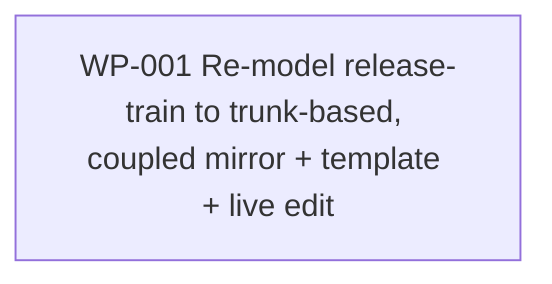

# Work Package Index — simplify-release-robot

> **Change:** CH-01KT4K · refactor · trunk-based cutover (Model A, step 4)
> **Spec:** [../../../.changes/refactor-simplify-release-robot.SPEC.md](../../../.changes/refactor-simplify-release-robot.SPEC.md)
> **Audit (edit-map + drift contract):** [../../../.changes/refactor-simplify-release-robot.AUDIT.md](../../../.changes/refactor-simplify-release-robot.AUDIT.md)
> **Guide (end-state):** [../../../docs/trunk-based-release-workflow-remodel.md](../../../docs/trunk-based-release-workflow-remodel.md)
> **Total WPs:** 1
> **Critical path:** WP-001 (single atomic coupled edit)
> **Peak parallelism:** 1

## Status Summary

| Status | Count |
|---|---|
| pending | 1 |
| in_progress | 0 |
| done | 0 |
| blocked | 0 |

## Why a single atomic WP

The drift gate (`check-canonical-drift.py`, the `canonical-drift-check` job in
`branch-ci`) compares the vendored mirror
(`plugins/sulis/instances/release-train/`) against the annotated template
(`plugins/sulis/templates/workflows/release-on-merge.yml`) **bidirectionally**.
Deleting a Step from the mirror without simultaneously removing the matching
template annotation makes the gate RED. The mirror edit and the template edit
therefore MUST land in the same commit/PR — they cannot be separate WPs without
a guaranteed-red intermediate state, which violates the change's core
constraint (LIVE release machinery — never leave the release flow bricked).
The live `.github` workflow edit ships in the same PR for the same reason.

See [WP-001](./WP-001-remodel-release-train-to-trunk.md) §Context for the full
coupling argument and the decompose finding that the live workflow is already
trunk-shaped.

## Primitive Distribution

| Group | Primitive | Count | WPs |
|---|---|---|---|
| REORGANISE | refactor | 1 | WP-001 (re-model the release-train Workflow + imperative template + live workflow to trunk-based) |
| EXPAND | — | 0 | — |
| SUBSTITUTE | — | 0 | — |
| CONTRACT | — | 0 | — |
| REINFORCE | — | 0 | — (the drift-parity + live-read-through assertions are folded into WP-001's Red per RGB discipline) |

> Per `references/change-primitives.md`: this is REORGANISE-refactor (a
> behaviour-shape change to canonical-entity instances + the imperative they
> bridge, deleting machinery that only served the dev→main promotion). It is
> NOT a Wrap (no internal code is wrapped) and NOT a Replace (the files are
> edited in place, not swapped). The characterisation-test-before-refactor MUST
> rule is satisfied: the drift gate + the existing
> `test_release_on_merge_yaml_unchanged_behaviour.sh` + a new live-workflow
> read-through assertion pin behaviour before and after.

## Kind Distribution

| Kind | Count | WPs |
|---|---|---|
| infra | 1 | WP-001 (CI workflow YAML + canonical-entity instance JSON-LD) |

> **Cross-kind shape:** single-kind (`infra`). No data-contract WP required —
> there is no cross-kind dependency to route. The drift-matcher contract
> (mirror ↔ template parity) is the structural contract, and it lives inside
> the single WP because the coupling forbids splitting it.

> **Visual contract:** not applicable. No user-facing visual surface. The
> "user" is the operator who runs `/sulis:release`; the surface is `git log`,
> the pushed tag, and the GitHub Release. Not founder-facing
> (`founder_facing: false`).

## Wrap Audit

> All Wrap WPs reviewed for No-Band-Aid-Wrappers compliance.

| WP | Subject | Ownership | Removal Plan | Status |
|---|---|---|---|---|
| (none) | — | — | — | — |

No Wraps proposed. WP-001 deletes machinery and rewires a graph in place — a
REORGANISE-refactor, the opposite of a Wrap.

## Characterisation Tests (REORGANISE compliance)

WP-001 is a REORGANISE WP. Per the characterisation-tests-before-refactor MUST
rule, behaviour is pinned before and after:

| WP | Subject | Characterisation Test |
|---|---|---|
| WP-001 | The release-train mirror ↔ template parity + the live trunk workflow | (a) `check-canonical-drift.py … --yaml-path …/templates/workflows/release-on-merge.yml` exit 0 — the load-bearing structural proof; (b) existing `tests/methodology/test_release_on_merge_yaml_unchanged_behaviour.sh`; (c) a NEW static read-through assertion that the live `.github/workflows/release-on-merge.yml` has no reachable promotion/back-merge/ancestry logic. Recorded in WP-001 `characterisation_test` frontmatter. |

## Dependency Graph

## WP Table

| ID | Title | Primitive | Status | Depends On | Blocks | Kind | Group | Token (in/out) | Verification |
|---|---|---|---|---|---|---|---|---|---|
| WP-001 | Re-model the release-train Workflow to trunk-based (15→10 Steps; coupled mirror + template + live edit) | refactor | pending | — | — | infra | REORGANISE | 14k / 10k | drift-gate exit 0 + `plugins/sulis/scripts/tests/` green (methodology adapter) |

**Totals:** ~14k input + ~10k output ≈ 24k tokens for the single atomic WP.

## Recommended Implementation Order

1. **Only wave (1 WP):** WP-001. Working sequence inside the single commit
   (per SPEC §Constraints): mirror (steps → workflow → failuremodes → triggers)
   → template (remove orphaned annotations + dead back-merge YAML) →
   `check-canonical-drift.py` exit 0 → live `.github` read-through + assertion →
   full `pytest`. Ship as ONE PR into `main`; branch-ci (drift + tests) is the
   definition of done.

## Validation

See [`DECOMPOSE_VALIDATION.md`](./DECOMPOSE_VALIDATION.md) for the full rubric
report (P1..P8 + P-PLAT + P-VER).
