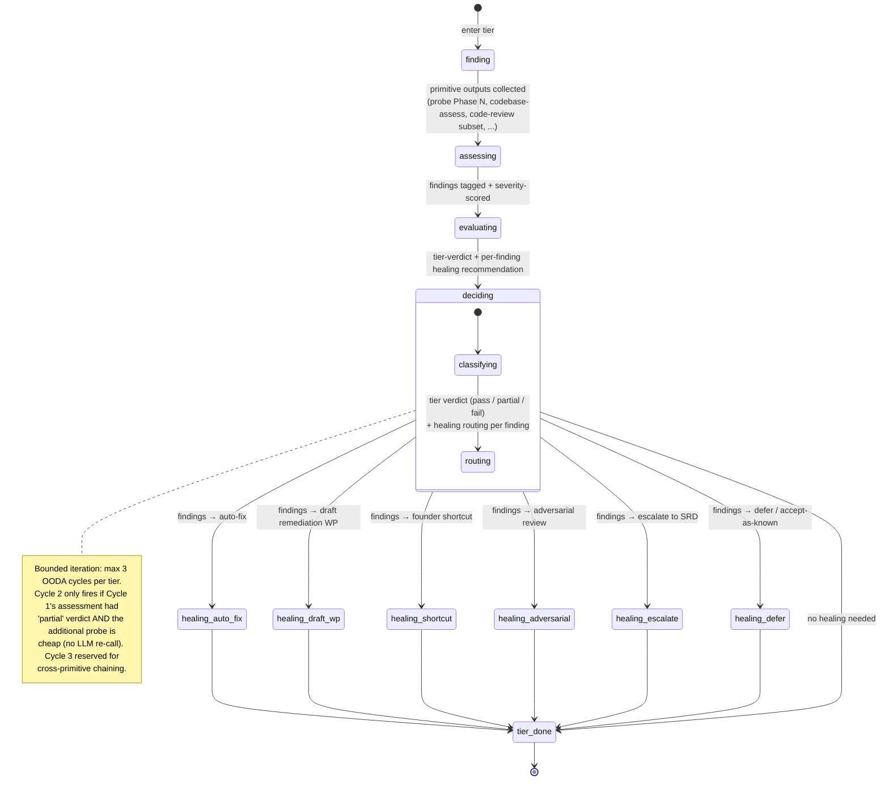

# Sulis Checkup — Technical Design Document

> **Status:** draft · **Mode:** investigation + design (no Work Packages, no implementation)
> **Brief:** `/Users/iain/Documents/repos/agents/` (Sulis marketplace) needs a single
> comprehensive code-health check the founder doesn't have to think about. Maslow's
> hierarchy for code: each tier checked, failures at low tiers short-circuit work
> at high tiers, one tiered report.
> **Sized:** tier L (multi-skill aggregator + new graph engine), addressable scope
> mostly net-new; partial coverage of `/sea:probe`, `/sea:codebase-audit`,
> `/sea:verify`, `/sulis-security:codebase-assess`, `/sea:code-review`.
> **Note on note-to-author:** the agent worked in greenfield mode (no SRD; no existing
> `.context/sulis-checkup`). The first ADR records this as the SRD gap.
> **ADRs produced:** 6 (graph engine; tier semantics; healing taxonomy; OODA per
> tier; report format; missing SRD as gap).

---

## Part 1 — Executive summary (the founder-facing read)

Today you have around ten different quality skills in the marketplace.
Most are good. None of them, on their own, answer the question you
actually have when you look at your project: **is this in good enough
shape?** You don't want to run six commands. You don't want to read
six reports. You want one button that says **"check my code"** and
gives you one organised answer.

### The picture

Think of code-health like Maslow's hierarchy. The bottom of the
pyramid has to be true before the top of the pyramid matters. There's
no point worrying about whether a function is named well if the build
is broken. There's no point obsessing about a beautiful design system
if there's a leaked password sitting in a git commit.

Seven tiers, lowest first:

1. **Exists** — does it build and run?
2. **Safe** — could anyone get hurt? (security holes, leaked secrets,
   personal data exposed)
3. **Works** — does it do what it's supposed to do? (tests pass, the
   feature does the thing)
4. **Survives** — does it handle when things go wrong? (timeouts,
   retries, no silent data loss)
5. **Understandable** — could a new person read this code and follow
   it? (clear names, modules that aren't kitchen sinks, docs match
   reality)
6. **Evolves** — can we change it later without breaking it? (tests
   cover the surface, no dead code, contracts intact)
7. **Polished** — is it delightful? (performance, accessibility,
   the founder-ergonomics layer)

The check walks the tiers in order. If the build is broken (tier 1
fails), the report tells you that's the only thing that matters
right now — everything else is noise until the build comes back.
If tier 1 is fine but there's a leaked AWS key (tier 2 critical),
the report tells you to fix the leak before worrying about whether
the code is well-named. Each tier gets a traffic-light verdict in
the front page; only the failing tiers get expanded.

### How the check actually runs

We don't run all ten skills sequentially every time — that's
wasteful and slow. The check is a **graph**: an outer graph that
walks the seven tiers, and an inner OODA loop per tier that says
"look, think, decide, act, repeat until the tier has a verdict".
Each tier has a small set of healing options: some tiers can fix
their own findings automatically (a missing timeout has a known
shape — wrap it); some tiers draft a remediation work package and
hand it to you to ship (an architecture refactor needs deliberation);
some tiers just record the finding and move on.

### What you get

One file. `CHECKUP.md`. Front page is the seven-tier traffic light.
Below that, deep-dive expansions only for the tiers that failed,
with the most-load-bearing fix at the top. Numbered shortcuts at
the bottom: `[1] fix the build`, `[2] rotate the leaked key`, etc.,
each of which fires the right downstream skill (`/sea:harden`,
`/sea:suggest-split`, manual escalation).

### What changes after this lands

Today the marketplace has a coverage matrix with gaps. This design
keeps the existing skills (they're good — they already do their
jobs) and adds an orchestrator that calls them in the right order
with the right gating. It also identifies which gaps need new
primitives and which are addressed by composing what we have.

---

## Part 2 — Source specification and references

| Source | Why |
|---|---|
| `docs/quality-coverage-matrix.md` | The 24-row gap analysis that triggered this work. Cross-checked in Part 4. |
| `plugins/sulis/CHANGELOG.md` v0.1.0–v0.4.0 | Establishes sulis as the canonical founder-facing plugin; introduces `add-skill` methodology, `founder-facing-conventions.md`, and the inbox aggregator pattern. |
| `plugins/sulis/references/founder-facing-conventions.md` | Rules 1–5 govern every founder-facing surface this skill produces. Audience lock = founder-facing or both. |
| `plugins/sulis/skills/add-skill/SKILL.md` | The five-gate methodology this design will be authored under when we move to implementation. |
| `plugins/sulis-security/skills/codebase-assess/references/primitives.md` | The 25-primitive catalogue; rows 5–8 of the coverage matrix; tier-2/tier-5/tier-6 candidates. |
| `plugins/sea/references/mece-3-architecture.md` | Form/Armor/Proof pillars; MEA-01..10. Tier-4 (Survives) and tier-6 (Evolves) map to MEA primitives. |
| `plugins/sea/references/boring-code.md` | The Green-stage standard. Any code that lands as part of `sulis-checkup` follows BC-01..BC-NN. |
| `plugins/sea/references/change-primitives.md` (inferred from agent.md citations) | Cross-group decision priority; informs the tier-5/6 healing strategy (refactor vs wrap). |
| `/Users/iain/Documents/repos/platform/apps/api/sulis/shared/workflows/` | The platform's graph-driven workflow service. **Study reference, not target.** Informs the engine choice ADR. |
| `/Users/iain/Documents/repos/platform/.specifications/kinds-and-tools/SUMMARY.md` + `KIND_LIFECYCLE.md` | The four-stage Kind lifecycle (find/generate/evaluate/decide). Already OODA-shaped; informs per-tier sub-graph design. |
| LangGraph documentation (StateGraph, conditional_edges, Send, checkpointer, interrupt/resume) | Informs the graph engine ADR. |

**No SRD exists** at `.specifications/sulis-checkup/`. **No context index exists**
at `.context/sulis-checkup/`. The agent ran `/sea:blueprint` in early-handoff /
greenfield mode with the user's brief as the sole upstream spec. The first ADR
records the absent SRD as an explicit gap, with the recommendation that
`srd:requirements-analyst` is run before any `/sea:decompose` step.

---

## Part 3 — Refined Maslow tier table (with audit results inline)

The seven tiers below are the refinement of the brief's draft. Boundary
adjustments are called out in the **Refinement note** column. Existing
skills + primitives listed are the **best-matching candidates today**;
the gap column names what's missing for the tier to be fully covered.

| # | Founder question | What gets checked | Existing skills + primitives | Gaps (recommended owner) | Refinement note |
|---|---|---|---|---|---|
| **1** | **Exists** — does it run? | Builds without error. Typecheck passes (mechanical baseline). Container image / deploy artefact produces. **Tests are discovered (the runner can find them)** — but tests *passing* is tier 3, not tier 1. | `/sea:probe` Phase 1.1 (stack), 1.9 (test discovery), 1.10 (lint dry-run). `/sea:code-review` CR-01 mechanical baseline (`tsc --noEmit`, `eslint`, `mypy`, `cargo check`, `go build`). | Build/deploy-artefact verification per language (a "does the Dockerfile build?" probe). Currently inferred from Phase 1.16 deployment topology + 1.10 lint signal — not directly executed. **Recommended:** extend `/sea:probe` Phase 1.9 with a `--build-artefact` opt-in. | Brief draft had `sea:probe` only. Adding CR-01 covers the typecheck/lint mechanical floor that distinguishes "compiles" from "ships". The brief asked about tier 1 vs 3 for tests: **tests passing is tier 3**, but tests *being runnable* (discovery) is tier 1, because a project that can't even find its tests is broken at the existence layer. |
| **2** | **Safe** — could anyone be harmed? | Hardcoded secrets in source/history. SQL/command/SSRF injection. Broken access control. Sensitive-data exposure. PII in logs. Supply-chain CVEs. Outdated EOL dependencies. Containers running as root. Plaintext secrets in deploy config. Verbose error messages leaking internals. | `/sulis-security:codebase-assess` covers SEC-01..07, DAT-01..05, SC-01..04, INF-01..04. `/sea:probe` Phase 1.17 credential scanning (hash-only, baseline-aware). `/sea:code-review` CR-09 PH-03 Safety primitive (migrations / secret patterns). | **Comprehensive coverage already exists.** Gap is *integration* — these primitives run in separate skills with separate report formats. The checkup graph re-uses them; no new primitives needed. | Brief draft was correct. Note tier-2 splits into two severity tracks: **critical** (leaked secret in production code → blocks everything) vs **advisory** (CVE on a transitive dep with no exploit path → recorded, doesn't gate). |
| **3** | **Works** — does it do what it should? | Tests pass. Functional spec met (if a spec exists). Smoke tests green against deploy. CR-10 performance procedural checks pass (no N+1 etc.). | `/sea:verify` perspectives P1–P6 (pillar coverage, WP completion, contract tests, chaos coverage, referential integrity, change-primitive discipline). `/sea:code-review` CR-10 performance checks + quality lens. `/sea:probe` Phase 1.9 (optional test execution). `/sulis-execution:status` for shipped-WP signal. | **`/sea:verify` requires an SRD + TDD + WPs to verify against** — only applicable to projects with prior spec work. For projects without a spec, "works" reduces to "tests pass + smoke green" — currently no skill owns the spec-less verification. **Recommended:** extend `/sea:probe` with a test-execution mode (`--run-tests`) that reports pass/fail without requiring an SRD. | Brief draft had `sea:verify` + test runners. Confirmed: test *execution* lives here, not at tier 1. |
| **4** | **Survives** — does it handle failure? | Every external call has timeout + retry + circuit breaker (MEA-04). Secrets fetched not embedded (MEA-05). Inter-service mTLS (MEA-06). Operations emit trace+log+metric (MEA-07). No data-loss paths on failure. Chaos tests exist (MEA-10). | `/sea:codebase-audit` Armor pillar — scans for unbounded HTTP/DB clients, missing timeouts, missing CBs, missing OTel. `/sea:harden` implements accepted deltas. `/sea:code-review` architecture lens within a PR. | **Per-operation Failure Mode and Effects Analysis (FMEA) is missing.** Coverage matrix row #16. The audit is one-shot ("scan everything once"); there is no per-module ongoing skill that asks "for each call site, what can fail and where does the failure go?" **Recommended:** new `sea:failure-mode-audit` (per coverage matrix row #16 + recommended new work #2). Owns module-level FMEA tables; consumes audit findings and adds the diagnosability layer (coverage matrix row #17). | Brief draft had `sea:codebase-audit` (Armor). Confirmed. Adding FMEA is the gap. |
| **5** | **Understandable** — can a new person read this? | Names are descriptive (no `wpx/wp/lib` jargon-density problem). Modules are cohesive (single concept, not kitchen-sink). Docs match code (no doc-drift). Cross-surface contracts (CLI ↔ SDK ↔ MCP) named consistently. | `/sea:probe` Phase 1.5 (coupling), 1.6 (CCN hotspots), 1.7 (wrapper-rot), 1.8 (conventions). `/sulis-security:CQ-01..05` (complexity, coverage, duplication, debt markers, review practices). `/sea:code-review` quality lens. `/sulis:discover-context` doc inventory. | **Stranger-reader naming/legibility/cohesion skill is missing.** Coverage matrix row #15. Coverage matrix row #18 (cross-surface contract drift) and #19 (doc-drift validation) are partial. **Recommended:** three skills — `sea:code-hygiene` (#15), `sea:surface-parity-audit` (#18), `sulis-context:validate` (#19, extends sulis-context). | Brief draft had a single new `sea:code-hygiene`. Coverage analysis shows tier 5 is actually **three sub-concerns** — naming/cohesion, surface parity, and doc drift. Bundling them into one skill loses the stranger-reader lens. Recommended split per coverage matrix. |
| **6** | **Evolves cleanly** — can we change it without breaking it? | Test coverage is real (not just count — coverage matrix row #22 says we count but don't judge). No dead code, no orphan exports, no stranded migrations. Surface contracts (port→adapter, schema→migration) intact. Migrations are N/M complete (no half-finished moves). | `/sea:probe` Phase 1.13 (dead code via ts-prune/vulture). `/sea:verify` P3 (contract test coverage) + P4 (chaos coverage). `/sea:code-review` CR-09 PH-04 Completeness primitive. `/sulis-security:CQ-02` test ratio signal. | **Three missing primitives.** Coverage matrix #20 (dead code), #21 (migration completion), #22 (test quality beyond coverage). **Recommended:** new `sea:dead-code-audit` (covers #20+#21 — they share infrastructure), new `sea:test-audit` (#22). Surface-parity-audit (from tier 5) also reads here. | Brief draft had three new skills. Refined per coverage matrix: the three concerns fold into **two** new skills (dead-code-audit covers both #20 and #21 because both are "is the cumulative state of the codebase coherent?" questions), plus test-audit. |
| **7** | **Polished** — is it delightful? | Performance (sub-tier-3 perf checks aside — CR-10 catches procedural N+1 already; tier 7 is empirical perf budgets). Accessibility. UX. Founder ergonomics (clear CLI, helpful error messages, sensible defaults). | None today. Coverage matrix row #23 (founder ergonomics) has no owner. Performance budgets typically tracked outside the marketplace. | **Whole tier is deferred.** Coverage matrix's second-wave gap. **Recommended:** new `sulis-concierge:ergonomics-audit` for founder UX (#23) when prioritised. Performance budgets best owned by deploy/observability tooling outside this marketplace. | Brief had tier 7 deferred. Confirmed defer. Checkup graph stubs tier 7 with a "not applicable for this run" terminal — it doesn't fail, it just doesn't gate. |

### Boundary decisions called out

1. **Tier 1 vs tier 3 for tests** — *test discoverability* sits at tier 1 (does
   the runner even find the test directory?). *Test execution result* sits at
   tier 3 (does the test pass?). A project where the test runner is misconfigured
   so badly that it returns "no tests found" fails tier 1, because the runner is
   not actually verifying anything — it's broken in the same way a non-compiling
   build is broken.

2. **Tier 4 vs tier 6** — *Armor primitives present* sits at tier 4 (does the
   call have a timeout?). *Test coverage of those primitives* sits at tier 6
   (does the chaos test exist?). Same primitive, two different load-bearing
   properties. The tier-4 check asks "is the safety net there?"; the tier-6
   check asks "have we proven the safety net works?".

3. **Tier 5 vs tier 6** — *naming and cohesion* (tier 5) is about the present-day
   reader. *Contract integrity and migration completion* (tier 6) is about the
   future-changer. A codebase can be readable but full of half-finished
   migrations, or migrated-cleanly but with kitchen-sink files. Different
   failure modes, different healing.

4. **Tier 7 stays deferred** — performance, accessibility, and founder
   ergonomics are real concerns but lower-frequency and (in the case of perf)
   often better measured against deployed traffic, which is outside the
   marketplace's primary scope. Stub the tier; don't pretend to check it.

5. **Tier ordering is fixed; tier gating is configurable.** The order
   (1→2→3→4→5→6→7) is load-bearing — it's the Maslow claim. Gating semantics
   (when does a fail at tier N short-circuit tier N+1?) is a separate axis,
   covered in Part 6 and ADR-002.

---

## Part 4 — Coverage matrix cross-check

Every row in `docs/quality-coverage-matrix.md` mapped to a tier. Rows that
don't fit are flagged.

| Matrix row | Concern | Tier | Note |
|---|---|---|---|
| 1 | Per-change correctness | 3 (Works) | `/sea:code-review` already lives at the PR layer; checkup runs it on a branch or last-N-commits in a project-level pass. |
| 2 | PR hygiene + sizing | 3 (Works) | Same — composes from `/sea:code-review` + `/sea:suggest-split` outputs. |
| 3 | Architecture primitive gaps | 4 (Survives) | `/sea:codebase-audit` is the tier-4 backbone. |
| 4 | Post-WP completeness | 6 (Evolves) | `/sea:verify` is tier-6 because it asks "is the architecture coherent enough to change?". Sub-result feeds tier 3 (works) via P2 WP-completion. |
| 5 | Cyclomatic complexity | 5 (Understandable) | Coverage overlap between `/sea:probe` and `sulis-security:CQ-01` resolved by checkup: probe is canonical (deeper), CQ-01 reads probe output. ADR not needed yet — flag as an existing consolidation opportunity to address out-of-band. |
| 6 | Test coverage ratio | 6 (Evolves) | `sulis-security:CQ-02`. Cross-feeds tier 3 if coverage is so low it suggests "works" is unverified. |
| 7 | Code duplication | 5 (Understandable) | `sulis-security:CQ-03`. |
| 8 | Tech-debt markers | 5 (Understandable) | `sulis-security:CQ-04`. |
| 9 | Review practices (git log) | 6 (Evolves) — adjacent to process | `sulis-security:CQ-05`. Borderline: process not code. Recorded under tier 6 because review patterns predict evolvability. |
| 10 | Security vulns | 2 (Safe) | `sulis-security:codebase-assess`. |
| 11 | Data protection / PII | 2 (Safe) | Same. |
| 12 | Supply chain | 2 (Safe) | Same. |
| 13 | Infrastructure posture | 2 (Safe) — for INF-02 secrets; 4 (Survives) for INF-04 error handling | INF-04 (verbose errors) is actually a security concern (info disclosure) AND an operational concern (no diagnostic). The checkup graph allows the same primitive to feed two tiers — see ADR-003. |
| 14 | Doc / ADR inventory | (process — pre-checkup) | `/sulis:discover-context` runs as a *pre-condition* of the checkup, not as a tier. The checkup's Phase 0 calls it if `.context/{project}/INDEX.md` is missing. |
| 15 | Naming / legibility / cohesion | 5 (Understandable) | **GAP** — new `sea:code-hygiene` needed. |
| 16 | Failure-mode enumeration | 4 (Survives) | **PARTIAL** — new `sea:failure-mode-audit` needed for per-module FMEA. |
| 17 | Observability / diagnosability | 4 (Survives) | **GAP** — addressed by `sea:failure-mode-audit` (folds in the "can the operator diagnose this op from logs alone?" lens). |
| 18 | Cross-surface contract drift | 5 (Understandable) | **GAP** — new `sea:surface-parity-audit` needed. Also reads to tier 6 because surface drift breaks evolvability. |
| 19 | Doc drift | 5 (Understandable) | **PARTIAL** — `sulis-context:validate` new sub-skill needed. |
| 20 | Dead code / stale deprecations | 6 (Evolves) | **PARTIAL** — new `sea:dead-code-audit` needed. |
| 21 | Migration completion | 6 (Evolves) | **PARTIAL** — same skill as #20. |
| 22 | Test quality beyond coverage | 6 (Evolves) | **PARTIAL** — new `sea:test-audit` needed. |
| 23 | CLI / founder ergonomics | 7 (Polished) | **GAP** — deferred per tier-7 decision. |
| 24 | Manifest hygiene | 1 (Exists) — for parseability; 3 (Works) — for semantic correctness | **PARTIAL** — extend `/sea:code-review` checklist + checkup runs YAML/JSON parser as part of the tier-1 mechanical floor. |

**No row failed to fit a tier.** Two rows (13, 24) cross-tier — a single primitive
contributing to two tiers. ADR-003 covers the "primitive contributes to multiple
tiers" pattern.

---

## Part 5 — Healing pathway per tier

Healing has six prototypes, drawn from existing marketplace patterns. The
table assigns one or more healing prototypes per tier with rationale.

### The six healing prototypes

| Prototype | Pattern source | When it works |
|---|---|---|
| **Auto-fix** | `/sea:harden` | When the fix is well-bounded and the failing characterisation test can be constructed deterministically. Example: add a timeout to an unwrapped `fetch()` call. |
| **Auto-draft remediation WP** | `/sulis-execution:backfill-gates`, `backfill-code-review` | When the fix needs deliberation but the gap is concrete. The skill drafts a WP at `status: proposed`; the founder ships it through the existing executor pipeline. |
| **Founder shortcut** | `/sulis:inbox` `[1] resume` pattern | When the action is low-stakes and routine. Echo-before-act per founder-facing-conventions Rule 3. |
| **Adversarial human-in-the-loop** | `/idc:adversarial-review` pattern | When the fix is a design decision. Skill produces a perspective; founder accepts/rejects/modifies. |
| **Escalate to SRD** | `/srd:requirements-analyst` referral | When the gap is a missing requirement, not missing code. Example: tier 3 fails because there's no spec for the feature — the answer isn't to add tests, it's to clarify the spec. |
| **Defer / accept-as-known** | `/sea:verify` OPEN_RISK pattern | When the risk is acknowledged but not fixed now. Recorded in the checkup state so re-runs don't re-surface it. |

### Per-tier healing assignment

| Tier | Primary healing | Secondary | Rationale |
|---|---|---|---|
| **1 — Exists** | **Auto-draft remediation WP** for build failures (with the failing typecheck/lint output embedded). | Founder shortcut: `[1] open the failing file at the first error`. | Build failures usually have one root cause and one or two fix sites. The WP is short; the founder ships it. Auto-fix is too risky because the agent might "fix" the build by deleting symbols rather than understanding the missing import. |
| **2 — Safe** | **Auto-fix** for known-shape findings (secret in source → replace with vault lookup; missing CSP header → add). | **Adversarial** for security-design findings (access-control gap → human reads the threat model). **Escalate** for unpatched supply-chain CVEs requiring vendor coordination. | Tier 2 splits by finding type. Bounded fixes (secret replacement) are exactly `/sea:harden`'s wheelhouse — the failing test is "secret appears in HEAD"; the green test is "secret has been rotated AND removed from history". Design gaps need human judgment. |
| **3 — Works** | **Auto-draft remediation WP** for failing tests (per-test). | **Escalate to SRD** if a test failure exposes a spec ambiguity. Founder shortcut: `[1] re-run failing test in isolation`. | Failing tests usually have a known cause (recent diff broke something). The WP carries the test name + most-recently-modified file in the test's call graph. SRD escalation only when the test author and the production code can't be reconciled without a spec decision. |
| **4 — Survives** | **Auto-fix** via `/sea:harden` for HD-NNN deltas with `subject_ownership: external` (timeouts on HTTP clients, retries on DB calls, OTel instrumentation). | **Auto-draft remediation WP** for findings requiring per-call-site judgment (which dependencies are critical-path vs advisory; which need bulkheads). | Tier 4 is the most mature healing path — `/sea:harden` and `/sea:codebase-audit` are already designed exactly for this. The checkup graph reuses them as-is. |
| **5 — Understandable** | **Auto-draft remediation WP** for naming/cohesion findings, with the recommended new name + rationale embedded. | **Adversarial** for "should this module be split?" decisions. **Defer / accept-as-known** for legitimate-jargon decisions (e.g. domain terms that look like jargon to a stranger but are correct). | Renaming and module-splitting are design decisions, not mechanical fixes. The skill proposes; the founder chooses. Auto-fix here would produce a name-change PR that the founder hates and the team rejects. |
| **6 — Evolves** | **Auto-draft remediation WP** for dead-code removal (one WP per orphan symbol or symbol group). | **Adversarial** for migration-completion decisions (is this migration legitimately stalled or actively in-progress?). **Defer** for low-value test-quality findings. | Dead-code removal is locally bounded but globally risky (the symbol might be referenced via reflection / dynamic dispatch). The WP carries the static-analysis evidence and the burden of proof falls to the executor agent in the Red stage. |
| **7 — Polished** | **Defer / accept-as-known** for the v1 of checkup. | (future: adversarial for UX, escalate for perf budget conversations) | Tier 7 is stubbed. The checkup reports "not assessed in this run" and moves on. When the tier graduates to active, founder ergonomics findings naturally route to adversarial (it's a taste decision). |

### Why the line between auto-fix and draft-WP matters

Auto-fix is **safe** when:
- The failing test is mechanical (a regex or a typecheck) — not behavioural.
- The fix has one canonical shape (a timeout has a number; a vault lookup has a key path).
- The fix doesn't change the contract of the surrounding code (a timeout on a `fetch()` doesn't change the function's signature or the data flowing through it).

Auto-fix is **dangerous** when:
- The fix could plausibly take multiple shapes and choosing the wrong one creates technical debt (renaming `wpx` to `executor` vs `pipeline` vs `train-runner` — three legitimate options).
- The fix requires understanding intent (a flaky test fixed by adding a retry loop hides the bug instead of finding it).
- The fix touches more than one file in non-mechanical ways.

The default for tiers 5 and 6 is **draft-WP** because almost every legibility/evolvability finding involves judgement.

---

## Part 6 — Tier-gating semantics

The brief asked three sub-questions: hard stop vs soft de-prioritise; severity-aware
gating; default + founder override. Answers below; full rationale in ADR-002.

### The three gating modes

| Mode | Behaviour | When to use |
|---|---|---|
| **Hard stop** | If tier N has any `critical` finding, do NOT run tiers N+1..7. Report stops at tier N with the failing finding and the remediation. | Tier 1 (Exists) and tier 2 (Safe) **critical** findings only. A non-building project cannot meaningfully be checked at higher tiers. A leaked secret is a fix-immediately situation. |
| **Soft de-prioritise** | Run all tiers but visually de-emphasise findings at tier N+1..7 if tier N has a `high` finding. The report still shows them, but collapsed below the load-bearing fix. | Tier 1 (Exists) and tier 2 (Safe) `high` findings. Tier 3+ findings of any severity. |
| **Per-finding gating** | A single finding may opt-into hard-stop semantics (declared in its source skill's metadata). | Rare — used for findings where progressing past them risks data loss or auth bypass. Example: a security finding showing user-data exfiltration. |

### Default

- **Hard stop:** tier 1 `critical`, tier 2 `critical`, any per-finding hard-stop flag.
- **Soft de-prioritise:** everything else.
- **Render order:** failing tiers first, by severity within tier. Passing tiers collapse to a single line each.

### Founder override

Two override switches, both surfaced in the checkup command:

- `--check-everything` — disables hard-stop; runs all tiers regardless of lower-tier failures. Used when the founder wants the full picture (e.g. before a security audit). Report still surfaces hard-stop findings at the top with `(WOULD HAVE STOPPED)` tag.
- `--tier=N` — runs only tier N (and its prerequisites if any have hard-stop conditions that aren't yet resolved). Used for focused re-runs.

Override semantics intentionally **don't** allow per-tier skipping with no reason. A founder who wants to skip tier 2 has to either fix the finding or accept-as-known in the checkup state (recorded with a date and a reason).

### Why not severity-aware everywhere

The temptation is to say "high in tier N gates tier N+1 if N is below 4, soft otherwise". This is too clever. The Maslow claim is **load-bearing** — tier 2 is more load-bearing than tier 5 *because of what each tier checks*, not because of where it sits in a severity matrix. A `critical` at tier 5 (e.g. "the entire codebase is one 5000-line file") is real but doesn't prevent reading tier 6 results. A `critical` at tier 1 makes everything else literally impossible to verify.

Keep gating simple. The complexity goes into the **healing** layer (which differs per tier), not the **gating** layer.

---

## Part 7 — Graph architecture

The checkup is a graph. Two layers: an **outer graph** that walks the seven tiers
and applies the gating from Part 6, and a per-tier **inner OODA sub-graph** that
runs the tier's primitives and produces a tier verdict.

### Architectural shape

```mermaid
flowchart TD
    Start([Founder runs /sulis:checkup]) --> Phase0{Context index<br/>present?}
    Phase0 -->|No| Discover[Run /sulis:discover-context]
    Phase0 -->|Yes| LoadState[Load .checkup/{project}/state.json<br/>or initialise]
    Discover --> LoadState

    LoadState --> Tier1
    Tier1[Tier 1: Exists OODA] -->|pass or non-critical| Tier2
    Tier1 -->|critical fail<br/>hard-stop| Render
    Tier2[Tier 2: Safe OODA] -->|pass or non-critical| Tier3
    Tier2 -->|critical fail<br/>hard-stop| Render
    Tier3[Tier 3: Works OODA] --> Tier4
    Tier4[Tier 4: Survives OODA] --> Tier5
    Tier5[Tier 5: Understandable OODA] --> Tier6
    Tier6[Tier 6: Evolves OODA] --> Tier7
    Tier7[Tier 7: Polished — stub] --> Render

    Render[Render CHECKUP.md<br/>+ healing shortcuts] --> End([Done])

    classDef ooda fill:#e8f4ff,stroke:#0066cc
    classDef gate fill:#fff4e1,stroke:#cc6600
    class Tier1,Tier2,Tier3,Tier4,Tier5,Tier6,Tier7 ooda
    class Phase0 gate
```

### Per-tier OODA sub-graph

Every tier runs the same shape internally — modelled on the **kinds-and-tools
four-stage Kind lifecycle** (find / generate / evaluate / decide) which is
already OODA-shaped. This is borrowed pattern, not borrowed code.



**OODA cycle bounding (MUST):** max 3 cycles per tier. Cycle 1 always runs.
Cycle 2 only fires when Cycle 1 verdict is `partial` AND the additional
probe is cheap (no new LLM call — only re-reading existing tool output with
new criteria). Cycle 3 reserved for cross-primitive chaining (e.g. a
tier-2 finding refines a tier-4 query). Borrowed from `sulis-security`'s
"3-5 cycles for code-only, 5-7 with deployed URL" but tighter because
checkup is project-wide not security-deep.

### State object

The graph's shared state is a typed object (TypedDict in Python, equivalent
in TS). Each node reads + updates fields; reducers handle list-append semantics
for the findings list.

```python
class CheckupState(TypedDict):
    # invocation context
    project: str
    workspace_root: Path
    invocation_id: str  # uuid; thread_id for the checkpointer
    started_at: datetime
    override_flags: dict[str, Any]  # --check-everything, --tier=N

    # context index status
    context_index_present: bool
    context_index_path: Path | None

    # per-tier state (one entry per tier)
    tiers: dict[int, TierState]

    # cross-tier findings (a single finding may contribute to >1 tier)
    findings: Annotated[list[Finding], operator.add]

    # healing actions queued
    healing_actions: Annotated[list[HealingAction], operator.add]

    # terminal
    overall_verdict: Literal["pass", "partial", "fail", "stopped"] | None
    short_circuit_at_tier: int | None  # if hard-stop fired

class TierState(TypedDict):
    tier_id: int
    tier_name: str
    status: Literal["pending", "running", "passed", "partial", "failed", "skipped"]
    ooda_cycle: int  # 1..3
    primitives_run: list[str]  # which sub-skill/tool outputs were consumed
    started_at: datetime | None
    completed_at: datetime | None

class Finding(TypedDict):
    finding_id: str  # stable hash for re-run dedup
    tier: int
    source: str  # which primitive surfaced it (e.g. "sulis-security:SEC-07")
    severity: Literal["critical", "high", "medium", "low", "advisory"]
    file: str | None
    line: int | None
    message: str  # operator-language version
    founder_message: str  # translated per founder-facing-conventions
    recommended_healing: HealingPrototype
    hard_stop: bool  # per-finding override

class HealingAction(TypedDict):
    finding_id: str
    prototype: HealingPrototype
    target: str  # WP path, shortcut command, ADR path, etc.
    status: Literal["queued", "applied", "skipped", "deferred"]
```

### Engine recommendation: LangGraph

ADR-001 captures the full rationale. Headline:

**Use LangGraph.** Not "port platform workflows patterns to the marketplace"
and not "build a minimal custom graph engine". Reasons:

1. **The platform workflows service is built ON LangGraph.** `GenericGraphCompiler`
   compiles `GraphDefinition` → LangGraph `CompiledStateGraph`. The platform's
   abstraction is "your declarative graph DSL on top of LangGraph". Re-implementing
   that DSL in the marketplace adds carrying cost with no win — the abstraction
   was justified at the platform by needing to compose graphs from typed Kind
   YAML; the checkup composes one graph from Python code.

2. **The checkup graph is small (15-25 nodes, 30-40 edges).** Platform's
   `GenericGraphCompiler` has `MAX_NODES = 200`, `MAX_EDGES = 500` for resource-
   exhaustion guards. Checkup is an order of magnitude smaller. The DSL overhead
   doesn't pay off at this scale.

3. **LangGraph's primitives map cleanly onto the checkup needs:**
   - **Outer tier sequencing** → `add_edge` (linear) + `add_conditional_edges`
     for hard-stop short-circuit.
   - **OODA per tier** → sub-StateGraph compiled separately and invoked via
     `kind_invocation`-equivalent node (just call `subgraph.invoke(state)`
     from a parent node, no special LangGraph feature needed).
   - **Per-finding healing dispatch** → `Send()` for dynamic parallel
     dispatch (4 findings → 4 healing nodes in parallel).
   - **Resumable runs** → LangGraph's `MemorySaver`/`SqliteSaver` checkpointer
     with `thread_id = invocation_id` (per LangGraph 2026 best practice;
     `SqliteSaver` for production marketplace use because we want resumability
     across process restarts).
   - **Founder override → interrupt mid-tier** → LangGraph's `interrupt()`
     function for adversarial-review nodes (the human says yes/no/modify).

4. **No bespoke YAML DSL.** Define the checkup graph in Python. The graph
   shape is stable across all checkup runs; the variability is in state, not
   topology.

5. **Carrying cost.** LangGraph is one dependency (`pip install langgraph`).
   Building a custom engine is N person-weeks + ongoing maintenance.

What we **don't** borrow from the platform workflows service:

- The DSL (`GraphDefinition` / `NodeDef` / `EdgeDef`). Justified at the platform
  for compiling typed YAML; not justified at the marketplace.
- The lint rules (L01..L10). They enforce architectural separation across a
  100k-LOC codebase; checkup is a few hundred lines.
- The composition root pattern with `AdapterIdentity` freeze. Justified for
  multi-tenant production; checkup is single-tenant single-process.

What we **do** borrow as patterns (not code):

- **The four-stage Kind lifecycle shape** for the per-tier OODA sub-graph
  (find / generate / evaluate / decide → finding / assessing / evaluating /
  deciding-and-healing).
- **The structured Verdict idea** — every tier produces a typed verdict
  object, not a pass/fail bool. The verdict carries `reason_class`,
  `specific_feedback`, `suggested_next_step`. Borrowed exactly from FR-8
  in kinds-and-tools.
- **Bounded iteration with explicit guards** — `i < max_iterations` as a
  first-class transition guard, exactly as Kind's `revising_content` /
  `revising_context` edges show.
- **Multiple named terminals** — `passed`, `partial`, `failed`,
  `stopped_by_hard_stop`, `stopped_by_iteration_exhausted`,
  `stopped_by_technical_fatal` (Kind's FR-9 pattern applied to the
  checkup terminus).

### Why not minimal custom

A minimal-custom engine sounds cheap but the moment you need checkpointing
for resumability ("the build crashed mid-run, pick up where it left off"),
or interrupt/resume for adversarial review ("the human says modify, then
continue"), or parallel `Send()` dispatch ("3 tier-5 findings each get their
own draft-WP node in parallel"), you're re-implementing LangGraph badly.
The decision to use LangGraph is also a decision to **stop re-implementing
LangGraph**.

### Why not platform-workflows port

The platform's workflows service is hexagonal-architecture-pure, multi-tenant,
production-grade. Most of that machinery is structural overhead for a
marketplace tool that runs locally for one founder at a time. Porting it
imports the cost without the benefit. We borrow the four-stage Kind lifecycle
*pattern* and the structured Verdict *contract* — both transferable as
ideas, not as code.

---

## Part 8 — Founder-facing surface design

### The command

**Working name:** `/sulis:checkup`.

Alternatives considered:
- `/sulis:health` — too vague (what kind of health? auth? db?). Rejected.
- `/sulis:audit` — overloaded already (codebase-audit, security audit). Rejected.
- `/sulis:review` — collides with `/sea:code-review` mental model. Rejected.
- `/sulis:status` — exists; reads INDEX state inline; conceptually orthogonal.

**Recommendation: `/sulis:checkup`.** Plain English. Implies "scheduled or
on-demand thorough look". No collision with existing commands. The medical
analogy is apt — Maslow's hierarchy + healing pathways are exactly the
diagnose-then-treat shape.

### Audience lock

`founder-facing` per `add-skill` Gate 2. All five rules in
`plugins/sulis/references/founder-facing-conventions.md` apply:
- Rule 1: FE-06 on every founder-visible string.
- Rule 2: Founder-readable name first, IDs in parens.
- Rule 3: Echo before act; prompt before destroy.
- Rule 4: Translate at output, not at storage.
- Rule 5: Error messages explain what + what-to-do.

### Report format — CHECKUP.md

**Two tiers per the `/sea:code-review` pattern.** Founder tier on top, technical
tier below the `## Technical detail` heading.

```markdown
# Project checkup — {project}

> **When:** 2026-05-23 14:32 (run id: a3f2c1d8)
> **Overall:** {verdict in plain English — e.g. "Two things need your attention"}

## At a glance

[ ] **Exists** — Build is broken. Three files have type errors.
[✓] **Safe** — No security issues found.
[✓] **Works** — All tests pass.
[—] **Survives** — Not checked yet (the build needs to pass first).
[—] **Understandable** — Not checked yet.
[—] **Evolves** — Not checked yet.
[—] **Polished** — (not part of this checkup yet)

> The build needs to come back before the deeper checks make sense.
> Fix the type errors first; re-run the checkup when the build is green.

## What needs your attention

### 1. The build won't compile (Must fix)

Three files have errors that stop the build:

- `apps/dashboard/app/coupons/page.tsx`, line 264 — uses `hasMore`
  but never declares it
- `src/payments/types.ts`, line 18 — imports a type that doesn't exist
- `src/lib/cache.ts`, line 42 — calls a function with the wrong arguments

**What to do:**
- [1] Apply the draft fixes (one per file) — they're queued and ready
- [2] Open the first failing file at the error
- [3] Skip — accept-as-known (you'll have to clear this before the next checkup)

---

## Technical detail

> Below this point is for engineers and downstream agents.

### Run metadata
- invocation_id: a3f2c1d8-...
- workspace_root: /Users/iain/Documents/repos/agents
- override_flags: {}
- ooda_cycles_executed: tier 1: 1; tier 2: 2; tier 3: 1
- short_circuit_at_tier: 1 (hard-stop triggered)

### Tier-by-tier
{detailed per-tier breakdown with finding IDs, severity scores,
 source primitives, healing-action references}

### Healing actions queued
- HD-NNN-fix-coupons-hasmore.md (status: proposed)
- HD-NNN-fix-payments-types.md (status: proposed)
- HD-NNN-fix-cache-args.md (status: proposed)

### Methodology self-attestation
- [✓] Context index loaded
- [✓] Tier 1 OODA: 1 cycle, build failed cleanly
- [—] Tiers 2–7 not run due to tier-1 hard-stop
- [✓] All findings cite source primitive
- [✓] All founder-visible strings passed FE-06
```

### Run semantics

| Semantic | Decision | Rationale |
|---|---|---|
| Fresh vs synthesise | **Fresh by default; synthesise on `--use-cached`.** | Founders mostly want a current picture. Cached mode is for cost-conscious re-runs ("I just fixed the secrets; re-check tier 2 only without re-running the others"). |
| Intermediate findings during OODA | **Final-only by default; stream intermediate on `--stream`.** | The graph runs in seconds-to-minutes; the founder doesn't want six intermediate "now running tier 4" messages. Stream is for debug. |
| Re-run after fixes | **Delta-only by default if `state.json` exists and `--delta` is set; full re-run otherwise.** | Delta-only resumes the LangGraph checkpoint at the failed tier, re-runs from there. Full re-run is the safer default (gives clean state). |
| Persistence | **`.checkup/{project}/state.json` + `.checkup/{project}/runs/{run-id}/CHECKUP.md`.** Latest run also symlinked to `.checkup/{project}/CHECKUP.md`. | Matches `.architecture/{project}/` convention. Run history retained for trend analysis. |
| Output of dismissed findings | **Persisted to `.checkup/{project}/dismissed.json` with reason + date.** Re-runs surface dismissed findings only in a separate "Previously dismissed" section. | Per `inbox` dogfood findings 5 + 10 (founder-facing-conventions MUC-F5) — dismissal write-back is required so the next checkup doesn't re-bother. |

### How healing routes work end-to-end

```mermaid
sequenceDiagram
    participant Founder
    participant Checkup as /sulis:checkup
    participant Tier4 as Tier 4 OODA
    participant Audit as /sea:codebase-audit
    participant Harden as /sea:harden
    participant Report as CHECKUP.md

    Founder->>Checkup: invoke
    Checkup->>Tier4: enter tier 4
    Tier4->>Audit: invoke (sub-skill)
    Audit-->>Tier4: 5 findings (3 timeout-missing, 2 secret-in-code)
    Tier4->>Tier4: classify findings → healing prototypes
    Tier4->>Report: queue 3 auto-fix actions (timeouts) + 2 draft-WP (secrets — sensitive)
    Tier4->>Checkup: tier-4 verdict: partial
    Checkup->>Report: render
    Report-->>Founder: "2 things to look at; 3 small fixes ready to apply"
    Founder->>Report: select [1] apply all ready fixes
    Report->>Harden: invoke with the 3 queued HD-NNN deltas
    Harden-->>Report: 3 fixes implemented + tests green
    Report-->>Founder: "Done. Re-run the checkup to confirm."
```

### Trigger condition (description: field, FE-06 compliant)

> Use when the founder wants a single check of their project's overall code health — covering whether it builds, whether it's safe, whether it works, whether it can handle failure, whether it's readable, and whether it can be changed safely. Produces one tiered report with the most-load-bearing fix first.

(36 words, founder-readable, no internal IDs.)

---

## Part 9 — Primitive gap list

The discrete table the brief asked for. **Recommended owner = which plugin
should host the new primitive when it's authored**, NOT a suggestion to ship
it now (that's `sulis:add-skill`'s job).

| # | Missing primitive | Tier | Why needed | Recommended owner |
|---|---|---|---|---|
| 1 | `sea:code-hygiene` | 5 | Coverage matrix #15 — naming/legibility/cohesion has no owner. Stranger-reader lens. | `sea` plugin (consistent with existing code-quality skills) |
| 2 | `sea:failure-mode-audit` | 4 | Coverage matrix #16 + #17 — per-operation FMEA + diagnosability. Codebase-audit is one-shot; need per-module ongoing. | `sea` plugin |
| 3 | `sea:surface-parity-audit` | 5 (primary), 6 (secondary) | Coverage matrix #18 — CLI ↔ SDK ↔ MCP ↔ OpenAPI drift. Affects readability AND evolvability. | `sea` plugin |
| 4 | `sea:dead-code-audit` | 6 | Coverage matrix #20 + #21 — dead code and migration completion are the same "cumulative codebase coherence" question. | `sea` plugin |
| 5 | `sea:test-audit` | 6 | Coverage matrix #22 — test-quality-beyond-coverage. We count, we don't judge. | `sea` plugin |
| 6 | `sulis-context:validate` | 5 | Coverage matrix #19 — doc-drift validation. Extends `sulis-context` (close to the inventory already there). | `sulis-context` plugin |
| 7 | `sulis-concierge:ergonomics-audit` | 7 | Coverage matrix #23 — founder ergonomics. Deferred for v1 of checkup. | `sulis` plugin (concierge ergonomics) — long-term |
| 8 | Build/deploy-artefact verification | 1 | Tier-1 gap surfaced in Part 3 — "does the Dockerfile build?" not directly executed. | Extend `/sea:probe` Phase 1.9 with `--build-artefact` opt-in (incremental, not new skill) |
| 9 | Spec-less test-execution mode | 3 | Tier-3 only fully covered by `/sea:verify` which requires SRD+TDD+WPs. Need a spec-less "tests pass + smoke green" mode. | Extend `/sea:probe` Phase 1.9 with `--run-tests` mode reporting pass/fail (already partially supported per probe SKILL.md) |
| 10 | Observability/diagnosability per-PR check | 3-4 | Coverage matrix #17 — extend `/sea:code-review` quality lens with diagnosability check. Incremental, not new skill. | Extend `/sea:code-review` CR-NN checklist |
| 11 | Manifest hygiene check | 1 | Coverage matrix #24 — `plugin.json`, `marketplace.json` semantic correctness beyond JSON-parseability. | Extend `/sea:code-review` PR-hygiene checklist OR extend `/sea:probe` Phase 1.16 |

**Eight new skills, three extensions.** This is the maximum scope. Checkup v1
ships with the four highest-priority new skills (#1–#4) plus the extensions
that fall into other skills naturally. Items #5–#7 + #11 are second-wave.

---

## Part 10 — Open questions

These need a founder/maintainer decision before `/sea:decompose` runs. Each
is genuinely open — not a question I could answer by reading more docs.

### Q1 — How aggressive should auto-fix be at tier 2?

`/sea:harden` currently auto-fixes hardcoded-secret findings by replacing the
literal with a vault lookup. The vault is configured at the project level. If
the project has no vault configured, what should checkup do?

- **Option A:** auto-fix nothing at tier 2 unless a vault config exists; otherwise draft-WP.
- **Option B:** auto-fix with `.env.example` as a fallback (insert reference, leave the actual value-supply problem to the founder).
- **Option C:** ask the founder per-finding.

Recommendation: **A**. The cost of B is "founder ships a `.env.example` reference but never gets around to wiring the real vault" — silent failure. C is annoying for batch runs.

### Q2 — Run cadence: on-demand only, or also scheduled?

The current design is on-demand (`/sulis:checkup` when the founder asks). Should it also run on a schedule (e.g. nightly via the existing `schedule` skill in the marketplace)? Scheduled runs would produce a trend line ("safety findings went from 3 to 5 this week"). Trade-off: scheduled runs cost LLM tokens; founders haven't asked for trend analysis yet.

Recommendation: defer. Ship v1 on-demand. Add `--schedule` if founders ask.

### Q3 — Cross-tier finding deduplication

A `verbose error message` finding could fire at tier 2 (info disclosure) AND tier 4 (no diagnostic). Same line of code, two valid findings, two valid healings. Do we:

- **Option A:** Show twice (once per tier), link them via a shared finding_id.
- **Option B:** Show once at the higher tier (most severe), reference the lower tier.
- **Option C:** Show at the lower tier (closest to the load-bearing fix), reference the higher.

Recommendation: **B for the founder tier, A for the technical tier**. Founder sees "this is a security issue (also makes diagnosis harder)"; engineers see both entries.

### Q4 — What "passing tier 3" means without a spec

If the project has no SRD/TDD/WPs, `/sea:verify` doesn't apply. Tier 3 then reduces to "tests pass + smoke green". But a project with no spec and no tests passes tier 3 trivially. Is that right?

Recommendation: **no.** A project with no tests should produce a tier 3 verdict of `partial` with the finding "no tests detected — tier 3 cannot be fully assessed". The tier 6 test-audit primitive will then drive the founder toward adding tests.

### Q5 — Where do checkup state files live?

Proposed: `.checkup/{project}/`. Consistent with `.architecture/{project}/`, `.specifications/{project}/`, `.security/{project}/`, `.context/{project}/`. Confirm OK?

### Q6 — Tier 7 stub

Tier 7 (Polished) is currently stubbed as `not assessed`. Should the report show it at all, or just hide the row until the tier graduates?

Recommendation: **show it as `not assessed in this run`** so founders know it exists and isn't being secretly skipped. Footnote: "Performance, accessibility, and UX checks are planned for a future version of checkup."

### Q7 — Does the checkup invoke `/sulis:discover-context` automatically?

Current proposal: yes (Phase 0). But discover is itself a non-trivial skill that may produce its own questions for the founder. Auto-invoking it creates a recursive interactive surface inside what should be a one-button command.

Recommendation: **auto-invoke only in non-interactive form** (write the index with `informational` classifications by default; surface a follow-up "review what discover found" shortcut in the checkup report). Or, alternatively, **refuse to run** if no context index exists and tell the founder to run discover first. Founder preference needed.

---

## Part 11 — Trade-offs called out

| Trade-off | Decision | Cost accepted |
|---|---|---|
| Use LangGraph vs build custom | LangGraph (ADR-001) | One Python dependency; some learning curve for contributors unfamiliar with StateGraph |
| Hard-stop at tier 1+2 critical vs run-everything | Hard-stop (ADR-002) | Founder doesn't see lower-priority findings until the load-bearing fix lands. Override flag exists for the "I want the full picture" case. |
| Six healing prototypes vs single uniform approach | Six (ADR-003) | More surface area; each prototype has its own UX. Single approach (always-draft-WP) was simpler but lost the auto-fix wins at tiers 2 and 4. |
| Bound OODA at 3 cycles vs let it run | 3 cycles (ADR-004) | Some assessments would benefit from more iteration. The bound prevents runaway cost and matches sulis-security's calibration. |
| Two-tier report vs single-tier | Two-tier (ADR-005) | Engineers reading the report stop at "## Technical detail"; founders skim above. Code-review already validated this shape. |
| Ship without SRD | Ship now, escalate gap to ADR-006 | TDD is the substrate for an eventual SRD. The marketplace operates on a "produce design first, validate with use" cadence already. |
| Defer tier 7 | Defer | Founders haven't asked for perf/a11y/UX checks. Stub the tier, ship the architecture. |

---

## Part 12 — Sizing report

| Field | Value |
|---|---|
| Tier (computed) | L (multi-skill aggregator + new graph engine adoption + 4-8 new skills) |
| Tier (user-confirmed) | (pending — user did not pre-confirm; tier inferred from brief scope) |
| TDD length | ~650 lines (target for L: 400-700) |
| ADRs produced | 6 (target for L: 3-10) |
| Pillar coverage applied | Form: full (new graph engine + state design); Armor: gap-filled (founder-facing-conventions for safety, no new external calls); Proof: gap-filled (per-tier OODA assertions, no chaos tests needed because checkup is local-only) |
| Authoritative sources referenced | 8 (coverage matrix, 4 sulis docs, mece-3, boring-code, founder-english) |
| Sections that referenced rather than restated | Founder-facing-conventions (referenced, not restated); MECE-3 (referenced for tier 4 mapping, not restated); kinds-and-tools lifecycle (referenced as pattern source, not copied) |
| Circuit breakers triggered | None |
| Reserved-Vocabulary Sweep | Skipped — greenfield, no probe synthesis with `reserved_vocabulary_hint` available. Vocabulary check done informally: `Checkup`, `Tier`, `OODA cycle`, `Finding`, `HealingAction`, `Verdict` checked against marketplace; `Verdict` matches kinds-and-tools usage (intentional borrow); no collisions. |
| Reserved-Vocabulary Sweep formal | DEFERRED — to be run when probe v0.9.1+ output exists for the marketplace and during `/sea:decompose`. |

---

## Part 13 — Reading order for downstream agents

| Reader | Start here |
|---|---|
| Founder reviewing this design | Part 1 (executive summary). Stop at Part 3. |
| Maintainer deciding whether to commit to the design | Parts 1, 3, 5, 7, 10. |
| Future SRD author writing `.specifications/sulis-checkup/SRD.md` | Parts 3, 4, 9, 10. Treat Part 9's gap list and Part 10's open questions as the source for the SRD's FR/NFR set. |
| Future SEA author running `/sea:decompose` after SRD lands | Parts 3, 7, 8 + all ADRs. |
| Future `sulis:add-skill` author for new primitives | Part 9 (gap list), plus the ADRs once the SRD is in place. |
