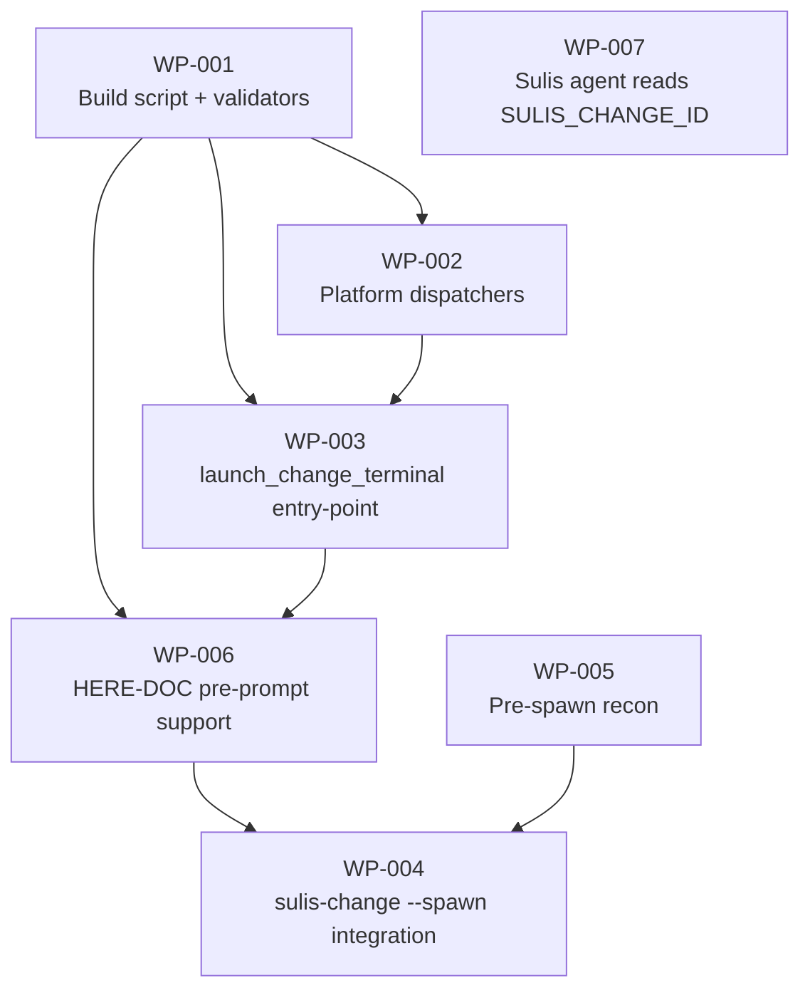

# Work Package Index — terminal-launcher-port

> **TDD:** [../TDD.md](../TDD.md)
> **SIZING:** [../SIZING.md](../SIZING.md)
> **ARCH:** [../ARCH.yaml](../ARCH.yaml)
> **Total WPs:** 7 (4 launcher mechanism + 3 integration)
> **Critical path:** WP-001 → WP-002 → WP-003 → WP-006 → WP-004 (5 packages)
> **Peak parallelism:** 3 (WP-001/WP-005/WP-007 can run simultaneously at start)
> **Tier:** S (per SIZING.md; target 3–8 WPs ✓)

## Status Summary

| Status | Count |
|---|---|
| pending | 7 |
| in_progress | 0 |
| done | 0 |
| blocked | 0 |

## Primitive Distribution

| Group | Primitive | Count | WPs |
|---|---|---|---|
| EXPAND | Create | 1 | WP-001 (new module file) |
| EXPAND | Extend | 6 | WP-002, WP-003, WP-004, WP-005, WP-006, WP-007 (all extend existing modules / files / agent body) |

## Wrap Audit

| WP | Subject | Ownership | Removal Plan | Status |
|---|---|---|---|---|
| (none) | — | — | — | — |

**No Wraps proposed.** Subprocess calls to `osascript` / `gnome-terminal` / `claude` are direct OS or CLI invocations, not SDK wrapping.

## Two distinct concerns

The WP set covers two related but separable concerns:

**A — Launcher mechanism** (WP-001 → WP-002 → WP-003 → WP-004):
The plumbing — module that builds shell scripts, dispatches to platform-specific spawn, integrates with `sulis-change start`. By itself, ships a working `sulis-change start --spawn` that opens a new terminal in the worktree with `SULIS_CHANGE_ID` set.

**B — Integration** (WP-005, WP-006, WP-007):
The polish that makes A actually feel like "the change is focused in the new terminal" — pre-spawn recon writes context, HERE-DOC pre-prompt briefs the spawned Claude session, Sulis agent recognises `SULIS_CHANGE_ID` and greets in change-context mode.

A alone is functional but cold. A + B gives the founder-experience the design doc describes.

## Dependency Graph

Critical path: **WP-001 → WP-002 → WP-003 → WP-006 → WP-004** (5 deep).

Parallel-able branches:
- **WP-005** (pre-spawn recon — touches `sulis-change` + new recon helper; independent of launcher module) — can land alongside WP-001/WP-002/WP-003
- **WP-007** (agent body modification — touches `plugins/sulis/agents/sulis.md`; independent of all Python) — can land alongside any phase

## WP Table

| ID | Title | Primitive | Status | Depends On | Blocks | Token (in/out) | TDD § |
|---|---|---|---|---|---|---|---|
| **A — Launcher mechanism** | | | | | | | |
| WP-001 | Create `_terminal_launcher.py` with `_build_launch_script` + input validators | create | pending | — | WP-002, WP-003, WP-006 | 6k / 4k | 3.1 + 3.2 |
| WP-002 | Extend with platform dispatchers (_launch_macos/_linux/_headless) | extend | pending | WP-001 | WP-003 | 5k / 4k | 3.1 + 3.3 |
| WP-003 | Extend with `launch_change_terminal` entry-point + session.json | extend | pending | WP-001, WP-002 | WP-004, WP-006 | 6k / 3k | 3.1 + 3.4 |
| WP-004 | Wire `--spawn` into `sulis-change start` + smoke-test doc + version bump | extend | pending | WP-003, WP-005, WP-006 | — | 4k / 2k | 3.1 |
| **B — Integration** | | | | | | | |
| WP-005 | Pre-spawn recon — write `CONTEXT.md` for the change | extend | pending | — | WP-004 | 4k / 3k | 3.1 + design-doc § Session binding |
| WP-006 | HERE-DOC pre-prompt support in `_build_launch_script` + `launch_change_terminal` | extend | pending | WP-001, WP-003 | WP-004 | 5k / 3k | 3.1 + 3.2 |
| WP-007 | Sulis agent reads `SULIS_CHANGE_ID` at session start + greets in change-context mode | extend | pending | — | — | 4k / 2k | 3.1 + design-doc § Session binding |
| **Total** | | | | | | | **34k / 21k** | |

## Recommended Implementation Order

Sequence respecting dependencies + parallel opportunities:

**Round 1** (parallel, 3 WPs):
- WP-001 (foundational)
- WP-005 (independent — recon)
- WP-007 (independent — agent body)

**Round 2** (WP-002 only — depends on WP-001):
- WP-002 (dispatchers)

**Round 3** (parallel, 2 WPs — both depend on WP-001 + WP-002):
- WP-003 (entry-point)
- WP-006 (HERE-DOC support — could also start here once WP-001 ships if we accept a brief WP-003 sub-dependency)

Actually WP-006 depends on WP-003 (modifies the entry-point signature too), so:

**Round 3** (WP-003 only):
- WP-003 (entry-point)

**Round 4** (WP-006 — depends on WP-003):
- WP-006 (HERE-DOC support)

**Round 5** (WP-004 — depends on WP-003 + WP-005 + WP-006):
- WP-004 (sulis-change integration)

Total: ~5 rounds, ~55k tokens, ~5–7 commit cycles.

## Total surface

| Metric | Value |
|---|---|
| New files | 4 (`_terminal_launcher.py` + `test_terminal_launcher.py` + `_change_recon.py` or extension to `_wpxlib.py` + `test_change_recon.py`) |
| Modified files | 5 (`sulis-change`, `plugin.json`, `marketplace.json`, `CHANGELOG.md`, `plugins/sulis/agents/sulis.md`) |
| Manual smoke-test docs | 4 (`smoke_terminal_launcher.md`, `smoke_sulis_change_context.md`, `smoke_sulis_change_id_stale.md`, `smoke_sulis_no_change_id.md`) |
| Total LOC introduced | ~500 (~250 launcher + ~80 recon + ~80 agent-body addition + ~90 tests) |
| Total LOC modified | ~40 (sulis-change + manifests + CHANGELOG) |

## What's still deferred to later phases (NOT in this WP set)

- **`/sulis:change start` slash command** (founder-facing wrapper around `sulis-change start --spawn`) — Phase 6
- **`/sulis:changes` smartlog / dashboard view** — Phase 6, requires Phase 5 #4 SQLite (deferred)
- **`/sulis:change focus CH-NNN` reattach** to a spawned terminal — Phase 6, requires session.json pid + os-specific window-focus calls
- **Heartbeat / session liveness tracking** — Phase 5 #4 SQLite (deferred)
- **Committed copy of CONTEXT.md at `.architecture/{project}/changes/{ulid}/CONTEXT.md`** — Phase 5.x follow-up (local-only sufficient for v0.43.0)

After this WP set ships at v0.43.0, founders can run `sulis-change start --slug X --primitive Y --spawn` and get a new terminal with a focused Sulis session that knows about the change. The full founder-CLI surface (slash commands) lands in Phase 6.

## Decompose Validation

See [`DECOMPOSE_VALIDATION.md`](DECOMPOSE_VALIDATION.md) for the rubric run.
