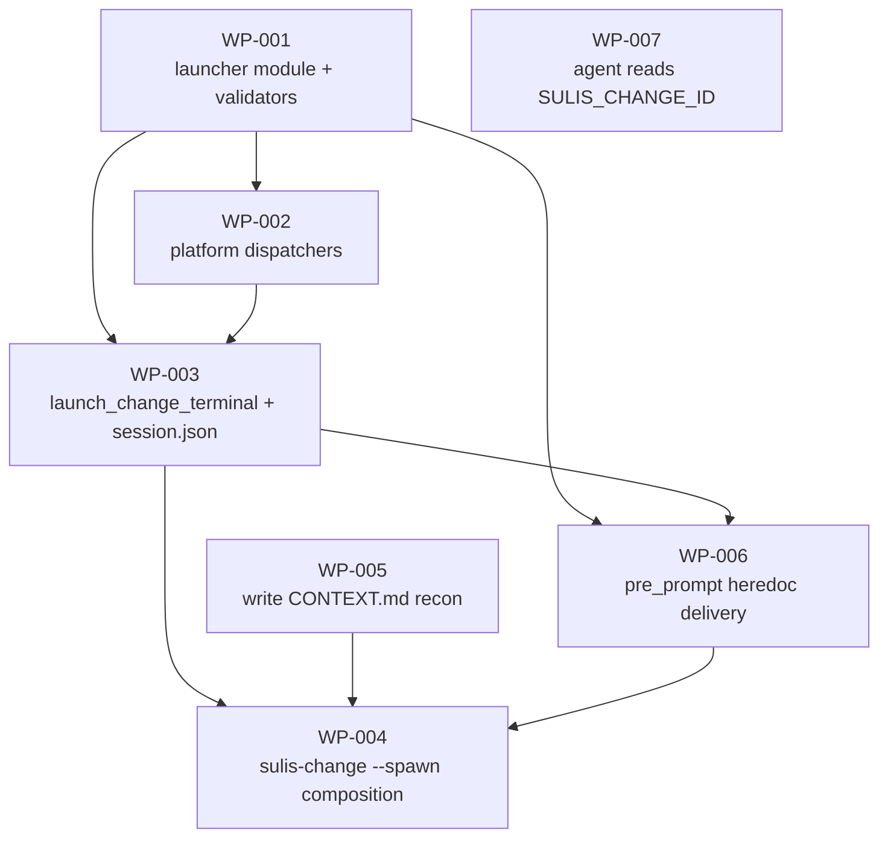

# Work Package Index — terminal-launcher-port

> **TDD:** [../TDD.md](../TDD.md)
> **SIZING:** [../SIZING.md](../SIZING.md)
> **ARCH:** [../ARCH.yaml](../ARCH.yaml)
> **Total WPs:** 7 (4 launcher mechanism + 3 session integration)
> **Critical path:** WP-001 → WP-002 → WP-003 → WP-006 → WP-004 (depth 5)
> **Peak parallelism:** 4 (WP-001, WP-005, WP-007 can run simultaneously at start; WP-002 joins as soon as WP-001 lands)
> **Tier:** S (per SIZING.md; target 3–8 WPs ✓)

## Status Summary

| Status | Count |
|---|---|
| pending | 7 |
| in_progress | 0 |
| done | 0 |
| blocked | 0 |

## Primitive Distribution

| Group | Primitive | Count | WPs |
|---|---|---|---|
| EXPAND | Create | 2 | WP-001 (new launcher module), WP-005 (new recon module) |
| EXPAND | Extend | 5 | WP-002, WP-003, WP-006 (extend launcher module); WP-004 (extend `sulis-change` CLI); WP-007 (extend Sulis agent body) |

All seven WPs are EXPAND-group. No Wrap, no Strangle, no Refactor in this set.

## Wrap Audit

| WP | Subject | Ownership | Removal Plan | Status |
|---|---|---|---|---|

**No Wraps proposed.** Subprocess calls to `osascript` / `gnome-terminal` / `claude` are direct OS or CLI invocations against external systems. The MECE-3 rule that *"implementing a new adapter for a domain-owned port is EXPAND-Create, not SUBSTITUTE-Wrap"* applies — these are adapters at the boundary, not wrappers over internal code.

## Two cohesive concerns shipped together

The WP set covers two related concerns that ship together at v0.43.0:

**A — Launcher mechanism** (WP-001 → WP-002 → WP-003 → WP-004):
The plumbing — module that builds shell scripts, dispatches to platform-specific spawn, integrates with `sulis-change start`. By itself, ships a working `sulis-change start --spawn` that opens a new terminal in the worktree with `SULIS_CHANGE_ID` set.

**B — Session integration** (WP-005, WP-006, WP-007):
The pieces that make A actually feel like *"the change is focused in the new terminal"* — pre-spawn recon writes `CONTEXT.md`, HERE-DOC pre-prompt briefs the spawned Claude session, Sulis agent body recognises `SULIS_CHANGE_ID` and greets in change-context mode.

A alone produces a working spawn that opens a cold Sulis session. A + B produces the founder UX the change-as-primitive design describes. They ship together because shipping A without B would land a release the founder can't use the way the design promises.

## Dependency Graph

Critical path: **WP-001 → WP-002 → WP-003 → WP-006 → WP-004** (depth 5).

Independent branches at start:
- **WP-005** (recon writer — new module + `sulis-change` extension; independent of launcher module)
- **WP-007** (agent body — pure markdown change to `plugins/sulis/agents/sulis.md`)

## WP Table

| ID | Title | Primitive | Status | Depends On | Blocks | Token (in/out) | TDD § |
|---|---|---|---|---|---|---|---|
| **A — Launcher mechanism** | | | | | | | |
| WP-001 | Create `_terminal_launcher.py` with `_build_launch_script` + input validators | create | pending | — | WP-002, WP-003, WP-006 | 6k / 4k | Form + Armor |
| WP-002 | Extend `_terminal_launcher.py` with platform dispatchers | extend | pending | WP-001 | WP-003 | 5k / 4k | Form + Armor (NFR-4) |
| WP-003 | Extend `_terminal_launcher.py` with `launch_change_terminal` + session.json | extend | pending | WP-001, WP-002 | WP-004, WP-006 | 6k / 3k | Form + Proof |
| WP-004 | Wire `--spawn` into `sulis-change start` — composes recon + pre-prompt + launcher | extend | pending | WP-003, WP-005, WP-006 | — | 5k / 3k | Form (composition root) |
| **B — Session integration** | | | | | | | |
| WP-005 | Write `~/.sulis/changes/{change_id}/CONTEXT.md` synchronously before terminal spawn | extend | pending | — | WP-004 | 4k / 3k | Form (composition root) |
| WP-006 | Extend `_terminal_launcher.py` with `pre_prompt` via quoted HERE-DOC | extend | pending | WP-001, WP-003 | WP-004 | 5k / 3k | Form + Armor (pre-prompt safety) |
| WP-007 | Extend Sulis agent body to recognise `SULIS_CHANGE_ID` and greet in change-context mode | extend | pending | — | — | 4k / 2k | Form (session-bound behaviour) |
| **Total** | | | | | | **35k / 22k** | |

## Recommended Implementation Order

Sequence respecting dependencies and parallel opportunities:

**Round 1** (parallel, 3 WPs — all independent at start):
- WP-001 (launcher foundation)
- WP-005 (recon — independent module)
- WP-007 (agent body — pure markdown, no Python)

**Round 2** (WP-002 only — depends on WP-001):
- WP-002 (dispatchers)

**Round 3** (WP-003 only — depends on WP-001 + WP-002):
- WP-003 (entry-point)

**Round 4** (WP-006 only — depends on WP-001 + WP-003):
- WP-006 (pre-prompt heredoc delivery)

**Round 5** (WP-004 — depends on WP-003 + WP-005 + WP-006):
- WP-004 (sulis-change composition + v0.43.0 release)

Total: 5 rounds, ~57k tokens combined, ~5–7 commit cycles.

## Total surface

| Metric | Value |
|---|---|
| New files | 4 (`_terminal_launcher.py`, `_change_context.py`, `test_terminal_launcher.py`, `test_change_context.py`) |
| Modified files | 5 (`sulis-change`, `plugin.json`, `marketplace.json`, `CHANGELOG.md`, `agents/sulis.md`) |
| Manual smoke-test docs | 5 (`smoke_terminal_launcher.md`, `smoke_sulis_change_start_spawn.md`, `smoke_sulis_change_id_resolves.md`, `smoke_sulis_change_id_stale.md`, `smoke_sulis_change_id_unset.md`) |
| New LOC introduced | ~500 (~280 launcher + ~120 recon + ~80 agent-body addition + ~tests across both modules) |
| Modified LOC | ~50 (`sulis-change` cmd_start additions + manifests + CHANGELOG) |

## What's still deferred to later phases (NOT in this WP set)

- **`/sulis:change start` slash command** — founder-facing wrapper around `sulis-change start --spawn` — Phase 6
- **`/sulis:changes` smartlog / dashboard** — needs Phase 5 #4 SQLite (deferred)
- **`/sulis:change focus CH-NNN` reattach** — needs `session.json.pid` + os-specific window-focus — Phase 6
- **Heartbeat / session liveness tracking** — Phase 5 #4
- **Committed copy of `CONTEXT.md`** at `.architecture/{project}/changes/{ulid}/CONTEXT.md` — Phase 5.x follow-up; local-only is sufficient for v0.43.0

After WPs 001..007 ship at v0.43.0, founders running `sulis-change start --slug X --primitive Y --spawn` get a new terminal with a focused Sulis session that knows about the change. The full founder-CLI surface (slash commands) lands in Phase 6.

## Decompose Validation

See [`DECOMPOSE_VALIDATION.md`](DECOMPOSE_VALIDATION.md) for the rubric run on the 7-WP set.
