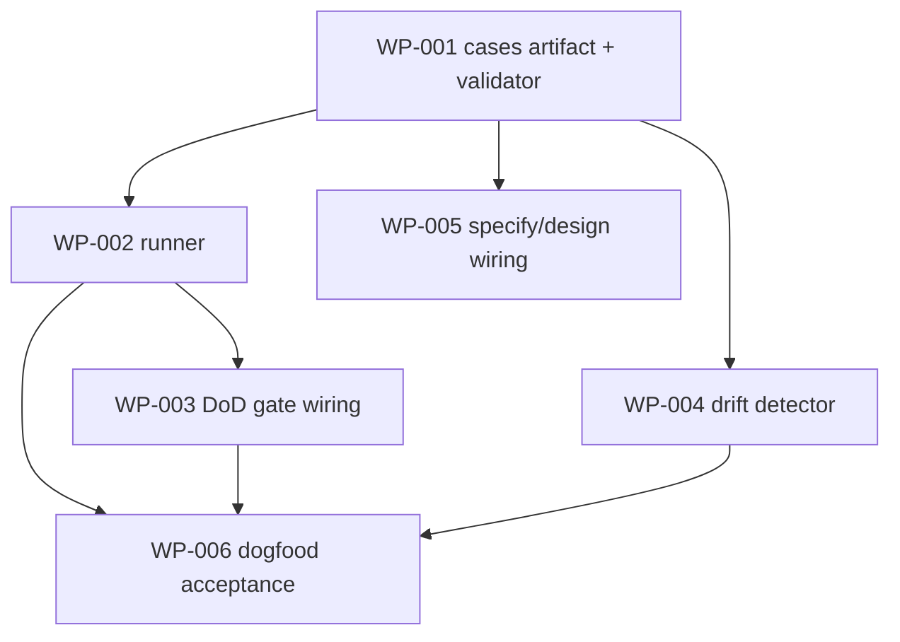

# Work Package Index — testable-state-done

> **TDD:** [../TDD.md](../TDD.md)
> **Total WPs:** 6
> **Critical path:** WP-001 → WP-002 → WP-003 → WP-006 (4 serial)
> **Peak parallelism:** 3 (after WP-001: WP-002, WP-004, WP-005 run together)

## Status Summary

| Status | Count |
|---|---|
| pending | 6 |
| done | 0 |

## WP Table

| ID | Title | kind | primitive | Status | Depends On | Why |
|---|---|---|---|---|---|---|
| WP-001 | Verification-case artifact schema (`verification-cases.yaml`) + plain-render + validator | contract | create | pending | — | The founder-legible index over the project's real tests (D-1). Locks the field set: id/title/how_to_run/expected/where/needs/status. |
| WP-002 | `sulis-verify-acceptance` runner — run cases against a standing app, dual surface (JSON + plain green/red) | backend | create | pending | WP-001 | Executes `how_to_run` against `--target local\|deployed`; reuses verify-environment's envelope/exit-code (D-2). Deferred-with-need reported, never silent-green. |
| WP-003 | Wire the acceptance gate into the ship-stage DoD gate (extend step 4.8) | backend | extend | pending | WP-002 | "Done" blocks unless every case pass-or-deferred-with-need (D-3). Founder-English failure naming the gap. |
| WP-004 | Cases↔implementation drift detector (reuse Path-A `check-canonical-drift` structure) | backend | create | pending | WP-001 | A case whose referent vanished is flagged before done (D-4). Exit-1-on-drift, founder-legible. |
| WP-005 | specify/design emit the verification-cases artifact upfront (methodology wiring) | methodology | extend | pending | WP-001 | The cases are defined at design time, like the visual/data-contract gates — not bolted on. |
| WP-006 | Dogfood acceptance — agent-journey blocked-on-login proof + passing fixture + drift-fires test | backend | create | pending | WP-002, WP-003, WP-004 | The change's own proof: the agent-journey failure (shipped, no login) is now CAUGHT at the gate; drift flag fires on a mutated referent. |

## Dependency graph

## Notes

- Hand-authored design (proportionate for a methodology/tooling change); each
  WP is TDD-first per the marketplace non-negotiables.
- Cockpit verification *view* is deliberately out of scope (ADE follow-on);
  this change emits the JSON envelope the cockpit will later render.
- WP-002/WP-004 reuse existing shapes (verify-environment envelope; Path-A
  drift detector) — check-before-building honoured.
