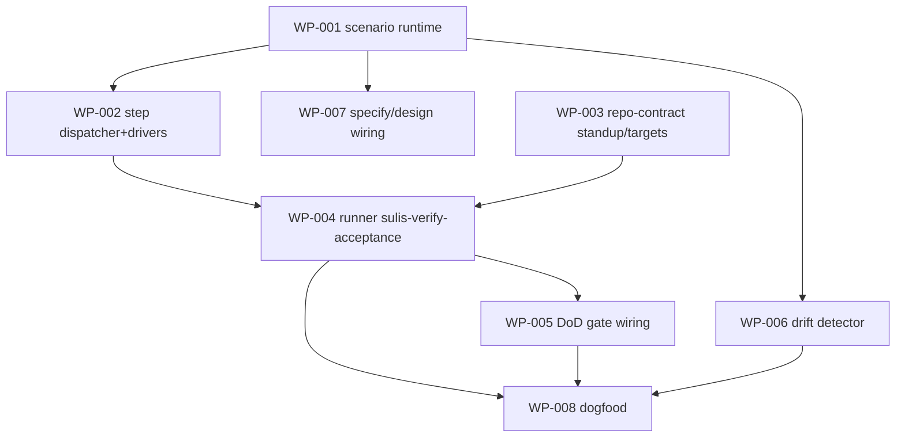

# Work Package Index — testable-state-done (Scenario-aligned)

> **Supersedes the original change-dir-`verification-cases.yaml` plan.** Cases
> ARE `Scenario` graph entities now (see `../scenario-entity.md`,
> `../BUILD-HANDOFF.md`). `Scenario` is live on dev (78e99b6).
> **TDD:** [../TDD.md](../TDD.md) · **Total WPs:** 8
> **Critical path:** WP-001 → WP-002 → WP-004 → WP-005 → WP-008

## Status Summary

| Status | Count |
|---|---|
| pending | 8 |
| done | 0 |

## WP Table

| ID | Title | kind | primitive | Status | Depends On | What |
|---|---|---|---|---|---|---|
| WP-001 | `_scenario_runtime.py` — load a Scenario (journey Workflow + IDEF0 Steps) + resolve each Step's driver via `Tool.implementation_kind` | backend | create | pending | — | The runtime spine: parse a Scenario from the graph, walk its journey Steps, map each `implementation_kind` → driver. TDD against a fixture Scenario. |
| WP-002 | Step dispatcher + drivers (`http_call`→httpx, `subprocess`→shell, `python_import`) | backend | create | pending | WP-001 | Execute ONE Step against a target base-URL; return step-outcome (pass/fail/`deferred:<need>` when an `input_artifact`/credential is absent). Agent-driven kinds (`mcp_server`/`claude_code_tool`) stubbed → deferred follow-on. |
| WP-003 | repo-contract extension — `commands.standup`/`seed` + `targets.{local,deployed}` + resolver | infra | extend | pending | — | Where "how to stand the app up locally" + the local/deployed URLs are declared. The concrete "local infra" contract. Parallel to WP-001/002. |
| WP-004 | runner `sulis-verify-acceptance` — walk a Scenario's Steps against a target, aggregate → TestRun/TestResult, emit JSON + plain green/red | backend | create | pending | WP-001, WP-002, WP-003 | The founder-runnable command. `--target local\|deployed`. Deferred-with-need reported, never silent-green. Reuses verify-environment's envelope/exit shape. |
| WP-005 | DoD gate wiring — extend ship step 4.8: block "done" unless in-scope Scenarios pass or deferred-with-need | backend | extend | pending | WP-004 | In-scope = blast-radius slice (Scenarios verifying Requirements/Designs the change touches). Founder-English failure naming the gap. |
| WP-006 | Scenario↔implementation drift detector (reuse Path-A `check-canonical-drift` structure) | backend | create | pending | WP-001 | A Scenario whose journey-Step referent (command/endpoint) vanished is flagged before done. |
| WP-007 | specify/design wiring — design defines/evolves the change's `Scenario` entities (graph), not change-dir yaml | methodology | extend | pending | WP-001 | Founder-legible: plain title + journey steps. Replaces the superseded verification-cases.yaml authoring. |
| WP-008 | Dogfood acceptance — agent-journey blocked-at-done (login fails) + drift-fires on a mutated Step referent | backend | create | pending | WP-004, WP-005, WP-006 | The proof: the failure that slipped through before is now caught at the gate. |

## Dependency graph

## Notes

- TDD-first (RGB per WP); tests in `tests/unit/` (CI only runs that path — #60).
- Reuse: `Tool.implementation_kind` (dispatch), Playwright + httpx (drivers),
  Step/Workflow (journey), verify-environment envelope, Path-A drift structure.
- The dependency stack (WP-003 standup/targets + credentials + integration
  access) IS the "fully testable state" prerequisite — see BUILD-HANDOFF closure.
