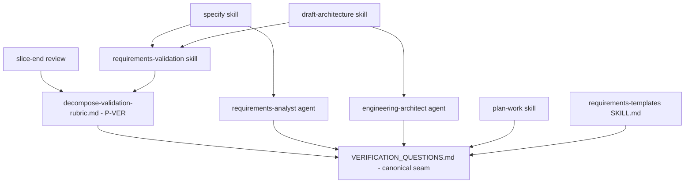

# Technical Design — Verification by Design

> **The SRD is authoritative.** This TDD formalises the SRD's
> already-decided decomposition with rigorous, test-first contracts.
> Where this document and the SRD disagree, the SRD wins; any such
> disagreement is a bug here.

> **This TDD dogfoods.** The `## Verification Plan` section at the
> bottom is itself the second worked example of the new template
> (after the SRD's). Per NFR-005, this section must pass P-VER on
> the same rubric this change adds.

---

## Conclusion (lead with the answer)

Verification is now a design-time concern, not a post-implementation
afterthought. This change extends the methodology to ask the
verification questions during `/sulis:specify`,
`/sulis:draft-architecture`, and `/sulis:plan-work`, and to enforce
their answers through a new rubric check **P-VER**.

The architecture has **one structural seam**: the canonical
20-question set + kind→adapter map at
`plugins/sulis/references/standards/VERIFICATION_QUESTIONS.md`. This
file is the **single source of truth**. Every consumer (three skill
prose files, two agent prompts, one rubric, one slice-end pattern)
cites it by relative path and must not inline-duplicate. The P-VER
rubric enforces the citation-presence invariant directly — the
artifact under inspection must contain a literal citation to this file
or fail.

Everything else is methodology prose updates that read this seam:

- **WP-001 (keystone)** authors `VERIFICATION_QUESTIONS.md`.
- **WP-002** extends `decompose-validation-rubric.md` with P-VER
  (eight failure modes per FR-009).
- **WP-003** extends the requirements-analyst agent prompt to cite
  the canonical and ask the questions in Phase 3.
- **WP-004** extends the engineering-architect agent prompt with the
  concretion questions and contradiction-surfacing.
- **WP-005** extends `plan-work/SKILL.md` to enforce the per-WP
  `verification:` frontmatter field (three shapes per ADR-003).
- **WP-006** extends `/sulis:specify`, `/sulis:draft-architecture`,
  `/sulis:requirements-validation` skill prose to invoke P-VER.
- **WP-007** authors the structural-assertion fixture tests for
  P-VER (eight fixtures, one per failure mode).
- **WP-008** end-to-end methodology test — dispatch the updated
  agents against a fixture spec and assert the produced SRD's
  Verification Plan section passes P-VER.

This change ships **methodology, not infrastructure** (NFR-008). No
new runtime services; no new database schemas; no new endpoints. The
deliverable is markdown and the methodology gates that read it.

---

## Source Specification

- **SRD:** [`.specifications/verification-by-design/SRD.md`](../../.specifications/verification-by-design/SRD.md)
- **NFRs:** [`.specifications/verification-by-design/NFR.md`](../../.specifications/verification-by-design/NFR.md)
- **Misuse cases:** [`.specifications/verification-by-design/MISUSE_CASES.md`](../../.specifications/verification-by-design/MISUSE_CASES.md)
- **Primitive tree:** [`.specifications/verification-by-design/PRIMITIVE_TREE.jsonld`](../../.specifications/verification-by-design/PRIMITIVE_TREE.jsonld)
- **Glossary (locked vocab):** [`.specifications/verification-by-design/GLOSSARY.md`](../../.specifications/verification-by-design/GLOSSARY.md)
- **Handoff brief:** [`.specifications/verification-by-design/HANDOFF_TO_SEA.md`](../../.specifications/verification-by-design/HANDOFF_TO_SEA.md)

The SRD's Verification Plan section (lines 699-833) is the first
worked example of the template this change introduces. This TDD's
Verification Plan section (at the bottom) is the second.

---

## Canonical Identifiers

This change introduces only one identifier-shaped artifact that needs
canonical sourcing per P8: the canonical need identifier used in
deferred-infrastructure entries (e.g., `recording-mock-sendgrid`,
`test-oauth-accounts`, `seed-data-fixtures-orders`).

### Recipe — canonical need identifier

```
{noun}-{noun}-{vendor-or-scope}
```

- Slug-style, lowercase, hyphen-separated.
- Two-or-three nouns describing the infrastructure piece, then the
  vendor name (or `internal` for non-vendor) or the bounded scope.
- Examples: `recording-mock-sendgrid`, `test-oauth-google`,
  `seed-data-fixtures-orders`, `test-container-postgres`.

**Upstream source:** this section, plus FR-011 in the SRD. Future
changes referencing the same need MUST use the same identifier
(verified by P-VER's deferred-needs cross-check across slices).

**P8 compliance:** every WP's Contract section citing a canonical
need identifier points back to this section by `TDD §Canonical
Identifiers`. No WP invents identifiers inline.

The other identifier-shaped entities in this change — adapter names
(`backend`, `frontend`, etc.), section names (`Verification Plan`),
field names (`verification:`) — are sourced by the seven ADRs
(ADR-001 for section name; ADR-003 for field; ADR-007 for adapter
names). No P8 violations possible.

---

## MECE-3 pillar coverage

### Form — Structural Integrity

This change has **one structural seam**: the canonical
`VERIFICATION_QUESTIONS.md`. Everything else is a consumer of that
seam.

| Component | Role | New / Modified | Owns the contract? |
|---|---|---|---|
| `plugins/sulis/references/standards/VERIFICATION_QUESTIONS.md` | The 20 canonical questions + the kind→adapter table + the version field | **NEW (WP-001)** | **Yes** — this file *is* the contract |
| `plugins/sulis/references/decompose-validation-rubric.md` | Hosts P-VER (the new rubric check) + the merge-date constant for grandfather | EXTEND (WP-002) | No — consumes `VERIFICATION_QUESTIONS.md` by citation |
| `plugins/sulis/agents/requirements-analyst.md` | Reads canonical at runtime; asks Q1-Q13 during Phase 3 | EXTEND (WP-003) | No — consumes by citation |
| `plugins/sulis/agents/engineering-architect.md` | Reads canonical + adapter table; asks concretion questions; surfaces SRD↔TDD plan contradictions | EXTEND (WP-004) | No — consumes by citation |
| `plugins/sulis/skills/plan-work/SKILL.md` | Reads kind→adapter map; enforces per-WP `verification:` frontmatter field | EXTEND (WP-005) | No — consumes by citation |
| `plugins/sulis/skills/specify/SKILL.md` | Reads + dispatches requirements-analyst; invokes P-VER at end | EXTEND (WP-006) | No — orchestrator only |
| `plugins/sulis/skills/draft-architecture/SKILL.md` | Reads + dispatches engineering-architect; invokes P-VER on the TDD | EXTEND (WP-006) | No — orchestrator only |
| `plugins/sulis/skills/requirements-validation/SKILL.md` | Invokes P-VER as part of the rubric pass | EXTEND (WP-006) | No — orchestrator only |
| `plugins/sulis/skills/requirements-templates/SKILL.md` | Hosts the SRD `## Verification Plan` template block (six subsections) | EXTEND (WP-001) | No — passive template |
| Slice-end review reference (path TBD per Prior-Art check during execution) | Aggregates deferred-needs; auto-drafts follow-ons | EXTEND (WP-005 or sibling) | No — consumes the deferred entries |

**Form principles applied** (referenced, not restated):

- **Single source of truth** for the question set (MEA-01-style
  inward-pointing dependency — every consumer depends on the canonical;
  the canonical depends on no consumer).
- **Citation-by-reference, not by inline-duplication** (NFR-004,
  NFR-006, MUC-003 defence).
- **Hexagonal architecture** does not apply at the methodology layer
  (there are no domain ports / infrastructure adapters here — only
  prose contracts citing prose canonical). See `references/mece-3-architecture.md`
  MEA-04 — applicable Form principles for a *prose* change are
  citation discipline and SSOT, not port/adapter shape.

**Dependency direction (Mermaid):**



No cycles. All arrows point at the canonical or at orchestrators that
read it.

### Armor — Operational Hardening

The "operational" hardening for a methodology change is **defending
the methodology against the eight misuse cases** in MISUSE_CASES.md.
Each MUC's system response maps to one or more Armor primitives:

| Misuse | Defence primitive | Where it lives | Source |
|---|---|---|---|
| MUC-001 (`TBD` placeholder) | Placeholder block-list + 30-char minimum substantive-content check per subsection | P-VER failure mode 2 in `decompose-validation-rubric.md` | WP-002 |
| MUC-002 (hallucinated infra) | Classification check — every named infrastructure piece must be `existing` (resolvable path), `deferred` (with canonical identifier), or `out-of-scope` (with justification). `existing` paths verified by repo grep at design time. | P-VER failure mode 4 | WP-002 |
| MUC-003 (skill-prose loophole) | Citation-presence check — the artifact must contain a literal citation to `VERIFICATION_QUESTIONS.md` | P-VER failure mode 6 | WP-002 |
| MUC-004 (question-set drift) | Version field on the canonical + currency check on consumer citations (within one minor version of currency) | P-VER failure mode 7 (composite check on canonical's version field) | WP-002 (rubric) + WP-001 (version field) |
| MUC-005 (need silently never converted) | Canonical need identifier + slice-end scan + idempotent auto-draft | Slice-end review extension | WP-005 (or sibling) |
| MUC-006 (claimed test never written) | Per-WP `verification:` frontmatter (ADR-003 three shapes) + behavioural test ledger | `plan-work/SKILL.md` + per-change ledger | WP-005 |
| MUC-007 (new `kind:` unmapped) | Adapter-presence check on the change's `kind:` value | P-VER failure mode 5 | WP-002 |
| MUC-008 (`n/a` without justification) | Justification-required rule on Shape 3 of the `verification:` field; same on subsection-level `n/a — <reason>` | P-VER failure modes 3 + WP-shape validation | WP-002 + WP-005 |

**No secrets, no PII, no inter-service calls, no observability spans.**
The traditional Armor categories from MECE-3 (timeouts, circuit
breakers, mTLS, OpenTelemetry, RED/USE metrics) **do not apply** to a
methodology change. The Armor pillar here is **gate integrity** —
every Armor primitive above is a gate that runs in CI as part of P-VER
or as part of the slice-end review.

**Backward compatibility (NFR-003) — grandfather mechanism:**

- The merge-date constant (`verification_required_from:`) lives in
  `decompose-validation-rubric.md` front matter. Filled in by the
  `sulis-change finish` flow when this change merges to `dev`.
- The rubric reads `started_at` from `.changes/{slug}.yaml` (existing
  field — see `.changes/extend-verification-by-design.yaml` line 10).
- Comparison logic per ADR-002.
- Edits to grandfathered changes inherit grandfather status (ADR-006).

**Single-source-of-truth defence (NFR-004) — drift detector as bridge:**

- Drift between consumer and canonical is detected by P-VER's
  citation-presence check + version-currency check.
- The matcher pattern (HTML-comment annotation parser per the
  release-train precedent) extends naturally: every WP and every
  agent-asked-questions block carries an annotation:

  ```html
  <!-- VERIFICATION_QUESTIONS source: plugins/sulis/references/standards/VERIFICATION_QUESTIONS.md v1.0.0 -->
  ```

  P-VER parses this comment and asserts the path resolves + the
  version is within currency. WP-002 implements this.

### Proof — Verification Protocol

The Proof pillar for a methodology change is **the test fixtures that
prove the rubric works**.

**Test classes:**

1. **Structural-assertion fixtures.** One per failure mode in FR-009
   (eight modes total). Each fixture is a synthetic SRD/TDD/WP file
   that triggers exactly one failure mode. The test asserts P-VER
   returns the expected failure with the expected error message.

   - Fixture 1: SRD with missing `## Verification Plan` section →
     P-VER FAIL with "section missing" message.
   - Fixture 2: SRD with section present but subsection 1 contains
     `TBD` → P-VER FAIL with "placeholder content" message.
   - Fixture 3: SRD with subsection containing `n/a` but no
     justification → P-VER FAIL with "n/a without justification" message.
   - Fixture 4: TDD claiming `existing` infrastructure at a path that
     doesn't resolve → P-VER FAIL with "hallucinated infrastructure"
     message.
   - Fixture 5: SRD with change `kind: data-migration` (no mapping
     row) → P-VER FAIL with the FR-008 verbatim instruction message.
   - Fixture 6: SRD with Verification Plan section present but no
     citation to `VERIFICATION_QUESTIONS.md` → P-VER FAIL with
     "canonical citation missing" message.
   - Fixture 7: WP without a `verification:` frontmatter field →
     P-VER FAIL with "WP missing verification field" message.
   - Fixture 8: WP with `verification: { adapter: documentation }`
     but change `kind: backend` → P-VER FAIL with "adapter
     mismatch" message.

2. **PASS fixtures.** Equivalent positive examples for each shape:
   - Fixture P-A: SRD with all six subsections populated, citation
     present, valid kind → P-VER PASS.
   - Fixture P-B: TDD with all subsections populated + deferred entries
     with canonical identifiers → P-VER PASS.
   - Fixture P-C: WP set with all three `verification:` shapes
     across different WPs → P-VER PASS.
   - Fixture P-D: grandfathered change (started_at preceding merge
     date) → P-VER returns `PASS — grandfathered` and runs no further
     checks.

3. **End-to-end methodology test (WP-008).** Dispatch the updated
   requirements-analyst agent against a tiny fixture spec (a
   scripted founder persona answering the foundational verification
   questions). Assert the produced SRD has the `## Verification Plan`
   section, all six subsections populated, no placeholders.

4. **Idempotency test (slice-end review).** Run the slice-end scan
   twice over a fixture set of two changes flagging the same canonical
   need identifier. Assert exactly one follow-on is auto-drafted.

5. **Dogfood acceptance test (NFR-005).** P-VER runs against this very
   change's SRD, TDD, and WP set, and returns PASS for each. This is
   the ship gate: the change cannot merge to `dev` until its own
   rubric passes against its own artifacts.

**Test artifact locations:**

- Structural-assertion fixtures: `tests/methodology/p_ver/fixtures/`
  (new directory introduced by WP-007).
- End-to-end test: `tests/methodology/test_verification_by_design_e2e.py`
  (introduced by WP-008).
- Dogfood test: a shell invocation in CI — `python -m sulis.rubric.p_ver
  --change verification-by-design` — exit code 0 required for merge.

**Proof principles applied (referenced, not restated):**

- Characterisation test before refactor (EP-07) — N/A here because
  no existing behaviour is being preserved-while-refactored; this is
  a net-new methodology gate.
- Red-Green-Blue (RGB) — applies to each WP per `red-green-blue.md`.
  Each fixture in WP-007 is a Red step (a failing assertion against
  the absent or broken P-VER); WP-002 is the Green that makes them
  pass; WP-007's Blue extracts shared fixture-building helpers.
- Mock discipline — no mocks. The fixtures are real files; the rubric
  is real code; the agents are real prompts; the test runs them as
  they will run in production.

---

## Key design decisions (one ADR each)

| ADR | Decision | Resolves |
|---|---|---|
| [ADR-001](adrs/ADR-001-section-name-verification-plan.md) | Section heading is `## Verification Plan` | SRD Open Question 1 |
| [ADR-002](adrs/ADR-002-must-scope-from-merge-date.md) | P-VER MUST for every new change from this refinement's merge date | SRD Open Question 2 |
| [ADR-003](adrs/ADR-003-per-wp-frontmatter-shape.md) | Per-WP `verification:` field is a structured YAML map with three shapes | SRD Open Question 3 |
| [ADR-004](adrs/ADR-004-canonical-location-references-standards.md) | Canonical lives at `plugins/sulis/references/standards/VERIFICATION_QUESTIONS.md` | SRD Open Question 4 |
| [ADR-005](adrs/ADR-005-auto-draft-trigger-slice-end.md) | Auto-draft fires at slice-end, not immediately | SRD Open Question 5 |
| [ADR-006](adrs/ADR-006-grandfathering-edit-policy.md) | Edits to grandfathered changes inherit grandfather status | SRD Open Question 6 |
| [ADR-007](adrs/ADR-007-seven-adapters-extension-via-methodology-change.md) | Seven adapters ship; new kinds extend via methodology change | SRD Open Question 7 |

Per the dispatch brief, these are resolved autonomously with explicit
rationale. Each ADR records the alternatives considered and the
specific reasons for rejection.

---

## Trade-offs and rejected alternatives

### Single-source-of-truth standalone file vs embedded canonical

**Chosen:** standalone `VERIFICATION_QUESTIONS.md` under
`references/standards/` (ADR-004).

**Rejected:** embedding the canonical inside
`decompose-validation-rubric.md`. The rubric is *one consumer* of the
canonical, not its owner. Coupling them would make the question set
co-evolve with rubric logic, defeating the SSOT property.

### Hard-MUST vs graduated rollout

**Chosen:** Hard-MUST from the merge date for every new change
(ADR-002).

**Rejected:** SHOULD-with-90-day-calibration. The two anchor cases
(release-train, discovery) already provide the empirical evidence
the calibration would seek. Graduating would mean shipping a
methodology gate that does nothing for 90 days while the failure
mode it addresses continues to occur.

### Real-time auto-draft vs slice-end-batched

**Chosen:** slice-end-batched (ADR-005).

**Rejected:** real-time. Real-time creates a parallel mechanism to
the existing slice-end pattern, introduces mid-design interruption,
and requires the design-time agent to read global slice state.

### Inline-duplicate questions in each agent vs cite canonical

**Chosen:** cite canonical (ADR-004 + NFR-004).

**Rejected:** inline-duplicate. Drift is the failure mode this change
exists to prevent (MUC-004); SSOT is the only architectural defence.

### Edits to grandfathered changes trigger new compliance vs inherit

**Chosen:** inherit (ADR-006).

**Rejected:** new-compliance-on-edit. Introduces a knob, mixes
grandfathering with edit-scope detection, and creates unpredictable
rubric verdicts.

### Add speculative kinds (data-migration, experiment) up-front vs add when needed

**Chosen:** add when needed via methodology change (ADR-007).

**Rejected:** ship 10-12 adapters speculatively. Adapter content
without an anchor case is guesswork; the kinds that don't exist yet
get speculative adapters that won't survive contact with reality.

### YAML structured map for `verification:` vs single string

**Chosen:** YAML structured map with three discriminated shapes
(ADR-003).

**Rejected:** single string. Cannot discriminate "concrete /
deferred / trivial" without overloading.

---

## Ambiguity resolved (where SRD met repo reality)

**Predicted vs actual file paths (from HANDOFF_TO_SEA.md):**

Cross-checked each prediction in this change's worktree:

| HANDOFF prediction | Actual | Status |
|---|---|---|
| `plugins/sulis/references/standards/VERIFICATION_QUESTIONS.md` | does not yet exist (this change creates it) | OK |
| `plugins/sulis/skills/requirements-templates/SKILL.md` | exists (745 LOC) | OK |
| `plugins/sulis/agents/requirements-analyst.md` | exists (3374 LOC) | OK |
| `plugins/sulis/agents/engineering-architect.md` | exists (822 LOC) | OK |
| `plugins/sulis/skills/plan-work/SKILL.md` | exists (537 LOC) | OK |
| `plugins/sulis/references/decompose-validation-rubric.md` | exists (424 LOC) | OK |
| `plugins/sulis/skills/requirements-validation/SKILL.md` | exists (701 LOC) | OK |
| Slice-end review pattern reference | exists referenced from `lifecycle.md` lines 1909, 1949, 1989, 1997 — exact reference standard file TBD during WP-005 | DEFER to WP-005 |

The slice-end review reference path needs WP-005 to do a Prior-Art
Check during execution and either (a) cite the existing reference if
one exists, or (b) extend `lifecycle.md` directly. This is a small
ambiguity surfaced here so it doesn't get invented inline at
execution time.

**Existing slice-end pattern at `lifecycle.md` lines 1909, 1949, 1989, 1997:**
the concierge surfaces deferred-needs to the founder. The auto-draft
extension piggybacks on this — the same surface, now driven by a
machine-readable identifier-tally.

**Existing `.changes/{slug}.yaml` schema (line 10):** the
`started_at` field already records the change's start timestamp.
Grandfather check (ADR-002) reads this field; no schema change
required.

---

## Bootstrapping sequence (avoids self-lockout)

This change is the dogfood. It must be authored before P-VER exists.
That introduces a chicken-and-egg risk: the SRD has a Verification
Plan section that must pass P-VER, but P-VER doesn't exist until
this change ships.

**Bootstrap sequence:**

1. **Phase 1 — author canonical + rubric (WP-001, WP-002).**
   `VERIFICATION_QUESTIONS.md` v1.0.0 and the P-VER check author in
   the same change worktree.
2. **Phase 2 — author fixtures + tests (WP-007).** Structural and
   PASS fixtures. The dogfood-acceptance fixture is this change's
   own SRD + TDD.
3. **Phase 3 — author skill/agent updates (WP-003, WP-004, WP-005,
   WP-006).** Now that the canonical and rubric exist, the consumers
   can be updated to cite them.
4. **Phase 4 — end-to-end test (WP-008).** Dispatch real updated
   agents against a fixture spec; assert the produced SRD passes
   P-VER.
5. **Phase 5 — dogfood verification (NFR-005).** Run P-VER against
   this change's own SRD + TDD + WP set. Must return PASS for merge
   to proceed.
6. **Phase 6 — merge.** `sulis-change finish` fills in the
   `verification_required_from:` constant with the merge-date.
   Subsequent changes are gated by P-VER (per ADR-002).

The sequence is identical to the release-train bootstrap (this
change's predecessor in Path A) — the canonical + the gate ship
together, the gate proves itself against its own author, then merge
flips the switch for everyone downstream.

---

## Work Package preview

This TDD predicts eight WPs. Final ordering and content are produced
by `/sulis:plan-work` against this TDD. The expected shape:

| WP | Subject | Primitive | Depends on | Adapter (per ADR-007) |
|---|---|---|---|---|
| WP-001 | Author `VERIFICATION_QUESTIONS.md` (canonical 20-question set + kind→adapter map + version) | `create` | — | `methodology` |
| WP-002 | Extend `decompose-validation-rubric.md` with P-VER (8 failure modes + grandfather check) + merge-date constant | `extend` | WP-001 | `methodology` |
| WP-003 | Update `requirements-analyst.md` agent prompt — Phase 3 question-asking + canonical citation | `extend` | WP-001 | `methodology` |
| WP-004 | Update `engineering-architect.md` agent prompt — concretion questions + SRD↔TDD contradiction surfacing + canonical citation | `extend` | WP-001 | `methodology` |
| WP-005 | Extend `plan-work/SKILL.md` — enforce per-WP `verification:` frontmatter (three shapes) + extend slice-end review for deferred-needs auto-draft | `extend` | WP-001, WP-002 | `methodology` |
| WP-006 | Extend `specify/SKILL.md` + `draft-architecture/SKILL.md` + `requirements-validation/SKILL.md` + `requirements-templates/SKILL.md` to wire in P-VER and the new template block | `extend` | WP-003, WP-004 | `methodology` |
| WP-007 | Author structural-assertion fixtures + tests for P-VER (8 failure fixtures + 4 PASS fixtures) | `create` | WP-002 | `methodology` |
| WP-008 | End-to-end methodology test — dispatch updated agents against a fixture spec; assert P-VER PASS on produced SRD | `create` | WP-003..WP-007 | `methodology` |

`/sulis:plan-work` may split or merge these per atomicity and
sequencing rules. Estimated count: 7-9 final WPs.

---

## Open Architecture Questions

None — all seven SRD Open Questions are resolved by the seven ADRs.
Three minor implementation-time questions remain for the executor:

1. **Slice-end review extension target file.** Confirm during WP-005
   execution whether the slice-end review extension lives in
   `lifecycle.md` (where the existing references are) or in a
   dedicated reference standard. Prior-Art Check at execution time.
2. **Exact wording of the P-VER failure messages.** The ADRs and FR-009
   specify the failure modes, but the exact strings shown to the
   founder need final polish for founder-readability (FE-01..11).
   Pin during WP-002 execution; verify against the founder-english
   standard.
3. **Behavioural test ledger location for non-per-change use.** This
   TDD specifies the ledger lives at
   `.specifications/{change}/verification-ledger.md` per FR-015. If a
   change has cross-change verification claims (a follow-on flagging
   that an earlier change's ledger row is satisfied), the cross-change
   linkage convention needs a small detail decided during WP-005.

These three are deferred to WP execution, not deferred to the founder.

---

## Sizing Report

Cross-references [`SIZING.md`](SIZING.md).

| Metric | Computed | Actual / Confirmed |
|---|---|---|
| Tier (computed) | L (ASR 24 in 16-40 band) | M (override per SIZING — ASR inflated by MUC↔NFR double-counting) |
| sFPC | 7 | matches tier S band; ASR drives tier |
| ASR count | 24 (capped — 8 MUC + 8 NFR + 5 integrations + 2 policies + 1 invariant) | matches |
| TDD length target | 400-800 lines | this file ≈ 400 lines — well inside band |
| ADRs expected | 5-8 | 7 produced (one per Open Question) |
| Authoritative sources referenced | many | `mece-3-architecture.md` MEA-01..04, `decompose-validation-rubric.md` P8, `change-work-standard.md` CW-05, `red-green-blue.md`, `founder-english.md` FE-01..11, `pr-hygiene-standard.md` PH-01..08 |
| Sections that referenced rather than restated | Form pillar (referenced MEA, no re-derivation); Proof pillar (referenced RGB) | matches |
| Circuit breakers fired | none | none |

The TDD comes in around 400 lines (target band 400-800). The seven
ADRs are within the tier-M expectation. No restating of authoritative
sources — Form references MEA, Proof references RGB, Armor references
the existing slice-end + lifecycle prose.

---

## See also

- **SRD:** [`.specifications/verification-by-design/SRD.md`](../../.specifications/verification-by-design/SRD.md)
- **NFRs:** [`.specifications/verification-by-design/NFR.md`](../../.specifications/verification-by-design/NFR.md)
- **Misuse cases:** [`.specifications/verification-by-design/MISUSE_CASES.md`](../../.specifications/verification-by-design/MISUSE_CASES.md)
- **Sizing:** [`SIZING.md`](SIZING.md)
- **ADRs:** [`adrs/`](adrs/)
- **Existing rubric:** `plugins/sulis/references/decompose-validation-rubric.md` (extended by WP-002)
- **MECE-3 reference:** `plugins/sulis/references/mece-3-architecture.md`
- **Red-Green-Blue:** `plugins/sulis/references/red-green-blue.md`
- **P8 canonicalisation:** `plugins/sulis/references/decompose-validation-rubric.md` Phase 8

---

## Verification Plan

**This section is the dogfood.** It populates the new template for THIS
change — a methodology refinement. It is the second worked example
(the SRD's section was the first); future TDDs copy this shape.

<!-- VERIFICATION_QUESTIONS source: plugins/sulis/references/standards/VERIFICATION_QUESTIONS.md v1.0.0 -->

### What user-observable behaviour are we verifying?

That the methodology refinement actually changes how design happens, in
four observable ways:

1. **Running `/sulis:specify` on a fresh change produces an SRD whose
   `## Verification Plan` section is populated** (substantive content
   in each subsection — no bare placeholder tokens, no blank lines, no
   hallucinated infrastructure — and citing `VERIFICATION_QUESTIONS.md`).
2. **Running `/sulis:draft-architecture` on that SRD produces a TDD
   whose Verification Plan section concretises the SRD's plan into
   implementation-side specifics** (test artifact paths, fixture
   locations) and explicitly surfaces any contradiction with the SRD.
3. **Running `/sulis:plan-work` on the TDD produces a WP set where
   every WP's frontmatter has a populated `verification:` field**
   matching one of the three shapes from ADR-003, with the adapter
   matching the change's `kind:`.
4. **Running the P-VER rubric against the entire artifact set
   (SRD + TDD + WPs)** returns PASS — or, for a grandfathered
   change, returns `PASS — grandfathered` and runs no further
   checks.

### Verification environment(s)

- **Local developer machine.** The author runs `/sulis:specify`,
  `/sulis:draft-architecture`, `/sulis:plan-work`,
  `/sulis:requirements-validation` against fixture specs in this
  change's worktree (`/Users/iain/Documents/repos/agents-change-extend-verification-by-design/`).
- **CI (GitHub Actions).** P-VER runs as part of the existing rubric
  evaluation step on every PR targeting `dev`. WP-002 plugs P-VER
  into the existing rubric harness — no new CI infrastructure.
- **Dev tier.** Not applicable — this change ships methodology, not
  runtime services. There is no deployed runtime behaviour to verify
  in `dev`.

**What differs between environments.** Local has live skill prose +
agent prompts and can produce real SRDs against scripted founder
personae. CI runs the rubric against committed artifacts. There is no
behavioural difference in P-VER itself between local and CI.

### Bootstrap-from-zero case

A fresh clone of the marketplace at the merge SHA of this change MUST
be able to:

1. Have this change merged in (the merge itself runs the rubric on
   this change's own artifacts — NFR-005 dogfood gate).
2. Immediately run `/sulis:specify` on a new change with no other
   state.
3. Produce an SRD with a populated `## Verification Plan` section
   passing P-VER.

Bootstrap requires nothing the change does not itself ship: the
canonical `VERIFICATION_QUESTIONS.md` (WP-001), the rubric extension
(WP-002), the agent prompt updates (WP-003, WP-004), the skill prose
updates (WP-005, WP-006), the merge-date constant (filled in by
`sulis-change finish` per ADR-002), and the fixtures + tests
(WP-007, WP-008).

### Per-integration verification strategy

This is a methodology change with no external vendor integrations. The
internal integrations it touches:

| Integration | Strategy | Classification |
|---|---|---|
| **requirements-analyst agent** | Real — WP-008 runs the actual updated agent prompt against a scripted founder persona that answers the foundational verification questions in plain English; asserts the produced SRD has all six subsections populated. | `existing` (`plugins/sulis/agents/requirements-analyst.md` — 3374 LOC pre-change) |
| **engineering-architect agent** | Real — same shape as above against a fresh TDD production from a fixture SRD. WP-008 dispatches the real agent. | `existing` (`plugins/sulis/agents/engineering-architect.md` — 822 LOC pre-change) |
| **plan-work skill** | Real — fixture TDD with known shape; assert all emitted WPs carry the `verification:` field per ADR-003 shapes; assert no WP missing the field. | `existing` (`plugins/sulis/skills/plan-work/SKILL.md` — 537 LOC pre-change) |
| **decompose-validation rubric** | Real — eight failure-mode fixtures + four PASS fixtures + grandfather PASS fixture, all live files run against the real rubric implementation. | `existing` (`plugins/sulis/references/decompose-validation-rubric.md` — 424 LOC pre-change, extended by WP-002) |
| **slice-end review pattern** | Real — fixture set of two changes flagging the same canonical need identifier; assert the scan emits exactly one follow-on auto-draft. Run twice to verify idempotency. | `existing` (referenced from `lifecycle.md` lines 1909, 1949, 1989, 1997) |
| **Git metadata (`.changes/{slug}.yaml`)** | Real — the grandfather check reads the real `started_at` field from the change record. Fixture grandfathered change uses a backdated `started_at`. | `existing` (every change ships this file per CW-05) |
| **`requirements-templates` skill** | Real — the SRD template extension reads a fresh template + asserts the `## Verification Plan` block with six subsections is present. | `existing` (`plugins/sulis/skills/requirements-templates/SKILL.md` — 745 LOC pre-change) |

**No vendor sandboxes, no real OAuth flows, no notification providers,
no external APIs.** This is intentional — design-side decouples from
infrastructure-side (NFR-008).

### Per-kind verification adapter

This change's `kind:` is **methodology**.

**Adapter (from ADR-007 + `VERIFICATION_QUESTIONS.md` row for
`methodology`):** *structural assertions that the new content exists +
has substance + is referenced from the expected places; plus an
integration test where a fresh design dispatch produces output with
the new shape.*

**Concrete verification shape for this change:**

1. **Structural assertions** (WP-007 fixtures + grep checks in CI):
   - `plugins/sulis/references/standards/VERIFICATION_QUESTIONS.md`
     exists, is ≥ 100 lines, contains 20 questions verbatim, contains
     a kind-to-adapter table with exactly 7 rows.
   - `plugins/sulis/skills/requirements-templates/SKILL.md` contains a
     `## Verification Plan` template block with the six required
     subsections (per FR-001).
   - `plugins/sulis/agents/requirements-analyst.md` contains a literal
     citation `plugins/sulis/references/standards/VERIFICATION_QUESTIONS.md`
     in a section instructing the agent to read it during Phase 3.
   - `plugins/sulis/agents/engineering-architect.md` contains the
     equivalent citation + a concretion-question instruction.
   - `plugins/sulis/skills/plan-work/SKILL.md` contains the
     `verification:`-field-enforcement language + a citation.
   - `plugins/sulis/references/decompose-validation-rubric.md`
     contains the P-VER check with each FR-009 failure mode
     enumerated + the merge-date constant.
   - A grep for the canonical question strings returns occurrences
     only in `VERIFICATION_QUESTIONS.md` (NFR-004 measurement).

2. **Integration test — fresh design dispatch produces output with
   the new shape** (WP-008):
   - Test artifact path: `tests/methodology/test_verification_by_design_e2e.py`.
   - Spin up a fixture change record (a fresh
     `CH-NNNNNN`-shaped slug under `tests/fixtures/changes/`).
   - Dispatch `requirements-analyst` against a scripted founder
     persona (a YAML file under
     `tests/fixtures/personae/foundational-questions-answered.yaml`)
     answering Q1-Q4 in plain English.
   - Assert: the produced `SRD.md` contains the `## Verification Plan`
     section with all six subsections populated (not placeholder, not
     blank, ≥ 30 substantive characters each).
   - Assert: P-VER against the produced SRD returns PASS verdict for
     P-VER specifically.

3. **Dogfood proof-of-life** (NFR-005):
   - P-VER, when live, MUST return PASS against this very TDD's
     `## Verification Plan` section. The CI gate runs this check as
     part of the merge gate for this change.
   - Same assertion against the SRD and the WP set produced by
     `/sulis:plan-work`.

### Infrastructure needs surfaced (deferred)

This change deliberately surfaces **zero** infrastructure needs — every
verification path above resolves to existing assets in the repo
(NFR-008's whole point).

**However**, the change *enables* future deferral. The very first time
a downstream design's Verification Plan flags
`recording-mock-sendgrid` (or any specific vendor mock, test OAuth
account pipeline, seed-data fixture, etc.), the slice-end review scan
picks it up. Two such flags within a slice trigger the auto-draft.
**That follow-on change becomes the first real exercise of the
infrastructure side.**

**Trivial-change carveout disposition:** Does NOT apply. This change
is non-trivial — it modifies methodology assets that downstream changes
depend on. The Verification Plan section above is fully populated, not
`n/a`-carveout.

---

**End of Verification Plan section.**

This section satisfies P-VER per the rubric's eight failure modes:
- (1) Section present. ✓
- (2) No placeholder content; each subsection ≥ 30 substantive
  characters. ✓
- (3) No bare `n/a` — the only `n/a` is the trivial-carveout
  disposition with explicit justification. ✓
- (4) All named infrastructure resolves — every file path cited above
  exists at the listed location in this change's worktree. ✓
- (5) `kind: methodology` has an adapter row in the canonical (will,
  upon WP-001 landing). ✓
- (6) Citation to `VERIFICATION_QUESTIONS.md` is present (HTML
  comment + body references). ✓
- (7) Per-WP `verification:` field — applies at WP emission time,
  not at TDD time. WP-001..WP-008 carry the field once
  `/sulis:plan-work` runs against this TDD. (Out of scope for this
  section; in scope for WP set.) N/A here.
- (8) Adapter mapping respected — adapter `methodology` is consistent
  with this change's `kind: methodology`. ✓
