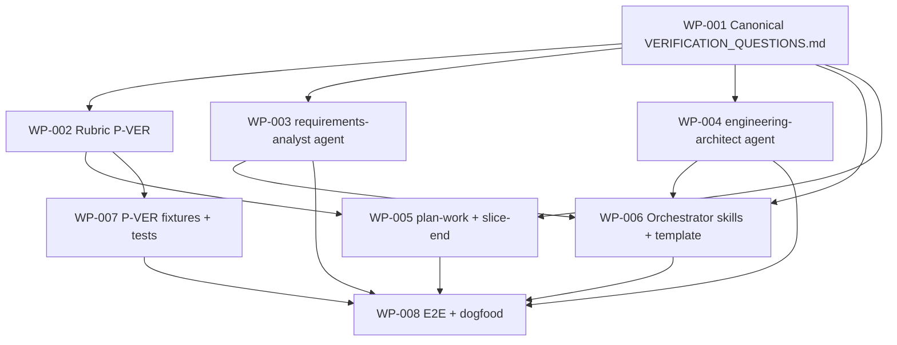

# Work Package Index — verification-by-design

> **TDD:** [../TDD.md](../TDD.md)
> **SIZING:** [../SIZING.md](../SIZING.md)
> **Total WPs:** 8
> **Critical path:** WP-001 → WP-002 → WP-005 → WP-008 (4 packages serial)
> **Peak parallelism:** 4 (after WP-001 lands: WP-002, WP-003, WP-004, WP-006 can run together)

## Status Summary

| Status | Count |
|---|---|
| pending | 8 |
| in_progress | 0 |
| done | 0 |
| blocked | 0 |

## Primitive Distribution

| Group | Primitive | Count | WPs |
|---|---|---|---|
| GENERATE | Create | 3 | WP-001, WP-007, WP-008 |
| EXPAND | Extend | 5 | WP-002, WP-003, WP-004, WP-005, WP-006 |
| SUBSTITUTE | Wrap | 0 | — |
| REORGANISE | Refactor / Move / Decompose | 0 | — |
| REINFORCE | Test / Instrument / Harden | 0 | — (test fixtures live inside WP-007 + WP-008 RGB DoD, not as separate WPs) |

> No Wraps proposed. No REORGANISE — this is a methodology *extension*,
> not a refactor of existing methodology. REINFORCE-Test work folded
> into each WP's Red phase per the standard's RGB discipline; WP-007
> + WP-008 are the test-authoring WPs by primary purpose.

## Kind Distribution

| Kind | Count | WPs |
|---|---|---|
| docs | 6 | WP-001..006 (methodology prose: canonical, rubric extension, agent prompts, skill prose, template block) |
| backend | 2 | WP-007 (P-VER fixtures + tests), WP-008 (E2E + dogfood test) |

> Cross-kind shape: **not triggered.** Six docs WPs + two backend WPs
> (the backend WPs are *tests* of the docs WPs, not application code
> sharing a frontend/backend seam). No `kind: contract` data-contract
> WP needed — the canonical (WP-001) IS the contract; it is itself
> kind: docs.
> Visual contract: **not applicable** (`founder_facing: false` per TDD
> frontmatter — this change ships methodology, not user-facing UI).

## Adapter Distribution

> Every WP carries `verification:` per ADR-003 (dogfood — this change's
> WP set is the first to enforce the new field).

| Adapter | Shape | Count | WPs |
|---|---|---|---|
| methodology (Shape 1 concrete) | adapter + artifact | 8 | WP-001..008 |
| methodology (Shape 2 deferred) | adapter + deferred-to-follow-on | 0 | — |
| methodology (Shape 3 trivial carveout) | na + justification | 0 | — |

All 8 WPs use Shape 1 because the verification of each methodology
change *can be expressed as a structural-assertion test or an E2E
methodology test* (per ADR-007's methodology adapter row). None defer
infrastructure; none qualify for the trivial-change carveout.

## Wrap Audit

> All Wrap WPs reviewed for No-Band-Aid-Wrappers compliance.

| WP | Subject | Ownership | Removal Plan | Status |
|---|---|---|---|---|
| (none) | — | — | — | — |

No Wraps proposed. No wrapper rot detected on existing modules.

## Dependency Graph

No cycles. All arrows point at the keystone (WP-001) or at consumers
of it. WP-008 is the terminal sink (everything blocks it).

## WP Table

| ID | Title | Primitive | Kind | Status | Depends On | Blocks | Token (in/out) | TDD § |
|---|---|---|---|---|---|---|---|---|
| WP-001 | Author canonical `VERIFICATION_QUESTIONS.md` (20 questions + 7-adapter table + version) | create | docs | done | — | WP-002..008 | 2k / 5k | Form §canonical (line 129); FR-006, FR-007 |
| WP-002 | Extend `decompose-validation-rubric.md` with P-VER (8 failure modes + grandfather + merge-date constant) | extend | docs | done | WP-001 | WP-005, WP-007, WP-008 | 4k / 4k | Form §rubric (line 130); Armor §gate-integrity; FR-009, FR-014, FR-016 |
| WP-003 | Extend `requirements-analyst.md` agent prompt — Phase 3 question-asking + canonical citation | extend | docs | done | WP-001 | WP-008 | 5k / 3k | Form §requirements-analyst (line 131); FR-003 |
| WP-004 | Extend `engineering-architect.md` agent prompt — concretion questions + SRD↔TDD contradiction surfacing | extend | docs | done | WP-001 | WP-008 | 3k / 3k | Form §engineering-architect (line 132); FR-004 |
| WP-005 | Extend `plan-work/SKILL.md` — per-WP `verification:` field + slice-end deferred-needs auto-draft | extend | docs | pending | WP-001, WP-002 | WP-008 | 5k / 4k | Form §plan-work (line 133); Form §slice-end (line 138); FR-005, FR-011, FR-012, FR-013, FR-015 |
| WP-006 | Wire P-VER into `specify` / `draft-architecture` / `requirements-validation` skills + add Verification Plan template to `requirements-templates` | extend | docs | pending | WP-001, WP-002, WP-003, WP-004 | WP-008 | 6k / 4k | Form §orchestrators (lines 134-137); FR-001, FR-002, FR-009 |
| WP-007 | Author P-VER fixtures + tests (8 fail + 4 pass + idempotency) | create | backend | pending | WP-002 | WP-008 | 4k / 8k | Proof §test classes 1-2 + 4 (lines 240-291) |
| WP-008 | E2E methodology test (dispatch updated agents) + dogfood assertion (P-VER on this change's own artifacts) | create | backend | pending | WP-003, WP-004, WP-005, WP-006, WP-007 | — | 5k / 6k | Proof §test class 3 + 5; NFR-005 |

**Totals:** ~34k input + ~37k output ≈ 71k tokens for the full WP set.

## Recommended Implementation Order

1. **First wave (serial — keystone):** WP-001. Until the canonical exists, nothing else can cite it.
2. **Second wave (parallel — 4-way):** WP-002 (rubric), WP-003 (requirements-analyst), WP-004 (engineering-architect), WP-006 partial (template block in requirements-templates). All read WP-001 only; no cross-deps.
3. **Third wave (parallel — 2-way):** WP-005 (plan-work + slice-end — needs WP-002), WP-007 (fixtures + tests — needs WP-002).
4. **Fourth wave:** WP-006 completion (the three orchestrator skills' rubric-invocation steps — needs WP-003 + WP-004).
5. **Fifth wave (terminal):** WP-008 (E2E + dogfood — needs all of WP-003..007).

Critical path: WP-001 → WP-002 → WP-005 → WP-008 (4 packages serial,
or equivalently WP-001 → WP-002 → WP-007 → WP-008). Parallelism peak:
4 (second wave runs WP-002, WP-003, WP-004, WP-006 concurrently).

## Validation

See [`DECOMPOSE_VALIDATION.md`](./DECOMPOSE_VALIDATION.md) for the
P1..P8 rubric report.

> **Note:** P-VER (Phase 9, added by WP-002 of this change) is not yet
> in force. The rubric this WP set is validated against is the current
> live rubric (P1..P8). After this change merges, future WP sets will
> be additionally validated against P-VER.
>
> However, **every WP in this set already carries the new
> `verification:` frontmatter field** per ADR-003 — the first dogfood
> of the field. WP-002 + WP-007 will assert P-VER passes on these
> WPs as part of NFR-005 (the dogfood gate).
