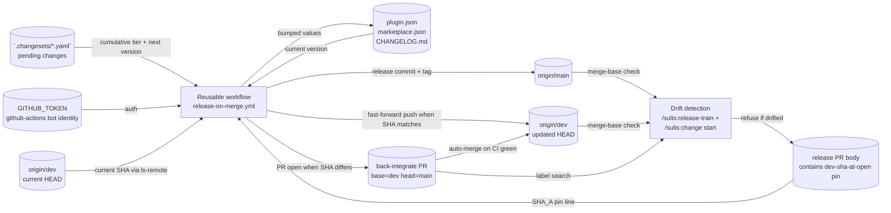

# Data Flow Diagram — auto-back-merge-on-release

%% Shows where the release-and-back-merge data flows: from the changesets +
%% dev SHA pin, through the reusable workflow, into bumped version files and
%% the dev branch HEAD.

Notes:

- The `dev-sha-at-open` pin in the release PR body is the only piece of data
  flowing from `/sulis:release-train` to the reusable workflow that controls
  the clean-vs-raced decision. Everything else flows through git refs.
- The drift detection (right side of the diagram) is a read-only consumer
  of git state. It does not write back; it refuses or proceeds.
- `BotIdentity` (GITHUB_TOKEN) is the single auth credential the workflow
  needs. Its scope (`contents: write, pull-requests: write`) is what
  enables both the fast-forward push and the PR open.
