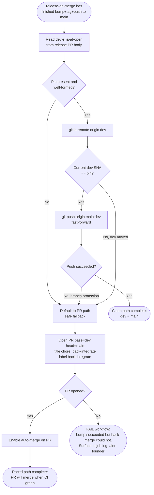
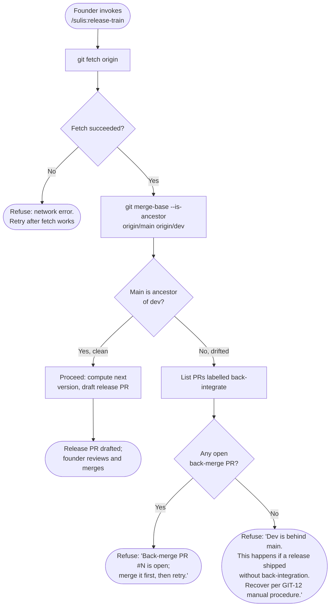
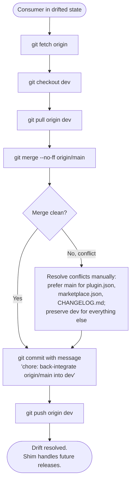

# Process Flow Diagrams — auto-back-merge-on-release

## PF-001: Release robot decision flow (UC-001 + UC-002 combined)

%% This is the entire decision tree inside the reusable workflow's
%% back-merge step. It runs AFTER the existing bump+tag+push-main steps
%% succeed. It's the inserted unit between today's "tag and push" step and
%% the end of the job.

## PF-002: Drift detection in /sulis:release-train (UC-006)

%% Defensive check fired before any release-PR drafting work. The same
%% pattern fires in /sulis:change start (UC-006 secondary trigger).

## PF-003: Manual recovery procedure (UC-005)

%% The procedure documented in GIT-12 worked examples, for use by consumers
%% who are already in the drifted state. Mirrors the three back-integration
%% commits in the marketplace's history.

