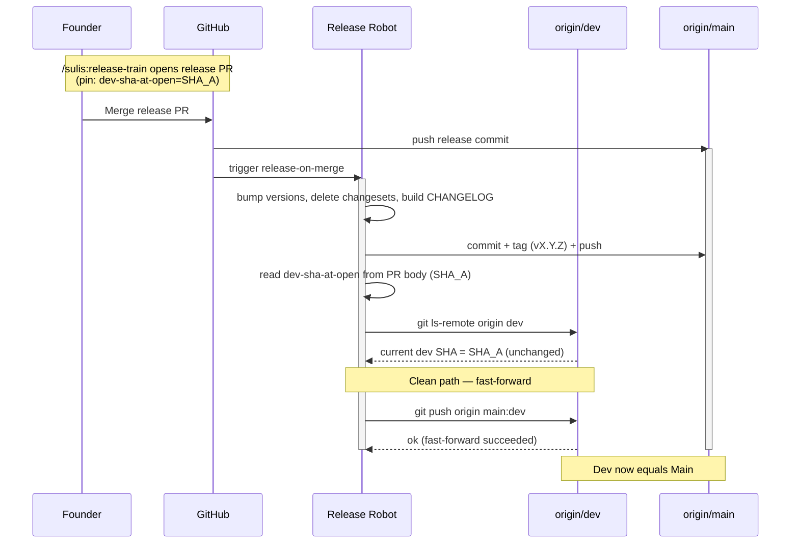
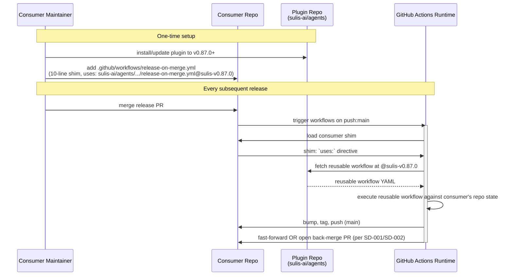
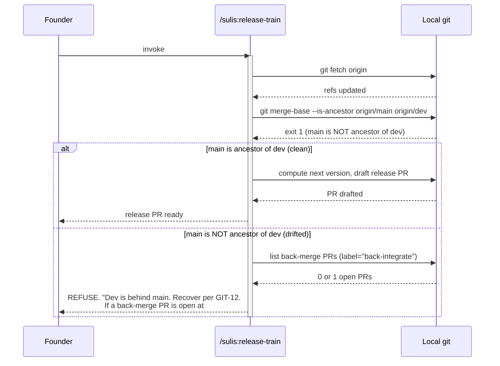

# Sequence Diagrams — auto-back-merge-on-release

## SD-001: Clean release path (UC-001)

%% Shows the happy-path interaction: founder merges the release PR, robot
%% bumps versions on main, then verifies the dev SHA pin still matches and
%% performs a fast-forward push of main → dev. No human in the loop after
%% the merge.



## SD-002: Raced release path (UC-002)

%% Shows the race: developer lands work on dev between PR open and robot
%% run. Robot detects the SHA mismatch, opens a back-merge PR instead of
%% force-pushing. PR auto-merges on CI green.

```mermaid
sequenceDiagram
    participant F as Founder
    participant D as Developer
    participant GH as GitHub
    participant R as Release Robot
    participant Dev as origin/dev
    participant Main as origin/main

    Note over F,GH: Release PR opened<br/>(pin: dev-sha-at-open=SHA_A)

    D->>Dev: merge feature work (dev advances to SHA_B)
    F->>GH: Merge release PR
    GH->>Main: push release commit
    activate Main
    GH->>R: trigger release-on-merge
    activate R

    R->>R: bump, tag, push (main now at vX.Y.Z)
    R->>R: read pin SHA_A
    R->>Dev: git ls-remote origin dev
    Dev-->>R: current dev SHA = SHA_B (moved!)

    Note over R,Dev: Raced — open PR, never force-push

    R->>GH: open PR (base=dev, head=main,<br/>title="chore: back-integrate main → dev (post-release vX.Y.Z)",<br/>label="back-integrate")
    GH-->>R: PR-N opened
    R->>GH: enable auto-merge on PR-N
    deactivate R

    Note over GH: CI runs on PR-N

    alt CI green
        GH->>Dev: auto-merge PR-N
        Note over Dev: Dev now contains main's release commit<br/>(via merge commit by github-actions[bot])
    else CI fails
        Note over GH,F: PR-N stays open; release-train drift check<br/>(UC-006) will block next release until merged
    end
    deactivate Main
```

## SD-003: Fork-consumer inherits via shim (UC-003)

%% Shows how a consumer's release flow becomes a back-merging one
%% transparently via the shim → reusable-workflow indirection. The consumer
%% installs the plugin update, adds the 10-line shim once, and from then on
%% every release auto-back-merges.



## SD-004: Drift-detection refusal in /sulis:release-train (UC-006)

%% Shows the defensive check: if main is not an ancestor of dev, the
%% release-train skill refuses to draft a release PR and points at the
%% recovery procedure.


