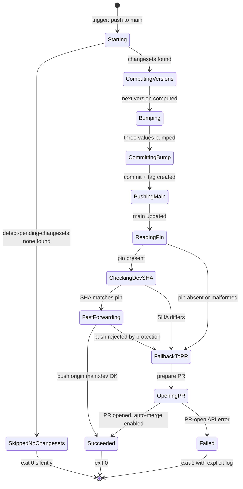

# State Diagrams — auto-back-merge-on-release

## ST-001: Dev branch state relative to main

%% Tracks the relationship between dev and main across release events. The
%% spec's job is to ensure the system spends almost no time in the "drifted"
%% state, and that recovery from "drifted" is well-defined.

```mermaid
stateDiagram-v2
    [*] --> InSync: Initial state<br/>(dev = main = first commit)

    InSync --> AheadOfMain: Developer merges to dev<br/>(normal day-to-day work)
    AheadOfMain --> AheadOfMain: More merges to dev
    AheadOfMain --> ReleasePending: /sulis:release-train opens<br/>release PR (pin = dev's SHA)

    ReleasePending --> ReleasePending: Developer keeps merging to dev<br/>(invalidates the pin)
    ReleasePending --> ReleasingClean: Founder merges release PR;<br/>robot finds dev SHA = pin
    ReleasePending --> ReleasingRaced: Founder merges release PR;<br/>robot finds dev SHA != pin

    ReleasingClean --> InSync: Robot fast-forwards dev to main

    ReleasingRaced --> BackMergePROpen: Robot opens back-merge PR
    BackMergePROpen --> InSync: PR auto-merges on CI green
    BackMergePROpen --> Drifted: PR fails CI and no one notices;<br/>or PR closed without merging

    Drifted --> InSync: Manual recovery per GIT-12<br/>(merge --no-ff origin/main + push)

    InSync --> [*]: never (steady state)
```

States:

- **InSync**: `dev` HEAD is identically `main` HEAD, or `dev` HEAD has `main`
  as a direct ancestor with no commits on `main` not yet on `dev`. The
  invariant `git merge-base --is-ancestor origin/main origin/dev` holds.
- **AheadOfMain**: `dev` has commits that `main` doesn't yet. This is the
  normal working state between releases. Invariant still holds (main is
  ancestor of dev).
- **ReleasePending**: A release PR is open. The pin records dev's SHA at
  this moment. Invariant still holds.
- **ReleasingClean**: Transient state during the robot's run on the clean
  path. Lasts seconds.
- **ReleasingRaced**: Transient state during the robot's run on the raced
  path. Lasts seconds.
- **BackMergePROpen**: A `chore: back-integrate` PR is open against dev,
  awaiting CI / auto-merge. Invariant temporarily violated; the back-merge
  PR is the announced fix-in-flight.
- **Drifted**: Invariant violated AND no recovery is in flight. This is the
  pathological state the spec exists to eliminate. The only allowed exit is
  manual recovery (UC-005).

Only `Drifted` allows pathological behaviour. Every other state either
holds the invariant or has an announced fix-in-flight.

## ST-002: Reusable workflow execution state

%% The states of a single run of the reusable workflow as it processes a
%% release. Used by the post-condition NFR-006 atomicity check.

