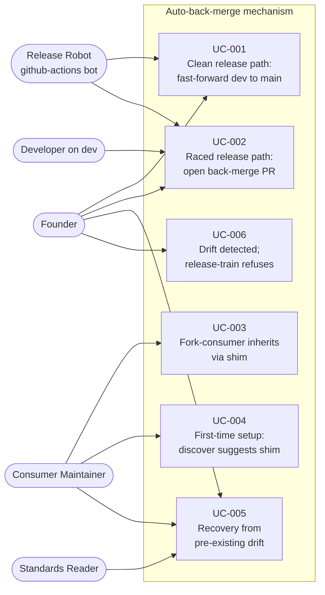

# Use Case Diagram — auto-back-merge-on-release

%% This diagram shows the actors and use cases for the auto-back-merge mechanism.
%% Five actors interact with the system: the founder (drives releases), the developer
%% (lands work on dev between releases), the release robot (the bot), the consumer
%% maintainer (installs the shim), and the standards reader (consults GIT-12).

## Use Case Summaries

- **UC-001 Clean release path** — Most releases. Dev is untouched between
  the release PR opening and the robot finishing. Robot fast-forwards dev to
  main with no merge commit, no review, no overhead.

- **UC-002 Raced release path** — Exception case. A developer's normal work
  landed on dev during the race window. The robot detects this and opens a
  back-merge PR instead of force-pushing. The PR auto-merges on CI green.

- **UC-003 Fork-consumer inheritance** — A repo that has installed the
  Sulis plugin and added the canonical shim file gets back-merge behaviour
  automatically when their next release fires.

- **UC-004 First-time setup** — A fresh consumer running
  `/sulis:discover-project` gets told their `.github/workflows/` is missing
  the shim and is offered the canonical template. (Detection arrives in
  this change; the install action ships in the follow-on.)

- **UC-005 Recovery from pre-existing drift** — A consumer who is already
  drifted (e.g., the marketplace itself, three times historically: `0e85c24`,
  `8612834`, `d93517c`) follows the GIT-12 documented manual recovery to
  reconcile dev to main once. After that, the shim handles it forever.

- **UC-006 Regression detection** — Defensive check: if back-merge somehow
  fails (manual operator bypass per MUC-003, broken shim per MUC-004, open
  back-merge PR left unmerged per MUC-007), the next
  `/sulis:release-train` invocation refuses to draft a release PR until
  drift is resolved.
