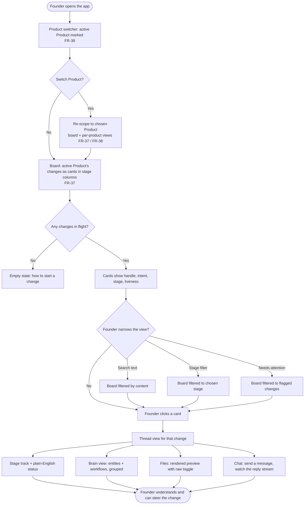

# Board → thread navigation

This shows how the founder gets from the landing board into a single change's
thread, and what each view reads. Every arrow that fetches data goes through the
one API boundary (the seam) — never the filesystem directly. The board is **scoped to
one active Product** (FR-37); a **product switcher** (FR-38) changes which Product is
active and re-scopes the board.

