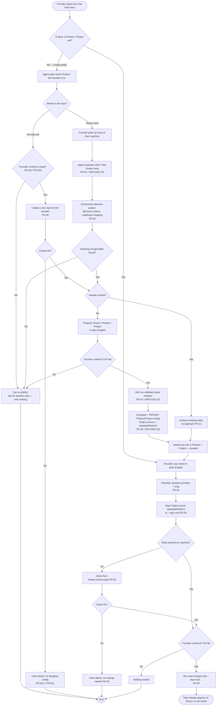

# Chat-driven discovery: discover → mint → start a change

This shows the chat front door (FR-27..FR-32). It does two jobs. **Cold-start
onboarding** (left branch): when the graph is empty, a behind-the-scenes discovery
agent — driven over the **same stream bridge as the two-way chat** — searches the
folder the founder chooses, asks plain-English questions, and (once the founder
confirms) mints the Tenant / Product / Project through the validated spine emitters.
**Start-a-change-from-intent** (right branch): once a Product/Project exists, the same
chat turns plain-English intent into a started change, cloning the repo first if it
isn't on the machine.

The load-bearing safety steps are: the agent **asks before it creates anything**
(FR-N6), it **searches only the chosen area** (FR-N7), it **doesn't mint duplicates**
(FR-31), and entity writes **go through the schema-validated emitters** (FR-32). The
onboarding branch now also **finds-or-creates the Product's repo** (FR-35) and **persists
a durable Product/Project config** (FR-36), so next time the founder needs no re-setup.

