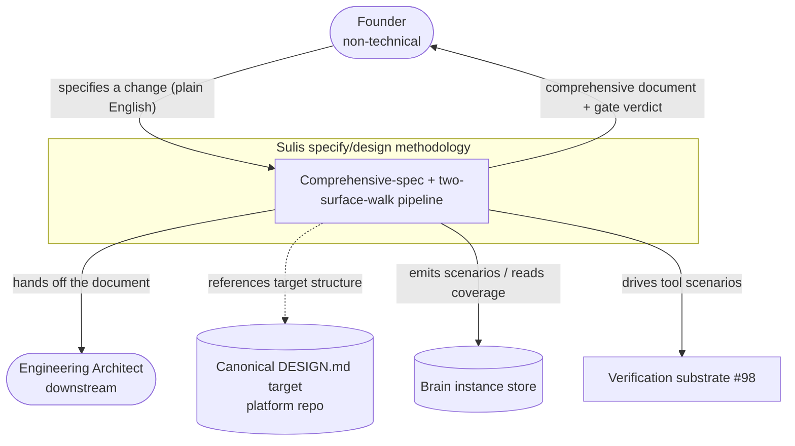
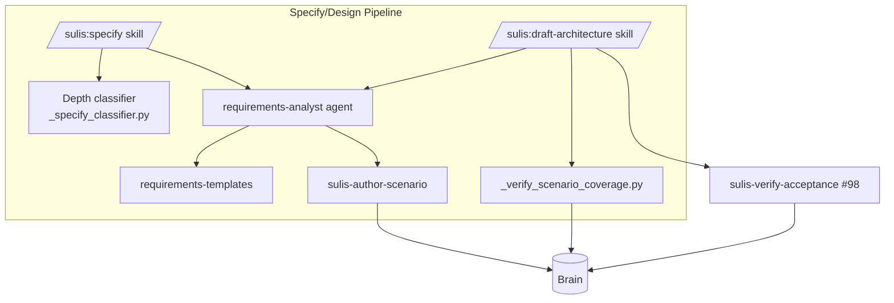
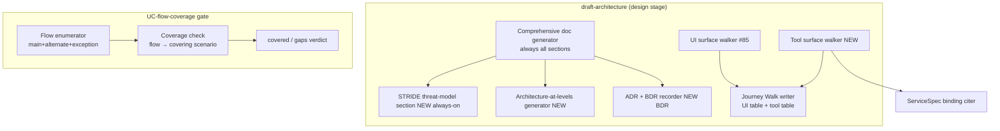

# Architecture-at-Levels (C4) — Comprehensive Spec & Two-Surface Journey Walk

This file demonstrates FR-16: the comprehensive design document must carry
architecture at three C4 levels — **context**, **container**, **component** —
beyond the 5 flat Mermaid types Sulis has today. The subject modelled is the
specify/design methodology pipeline itself.

## Level 1 — Context (the methodology in its environment)

## Level 2 — Container (deployable / runnable units)

## Level 3 — Component (internals of the design skill / coverage gate)

## Notes

- The **NEW** components (tool surface walker, always-on STRIDE generator,
  architecture-at-levels generator, BDR recorder, flow enumerator) are what this
  change introduces; the rest are extended existing units.
- This three-level set is itself the proof that architecture-at-levels is
  producible — the produced comprehensive document carries the same shape for
  the system *it* designs.
