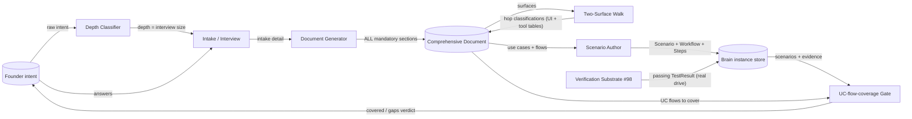

# Data Flow Diagram — Comprehensive Spec & Two-Surface Journey Walk

Shows how intake, depth, the comprehensive document, scenarios, and the brain
move through the methodology pipeline.

## Narrative

- **Depth** flows ONLY into the interview sizer — never into the document
  generator's section-emission decision (FR-03). The arrow from Classifier to
  DocGen carries nothing about which sections exist.
- The **comprehensive document** is the single source of the mandatory section
  set; its use-case flows feed both the scenario author and the coverage gate.
- The **brain** is the objective source of truth for coverage: scenarios authored
  there, evidence (passing TestResults) deposited there by the #98 substrate; the
  gate reads both (NFR-D01). No agent-asserted coverage crosses into the gate.
- The **gate verdict** (covered/gaps) is the only thing the founder sees, in plain
  English.
