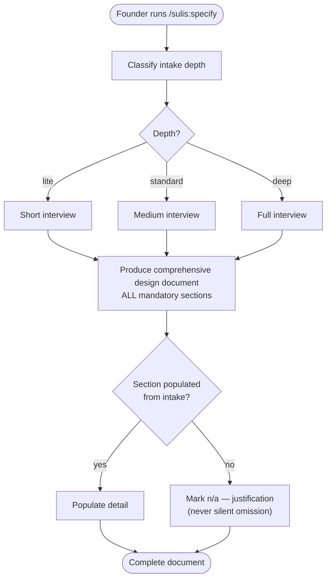
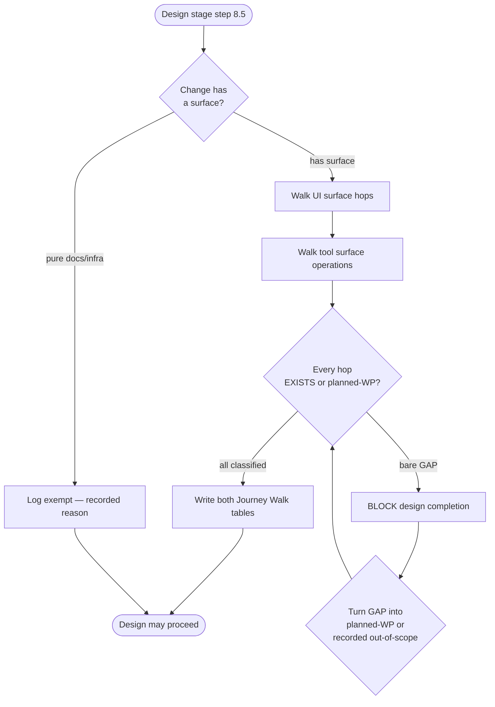
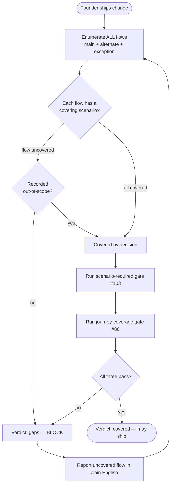

# Process Flow Diagrams — Comprehensive Spec & Two-Surface Journey Walk

## Flow 1 — Decoupled depth → intake (Phase 1)

The corrected flow: depth sizes the interview; the comprehensive document is
always produced.

Contrast with the OLD (backwards) flow, which this change removes: `Depth → lite`
branched to "emit short SPEC, skip use cases / NFR / threat model / diagrams". No
emission branches on depth after this change (FR-03).

## Flow 2 — Two-surface journey walk (Phase 2)

For a tool operation: EXISTS requires the handler AND its ServiceSpec binding; a
serving interface without a binding is a GAP (FR-09).

## Flow 3 — UC-flow-coverage gate (Phase 2)

