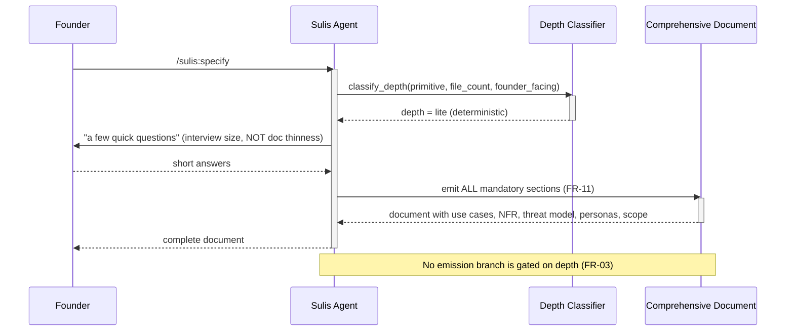
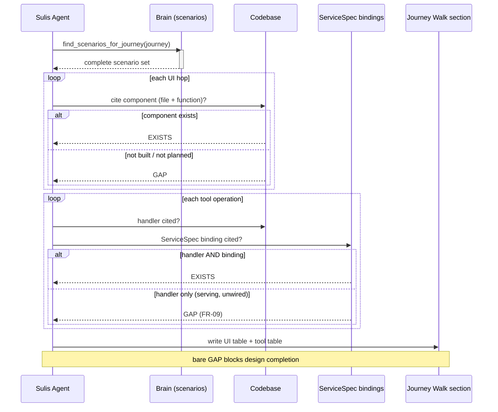
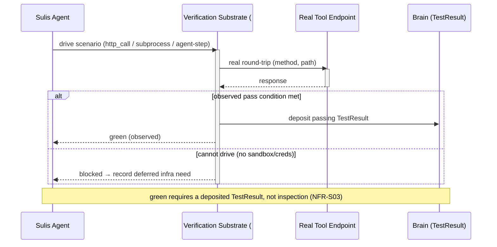

# Sequence Diagrams — Comprehensive Spec & Two-Surface Journey Walk

## SD-01 — Specify at lite depth still yields the comprehensive document

## SD-02 — Two-surface journey walk

## SD-03 — Driving a tool scenario for real (#98 substrate)

