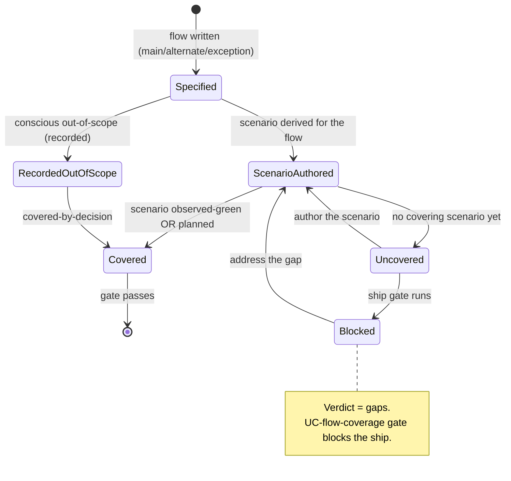
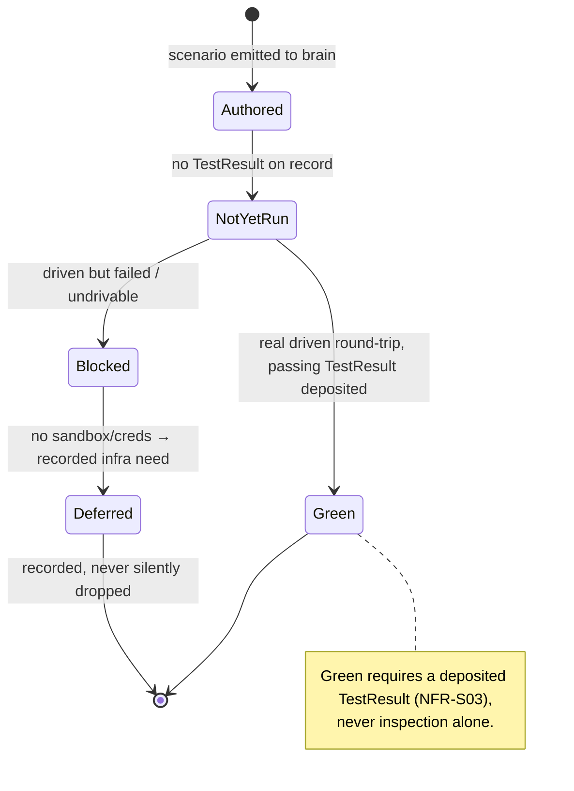

# State Diagrams — Comprehensive Spec & Two-Surface Journey Walk

## ST-01 — Hop classification lifecycle (a single hop in a journey walk)

```mermaid
%% A hop moves between classifications as the design evolves
stateDiagram-v2
    [*] --> Unclassified: hop identified in journey
    Unclassified --> EXISTS: component cited (file+function); tool hop also needs ServiceSpec binding
    Unclassified --> PlannedWP: no component, but a WP is planned
    Unclassified --> GAP: neither built nor planned
    GAP --> PlannedWP: turn into a planned WP
    GAP --> OutOfScope: recorded out-of-scope decision
    PlannedWP --> EXISTS: WP built and cited
    EXISTS --> [*]: design completes
    PlannedWP --> [*]: design completes (planned)
    OutOfScope --> [*]: design completes (recorded)

    note right of GAP
        A bare GAP BLOCKS design completion.
        It must become PlannedWP or OutOfScope.
    end note
```

## ST-02 — Use-case flow coverage lifecycle (a single flow)

## ST-03 — Tool scenario drive status

