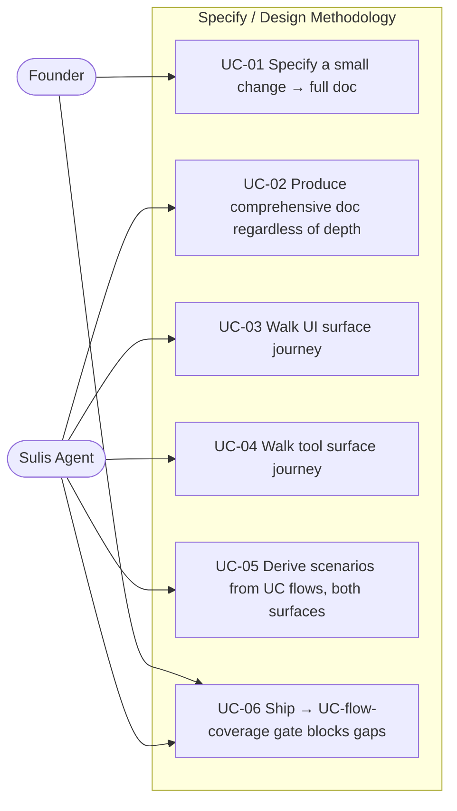

# Use Case Diagram — Comprehensive Spec & Two-Surface Journey Walk

The actors are the **Founder** (human, non-technical) and the **Sulis agent**
(automated). The system is the specify/design methodology pipeline.

## Narrative

- **UC-01 (Founder)** — A founder specifies a small user-facing change and gets a
  comprehensive design document anyway. Depth sizes the questions, not the doc.
- **UC-02 (Agent)** — The agent always emits the full mandatory section set; no
  emission branch is gated on depth.
- **UC-03 (Agent)** — The agent walks the human consumer's path hop-by-hop
  (existing #85 behaviour, retained).
- **UC-04 (Agent)** — The agent ALSO walks the machine consumer's path — an
  agent/SDK calling the tools end-to-end — with the ServiceSpec-binding bar for
  EXISTS.
- **UC-05 (Agent)** — Every use-case flow (main/alternate/exception) becomes a
  drivable scenario, on the UI surface, the tool surface, or both.
- **UC-06 (Founder + Agent)** — The founder ships; the UC-flow-coverage gate
  blocks if any flow has no covering scenario, alongside the scenario-required and
  journey-coverage gates.
