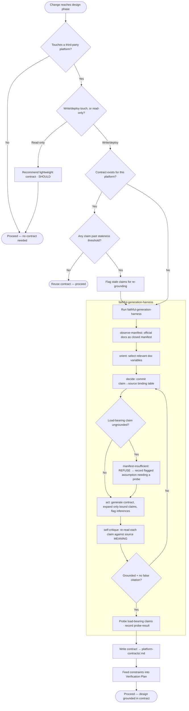

# Process Flow — The Design-Stage Gate + Harness Run

%% Shows the gate decision and the harness loop that produces a Platform Contract.

## Narrative

The diamond at `K` is the gate that prevents the triggering incident: an ungrounded
load-bearing claim does not silently become content — it forces a refusal and a
flagged assumption. The loop `O → J` is the meaning-check rejecting drifted or
falsely-cited spans before the contract passes.
