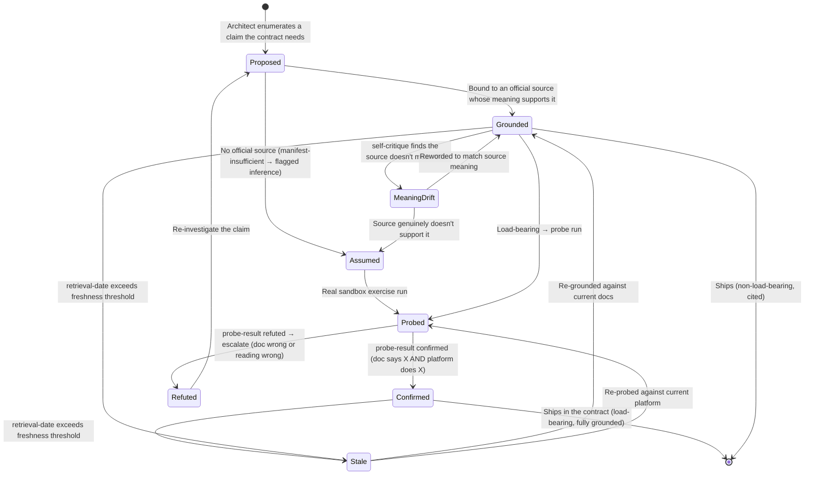

# State Diagram — Lifecycle of a Platform Contract Claim

%% A single claim moves through these states. Any transition not shown is not allowed.

## Narrative

- **Proposed → Assumed** is the refusal path — the gate against fabrication. An
  assumed claim is never asserted as documented fact; it carries `inferred: true`.
- **Grounded → MeaningDrift → Assumed** is MUC-002 being caught: a real citation
  whose meaning doesn't support the claim is demoted, not trusted.
- **Probed → Refuted** is the most valuable transition — the empirical check
  contradicting the documentation, the exact signal the reusable-workflow incident
  needed and never got.
- **Stale** is the freshness boundary (FR-013). A claim re-enters grounding/probing
  rather than being silently reused. The automated re-probe that *detects* staleness
  is deferred (Out of Scope); the manual flag from the retrieval date ships now.
