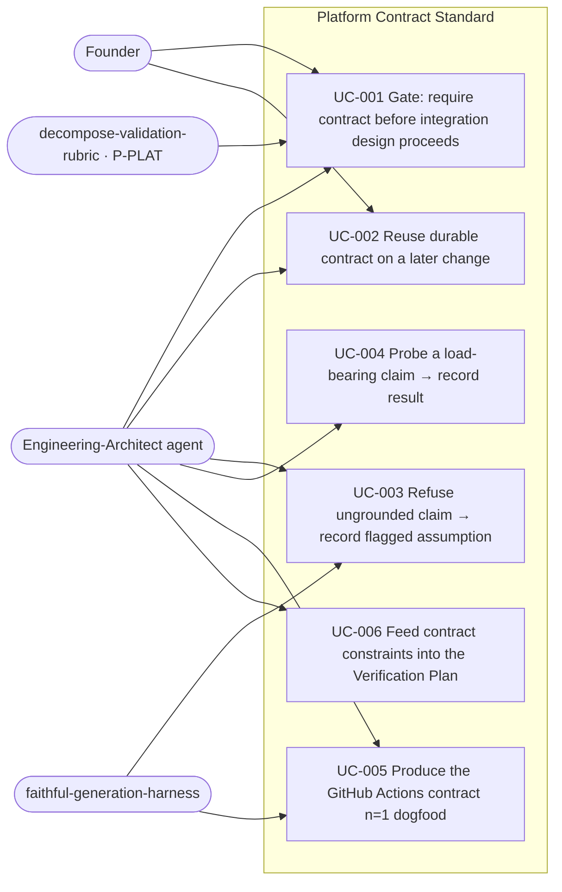

# Use Case Diagram — Platform Contract Standard

%% Shows who interacts with the Platform Contract discipline and the six use cases.

## Narrative

- **UC-001 (the gate)** — the load-bearing use case. An integration design cannot
  proceed without a contract. Enforced by both the architect (prose) and the rubric
  (mechanical). The direct fix for the triggering incident.
- **UC-002 (reuse)** — contracts are durable assets that accrue across changes, not
  per-change throwaways.
- **UC-003 (refusal)** — the harness refuses to fabricate; the gate that would have
  caught "reusable workflow in a plugin subdir".
- **UC-004 (probe)** — load-bearing claims get empirical confirmation, not just a
  citation.
- **UC-005 (n=1 dogfood)** — produces the GitHub Actions contract this change ships.
- **UC-006 (verification feed)** — each constraint becomes a test assertion or a
  named post-ship observable (#138).
