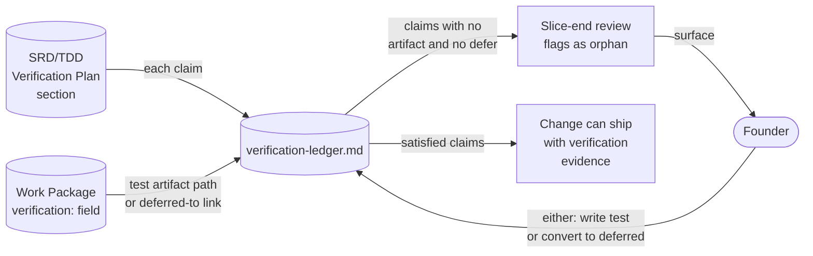

# Data Flow Diagrams — verification-by-design

**Change:** CH-01KT2B
**Date:** 2026-06-01

---

## DF-001 — Canonical question set as single source of truth

Shows how the canonical question set + adapter taxonomy flow into every design
phase and rubric check, with no duplication.

```mermaid
%% VERIFICATION_QUESTIONS.md is the single source of truth. Every consumer
%% reads from it; no consumer inline-duplicates. The rubric closes the loop
%% by citation-checking that consumers actually cited it.
flowchart LR
    Canon[(VERIFICATION_QUESTIONS.md<br/>4 + 9 + 7 questions<br/>kind→adapter map)]
    Founder([Founder])

    Canon -->|"20 questions + adapter map"| Specify[/sulis:specify]
    Canon -->|"20 questions + adapter map"| Draft[/sulis:draft-architecture]
    Canon -->|"adapter map"| Plan[/sulis:plan-work]
    Canon -->|"current version"| Rubric[Rubric P-VER]

    Founder -->|"invokes"| Specify
    Founder -->|"invokes"| Draft
    Founder -->|"invokes"| Plan

    Specify -->|"Verification Plan section<br/>with citation"| SRD[(SRD.md)]
    Draft -->|"Verification Plan section<br/>with citation"| TDD[(TDD.md)]
    Plan -->|"verification: field<br/>per WP"| WPs[(work-packages/*.md)]

    SRD -->|"section content"| Rubric
    TDD -->|"section content"| Rubric
    WPs -->|"frontmatter"| Rubric

    Rubric -->|"PASS / FAIL"| Founder
```

---

## DF-002 — Deferred infrastructure needs ledger

Shows how deferred infrastructure needs are recorded in each change's
Verification Plan, aggregated by slice-end review, and converted into either
follow-on changes or surfaced singletons.

```mermaid
%% Each change records its deferred needs in its SRD's Verification Plan
%% section. Slice-end review aggregates across the slice, applies the
%% repeated-need rule, and emits follow-ons or singletons-to-decide.
flowchart LR
    SRD1[(Change A<br/>SRD.md)]
    SRD2[(Change B<br/>SRD.md)]
    SRD3[(Change C<br/>SRD.md)]

    SRD1 -->|"deferred needs<br/>(canonical IDs)"| Aggregate[Slice-end review<br/>aggregator]
    SRD2 -->|"deferred needs<br/>(canonical IDs)"| Aggregate
    SRD3 -->|"deferred needs<br/>(canonical IDs)"| Aggregate

    Aggregate -->|"need flagged 2+ times"| Auto[Auto-draft<br/>follow-on]
    Aggregate -->|"need flagged once"| Single[Surface singleton<br/>to founder]

    Auto -->|"new change record"| FollowOn[(.specifications/{follow-on}/)]
    Single -->|"decision"| Founder([Founder])
    Founder -->|"draft now"| Auto
    Founder -->|"defer further"| NextSlice[(Next slice<br/>scan input)]

    FollowOn -->|"ships infra"| InfraBuilt[Infrastructure<br/>now available]
    InfraBuilt -->|"unblocks"| Original[Original changes<br/>can re-verify]
```

---

## DF-003 — Behavioural test ledger

Shows how Verification Plan claims flow into the behavioural test ledger and how
the slice-end review uses the ledger to flag unfulfilled claims.


