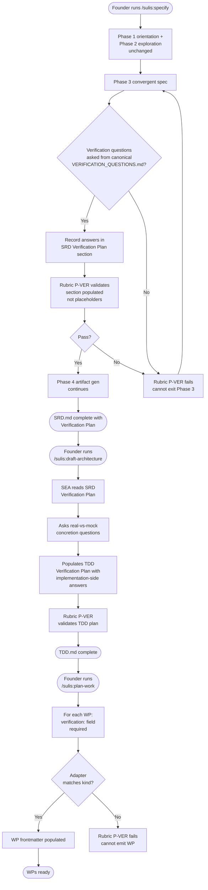
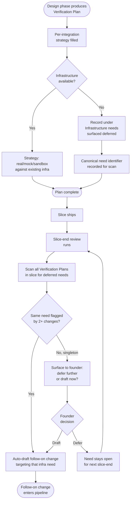
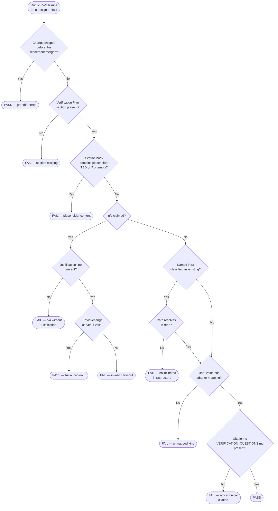

# Process Flow Diagrams — verification-by-design

**Change:** CH-01KT2B
**Date:** 2026-06-01

---

## PF-001 — Design phase asks the verification questions

Shows where in the existing design pipeline the new verification questions are
asked and where the Verification Plan section gets populated.

---

## PF-002 — Infrastructure-need flag and follow-on auto-draft

Shows the flow from "Verification Plan flags a deferred infrastructure need" to
"follow-on change auto-drafted at slice-end review."

---

## PF-003 — Rubric P-VER decision tree

The decision tree the verification rubric check evaluates against each design
artifact.

