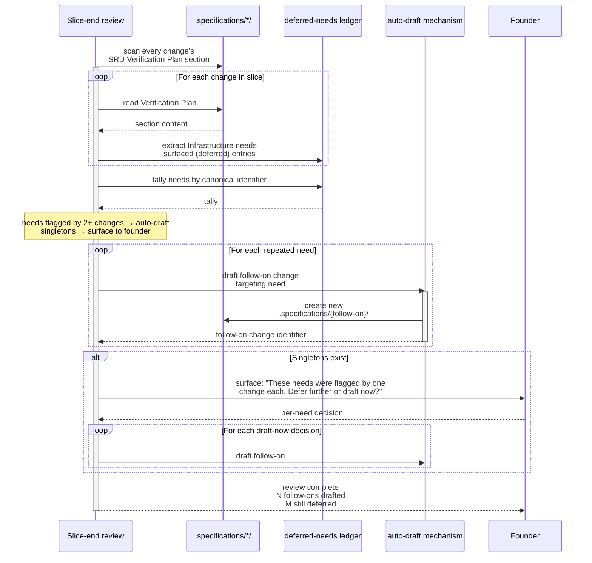

# Sequence Diagrams — verification-by-design

**Change:** CH-01KT2B
**Date:** 2026-06-01

---

## SD-001 — `/sulis:specify` asks the verification questions

Shows the interaction between the founder, the `/sulis:specify` skill, the
dispatched requirements-analyst agent, and the canonical question set during
Phase 3 of the facilitation.

```mermaid
sequenceDiagram
    participant F as Founder
    participant Skill as /sulis:specify
    participant RA as requirements-analyst
    participant Canon as VERIFICATION_QUESTIONS.md
    participant Disk as .specifications/{change}/

    F->>Skill: invoke
    activate Skill
    Skill->>RA: dispatch
    activate RA
    RA->>Disk: read CODEBASE_INDEX.json, PRIMITIVE_TREE.jsonld
    RA->>F: Phase 1 + 2 facilitation (unchanged)
    F->>RA: answers across exploration domains
    RA->>F: Phase 3 — convergent specification
    Note over RA,Canon: Phase 3 enters verification-question subphase
    RA->>Canon: read canonical question set + adapter taxonomy
    activate Canon
    Canon-->>RA: 4 foundational + 9 per-integration + 7 per-kind questions
    deactivate Canon
    RA->>F: ask Q1: user-observable behaviour we're verifying?
    F-->>RA: answer
    RA->>F: ask Q2: verification environment(s)?
    F-->>RA: answer
    Note over RA,F: continues for each foundational + per-integration<br/>+ per-kind question that applies to this change
    RA->>Disk: write SRD.md with Verification Plan section populated
    RA->>Disk: write GLOSSARY.md, MISUSE_CASES.md, PRIMITIVE_TREE.jsonld
    Note over RA: rubric P-VER check before exit
    RA->>Canon: re-read for citation
    RA->>Disk: validate Verification Plan section passes rubric
    alt Rubric fails
        RA->>F: surface gap; ask only the unresolved questions
        F-->>RA: answer
        RA->>Disk: re-write SRD.md
    end
    RA-->>Skill: complete
    deactivate RA
    Skill-->>F: SRD ready; next step /sulis:draft-architecture
    deactivate Skill
```

---

## SD-002 — `/sulis:draft-architecture` concretises the Verification Plan

Shows how the engineering-architect agent reads the SRD's Verification Plan and
asks the implementation-side concretion questions before producing the TDD.

```mermaid
sequenceDiagram
    participant F as Founder
    participant Skill as /sulis:draft-architecture
    participant SEA as engineering-architect
    participant Canon as VERIFICATION_QUESTIONS.md
    participant SRD as SRD.md
    participant TDD as TDD.md

    F->>Skill: invoke .specifications/{change}/
    activate Skill
    Skill->>SEA: dispatch
    activate SEA
    SEA->>SRD: read full SRD including Verification Plan
    SEA->>Canon: read adapter taxonomy + per-integration question set
    activate Canon
    Canon-->>SEA: adapter mappings + question set
    deactivate Canon
    Note over SEA: SEA produces draft TDD with Verification Plan stub
    SEA->>F: ask concretion Q1: for SRD's "auth mock" plan,<br/>which existing mock or new build?
    F-->>SEA: answer
    SEA->>F: ask Q2: bootstrap-from-zero — what seed data?
    F-->>SEA: answer
    Note over SEA,F: continues per-integration; SEA reconciles each<br/>concretion against SRD's plan
    SEA->>TDD: write TDD.md with concretised Verification Plan
    Note over SEA: rubric P-VER check
    alt Rubric fails — TDD plan contradicts SRD plan
        SEA->>F: surface contradiction;<br/>ask whether SRD plan should change<br/>or TDD plan should change
        F-->>SEA: decision
        SEA->>SRD: amend if SRD plan changes
        SEA->>TDD: amend TDD
    end
    SEA-->>Skill: TDD complete
    deactivate SEA
    Skill-->>F: TDD ready; next step /sulis:plan-work
    deactivate Skill
```

---

## SD-003 — Slice-end review auto-drafts follow-on for repeated infrastructure need

Shows the automated slice-end review scanning Verification Plans for deferred
infrastructure needs and auto-drafting a follow-on change.


