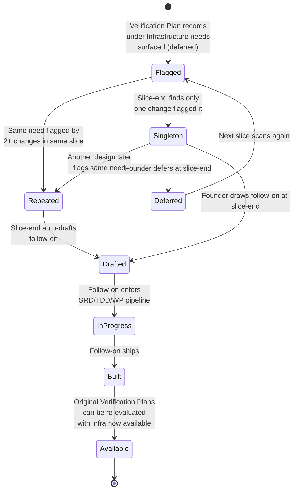

# State Diagrams — verification-by-design

**Change:** CH-01KT2B
**Date:** 2026-06-01

---

## ST-001 — Verification Plan section lifecycle

Shows the states a Verification Plan section moves through across the design
pipeline and the transitions that move it between them.

```mermaid
%% A Verification Plan section is created during /sulis:specify, concretised
%% during /sulis:draft-architecture, bound to WPs during /sulis:plan-work,
%% and either fulfilled at ship or carried via a deferred follow-on link.
stateDiagram-v2
    [*] --> Missing: Change created
    Missing --> Drafting: /sulis:specify enters Phase 3
    Drafting --> Populated: All applicable questions answered
    Drafting --> Placeholder: Operator pastes TBD or skips
    Placeholder --> Drafting: Rubric P-VER fails;<br/>RA re-asks
    Populated --> Concretised: /sulis:draft-architecture<br/>produces TDD plan
    Concretised --> WPBound: /sulis:plan-work emits WPs<br/>with verification: field
    WPBound --> Fulfilled: Behavioural tests written<br/>and pass
    WPBound --> DeferredFulfilled: All Verification Plan claims<br/>linked to follow-on change
    Fulfilled --> [*]: Change ships
    DeferredFulfilled --> [*]: Change ships with<br/>follow-on dependency
```

---

## ST-002 — Infrastructure need lifecycle

Shows the states an infrastructure need moves through from "flagged in one
Verification Plan" to "satisfied by a built infrastructure piece."



---

## ST-003 — Rubric P-VER verdict states

Shows the verdict the rubric produces for any given design artifact and the
conditions that drive each transition.

```mermaid
%% The rubric P-VER returns one of four terminal verdicts. Grandfathered is
%% time-bounded by the change's shipped-on date.
stateDiagram-v2
    [*] --> Evaluating
    Evaluating --> Grandfathered: shipped-on date<br/>precedes refinement merge
    Evaluating --> Pass: Section populated +<br/>citation present +<br/>kind has adapter
    Evaluating --> PassTrivial: n/a + valid justification<br/>+ CW-05 conditions met
    Evaluating --> Fail: Any failure code from<br/>MUC-001..008
    Grandfathered --> [*]
    Pass --> [*]
    PassTrivial --> [*]
    Fail --> Evaluating: Operator fixes;<br/>rubric re-runs
```
