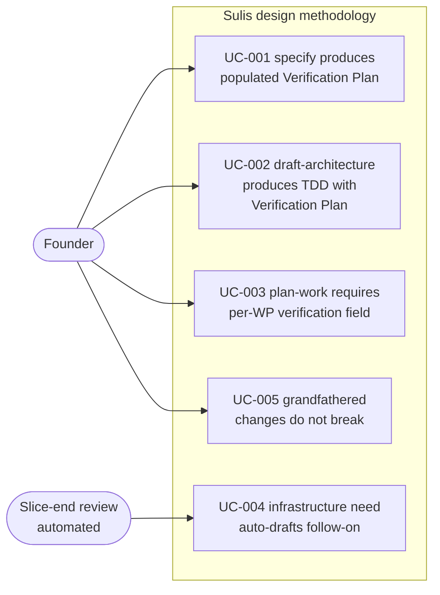

# Use Case Diagram — verification-by-design

**Change:** CH-01KT2B
**Date:** 2026-06-01

This diagram shows which actors interact with which design-time and methodology
capabilities introduced by this change. The actors and use cases match SRD.md §
Use Cases.

---

## UC-001 — `/sulis:specify` produces an SRD with a populated Verification Plan

**Actor:** Founder
**Trigger:** Founder runs `/sulis:specify` on a new change.
**Outcome:** SRD.md is produced containing a `## Verification Plan` section with
every subsection populated (not blank, not `TBD`, not bare `n/a`). The
requirements-analyst agent asked the foundational + per-integration +
per-kind-adapter questions and recorded answers in plain English.

## UC-002 — `/sulis:draft-architecture` produces a TDD with a Verification Plan

**Actor:** Founder
**Trigger:** Founder runs `/sulis:draft-architecture` on an SRD that includes a
Verification Plan section.
**Outcome:** TDD.md is produced containing a `## Verification Plan` section that
concretises the SRD's plan into implementation-side terms — real vs mocked, sandbox
vs bypass, test artifact paths or deferred-to-follow-on links. The engineering-architect
agent asked the verification-strategy questions and reconciled its answers against
the SRD's plan.

## UC-003 — `/sulis:plan-work` requires each WP carry a `verification:` field

**Actor:** Founder
**Trigger:** Founder runs `/sulis:plan-work` on a TDD that includes a Verification Plan.
**Outcome:** Each emitted Work Package's frontmatter carries a `verification:` field
naming the adapter and (where applicable) the specific test artifact path or
`deferred-to-follow-on:` with a follow-on identifier. The rubric (P-VER) fails the
decomposition if any WP lacks the field or names an adapter that does not fit the
change's `kind:` value.

## UC-004 — Slice-end review auto-drafts a follow-on change for repeated infrastructure needs

**Actor:** Slice-end review (automated pattern, no human trigger)
**Trigger:** Slice-end review runs at the boundary between delivery slices.
**Outcome:** The review scans the "Infrastructure needs surfaced (deferred)"
subsection of every Verification Plan in the slice. When the same infrastructure
need is flagged by 2 or more changes, the review auto-drafts a follow-on change
targeting that need (its own SRD/TDD/WP pipeline begins). Singletons surface to
the founder for explicit decision (defer further or draft now). The scan is
idempotent — re-running produces the same set of follow-ons, not duplicates.

## UC-005 — Grandfathered changes do not break the new rubric

**Actor:** Founder (re-running any methodology gate on an older change)
**Trigger:** The rubric check runs against a change that shipped before this
methodology refinement merged.
**Outcome:** The rubric recognises the change as grandfathered (its shipped-on
date predates the merge date of this change) and does not retroactively require
a Verification Plan. The rubric passes for grandfathered changes; it fails for
any new change that does not produce a populated Verification Plan.
